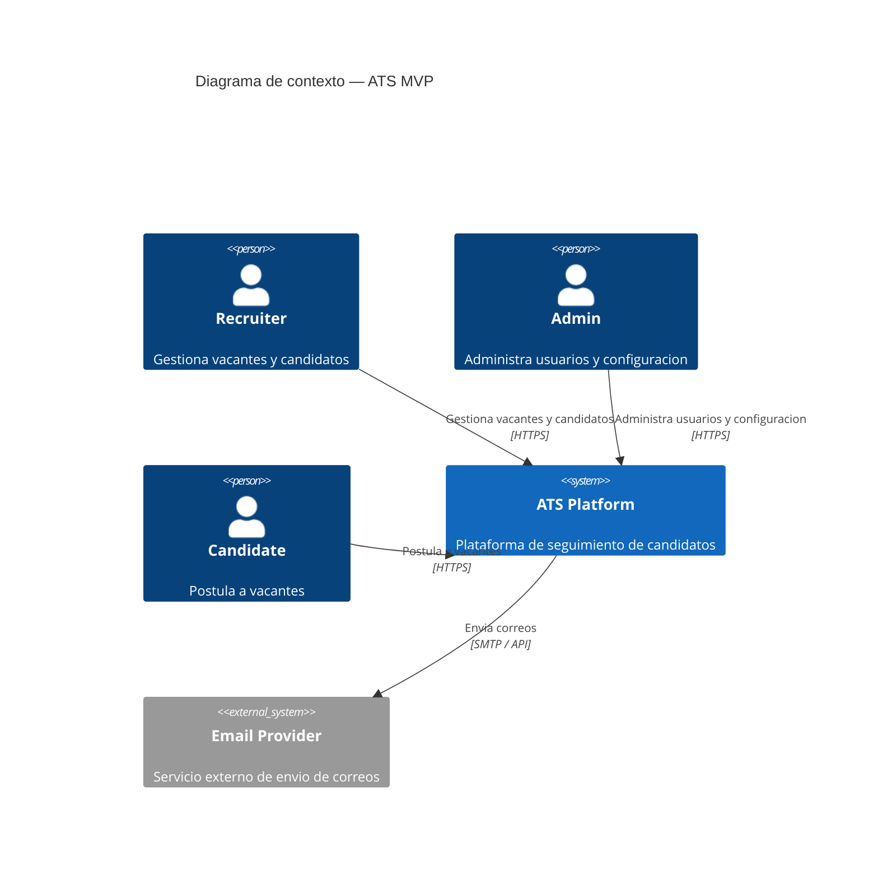
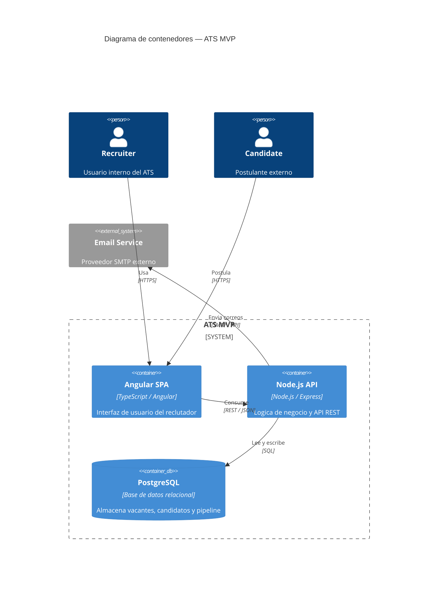
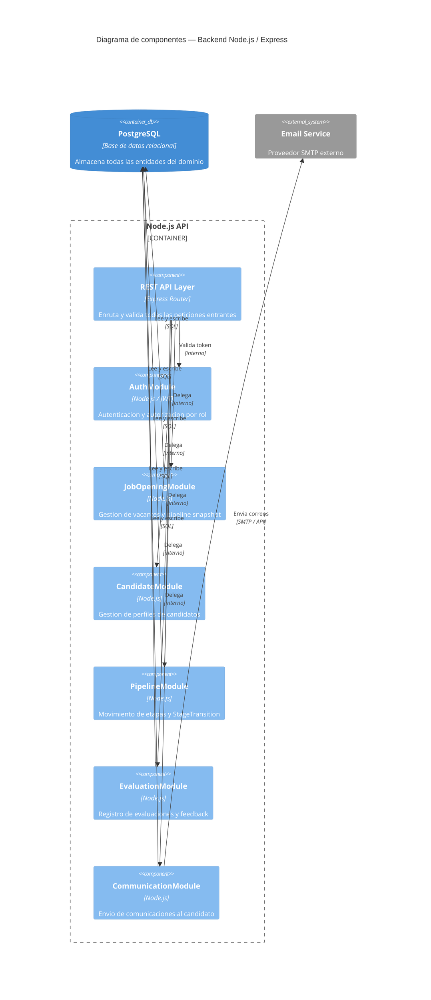
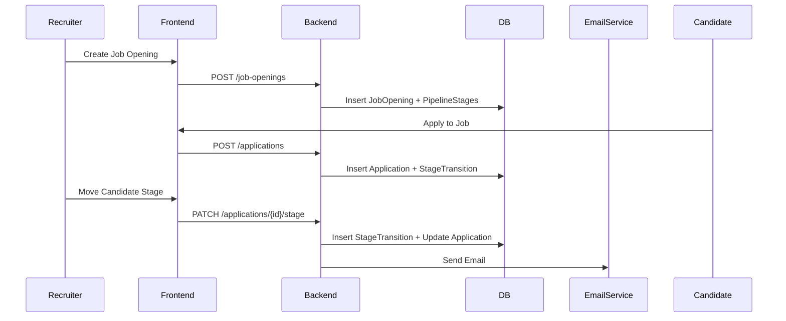
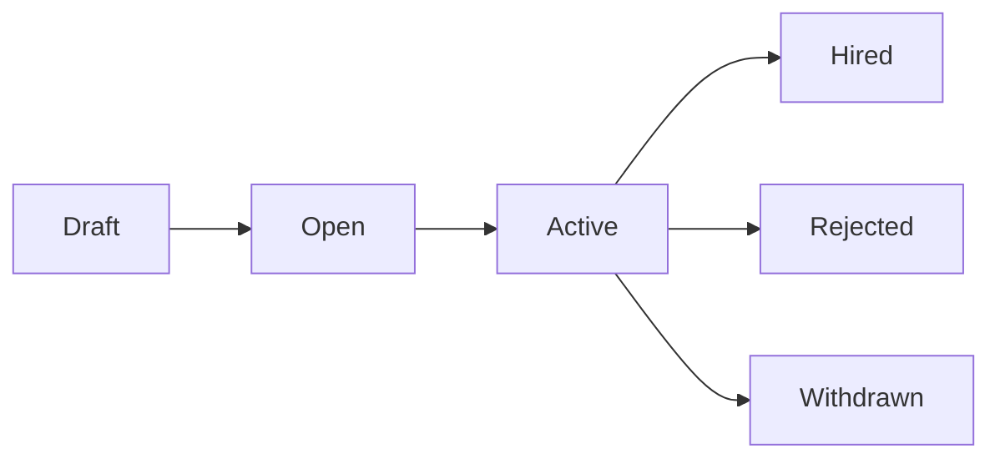

Aquí tienes el **diseño del sistema ATS MVP a alto nivel**, siguiendo exactamente los lineamientos definidos y alineado con el modelo de datos proporcionado .

---

# 1. Diagrama de Contexto (C4 Nivel 1)

### Explicación

Este diagrama define el ATS como una **caja negra central**, mostrando únicamente actores externos. Se prioriza claridad funcional: Recruiters y Admins operan internamente, mientras el Candidate interactúa solo vía aplicación. El Email Provider es la única integración externa del MVP, lo cual reduce complejidad inicial. Esta separación permite evolucionar integraciones sin afectar el core del sistema.

---

# 2. Diagrama de Contenedores (C4 Nivel 2)

### Explicación

Aquí se define una arquitectura clásica **3-tier desacoplada**. El frontend Angular es una SPA que consume la API REST, manteniendo lógica de negocio únicamente en backend. PostgreSQL actúa como fuente única de verdad, consistente con los aggregates definidos (Application, Candidate, JobOpening). El servicio de email está separado para permitir retries, colas futuras o cambio de proveedor sin afectar la API.

---

# 3. Diagrama de Componentes del Backend (C4 Nivel 3)

### Explicación

El backend sigue un enfoque **modular por dominio (DDD-lite)** alineado a los Aggregate Roots del modelo. Cada módulo encapsula lógica, validaciones y acceso a datos de su contexto. `PipelineModule` es crítico porque coordina `StageTransition` y consistencia con `Application`. `AuthModule` centraliza seguridad y multi-tenant enforcement. Esta estructura permite escalar a microservicios en el futuro si es necesario, sin cambiar el modelo mental actual.

---

# 4. Diagrama de Secuencia — Flujo Principal

### Explicación

Este flujo muestra el **happy path completo del ATS**. La clave arquitectónica es que `StageTransition` es la fuente de verdad, mientras `Application.currentStageId` es un cache consistente (actualizado en la misma transacción). El envío de email ocurre después de eventos clave (ej. cambio de etapa). Este diseño garantiza trazabilidad completa del pipeline sin sacrificar performance en lecturas.

---

# 5. Diagrama de Flujo — Ciclo de Vida de Application

### Explicación

El ciclo de vida refleja claramente la naturaleza transaccional de `Application`. El estado `Active` representa participación en pipeline (con stages). Las salidas (`Hired`, `Rejected`, `Withdrawn`) están alineadas con `stageType` del pipeline, garantizando consistencia entre estado y etapa. Este modelo evita estados ambiguos y simplifica lógica de negocio en frontend y backend.

---

# Decisiones Arquitectónicas Clave (Resumen Ejecutivo)

### 1. Multi-tenant por `Company`

* Aislamiento lógico con `companyId` en todas las entidades
* Escalable sin necesidad de múltiples bases en MVP

### 2. Consistencia fuerte en pipeline

* `StageTransition` = source of truth
* `Application.currentStageId` = optimized read model

### 3. Modularización backend (DDD-aligned)

* Cada módulo corresponde a un dominio claro
* Facilita mantenimiento y evolución

### 4. Arquitectura simple pero extensible

* Monolito modular → preparado para microservicios
* Email desacoplado desde el inicio

### 5. Stack balanceado

* Angular → rapidez en UI empresarial
* Node.js → velocidad de desarrollo + I/O eficiente
* PostgreSQL → integridad + flexibilidad (JSONB futuro)
