# LTI — Sistema ATS: Documento de Diseño y Análisis

**Subtítulo:** Versión MVP

**Fecha:** 2026-04-13

**Autore:** Walter Alexander Cordero Lara

---

## Tabla de Contenidos

1. [Introducción](#introducción)
2. [Brainstorming y Definición del Problema](#brainstorming-y-definición-del-problema)
3. [Casos de Uso](#casos-de-uso)
4. [Modelo de Datos](#modelo-de-datos)
5. [Diseño del Sistema a Alto Nivel](#diseño-del-sistema-a-alto-nivel)
6. [Anexos — Diagramas Complementarios](#anexos--diagramas-complementarios)
7. [Glosario](#glosario)

---

## Introducción

> Fuente: 1-initial-step.md

### Beneficios clave de un ATS para una empresa

Un ATS no es solo "gestionar CVs". Bien diseñado, impacta directamente **costos, velocidad y calidad de contratación**.

#### Beneficios principales

##### 1. Reducción del Time-to-Hire

* Automatiza screening inicial
* Centraliza candidatos
* Evita cuellos de botella entre HR y hiring managers
  👉 Resultado: contrataciones más rápidas

---

##### 2. Mejora en la calidad de contratación

* Filtros inteligentes (skills, experiencia)
* Scorecards estructurados
* Evaluación consistente
  👉 Menos contrataciones "por intuición"

---

##### 3. Estandarización del proceso de reclutamiento

* Flujos definidos por etapas (pipeline)
* Feedback obligatorio en entrevistas
* Evita procesos caóticos
  👉 Escalabilidad organizacional

---

##### 4. Mejor experiencia del candidato (Candidate Experience)

* Aplicaciones simples
* Comunicación automatizada
* Seguimiento claro del proceso
  👉 Mejora employer branding

---

##### 5. Data-driven hiring (decisiones basadas en datos)

* Métricas como:

  * Time-to-hire
  * Source of hire
  * Conversion rates por etapa
    👉 Optimización continua del proceso

---

##### 6. Cumplimiento legal (compliance)

* Auditoría de decisiones
* Historial de candidatos
* Manejo de datos sensibles (GDPR/EEOC/etc.)
  👉 Reduce riesgos legales

---

##### 7. Ahorro de costos

* Menos dependencia de agencias
* Menos retrabajo
* Procesos más eficientes
  👉 ROI claro en mediano plazo

---

### Funcionalidades clave de un ATS (ordenadas por prioridad)

Aquí te lo dejo como lo diseñaría en un roadmap real de producto (tipo SDD/MVP → Scale)

---

#### Prioridad 1 — Core del sistema (MVP obligatorio)

##### 1. Gestión de Vacantes (Job Management)

* Crear, editar, publicar vacantes
* Multi-channel posting (LinkedIn, portal propio)

---

##### 2. Pipeline de Candidatos (Kanban)

* Etapas: Applied → Screening → Interview → Offer → Hired
* Drag & drop
* Estado visible para todo el equipo

---

##### 3. Candidate Profile (perfil unificado)

* CV
* Datos personales
* Historial de aplicaciones
* Notas internas

---

##### 4. Aplicación del candidato (Apply flow)

* Formulario simple
* Upload CV
* Preguntas de screening

---

##### 5. Evaluación y feedback

* Scorecards
* Comentarios por entrevistador
* Evaluación estructurada

---

#### Prioridad 2 — Automatización y eficiencia

##### 6. Automatización (Workflows)

* Emails automáticos
* Cambios de estado automáticos
* Reglas (ej: rechazo automático por criterios)

---

##### 7. Parsing de CV (Resume parsing)

* Extraer:

  * Experiencia
  * Skills
  * Educación
    👉 Reduce trabajo manual

---

##### 8. Búsqueda avanzada de candidatos

* Filtros por:

  * Skills
  * Experiencia
  * Keywords
    👉 Talent pool reutilizable

---

##### 9. Colaboración en equipo

* Comentarios internos
* Menciones
* Roles (HR, Hiring Manager, Interviewer)

---

#### Prioridad 3 — Optimización y escalabilidad

##### 10. Analytics & Reporting

* Time-to-hire
* Funnel conversion
* Performance por fuente

---

##### 11. Integraciones

* LinkedIn
* Calendarios (Google / Outlook)
* HRIS / Payroll

---

##### 12. Candidate Experience avanzada

* Portal del candidato
* Status tracking
* Comunicación bidireccional

---

##### 13. Compliance & Seguridad

* GDPR
* Data retention policies
* Logs/auditoría

---

##### 14. Employer Branding

* Career page personalizable
* Landing pages de vacantes

---

### Perfil ideal de empresa para usar un ATS

Aquí entramos en Product-Market Fit real 👇

---

#### Tipo de empresa ideal

* Empresas en crecimiento (10 → 500+ empleados)
* Startups en scaling
* Empresas con contratación constante
* Equipos con:

  * HR interno
  * Hiring managers activos

---

#### ¿Qué le duele? (Pain Points)

* Procesos manuales (Excel, emails)
* Pérdida de candidatos (no seguimiento)
* Desorden en entrevistas
* Mala comunicación interna
* Contrataciones lentas o fallidas

---

#### ¿Qué quiere lograr?

* Contratar más rápido
* Mejorar calidad de talento
* Tener control del pipeline
* Profesionalizar HR
* Escalar sin caos

---

#### ¿Cuáles son sus mayores temores?

* Elegir una herramienta compleja
* Resistencia del equipo al cambio
* Pagar por algo que no usan
* Perder información de candidatos
* Mala experiencia del candidato

---

#### ¿Qué han intentado antes de usar un ATS?

##### 1. Uso de Excel / Google Sheets

* Tracking manual
* Columnas para etapas
  👉 Problema: no escala

---

##### 2. Emails como sistema de gestión

* Inbox como "pipeline"
  👉 Problema: pérdida de información

---

##### 3. Herramientas genéricas (Notion, Trello)

* Kanban improvisado
  👉 Problema: no especializado en recruiting

---

##### 4. Uso de LinkedIn únicamente

* Reclutamiento reactivo
  👉 Problema: no hay base de datos propia

---

##### 5. Agencias de reclutamiento

* Outsourcing completo
  👉 Problema: alto costo + poco control

---

### Insight clave (nivel producto)

> ❗ Un ATS NO compite por features, compite por:

* **simplicidad**
* **velocidad**
* **adopción del equipo**

---

## Brainstorming y Definición del Problema

> Fuente: 2-brainstorming.md

### Funcionalidades Principales

* **Gestión de vacantes:** Crear, editar, duplicar y publicar vacantes con título, descripción, requisitos y ubicación. | **Beneficio:** Centraliza y agiliza la apertura de procesos.

* **Formulario de aplicación:** Formulario configurable para capturar datos personales, CV y respuestas básicas de screening. | **Beneficio:** Estandariza la entrada de candidatos y reduce errores.

* **Perfil de candidato:** Vista única con datos personales, CV, historial de aplicaciones, evaluaciones y actividad. | **Beneficio:** Permite seguimiento completo y decisiones informadas.

* **Pipeline de candidatos:** Tablero por etapas (Applied, Screening, Interview, etc.) con visualización tipo kanban. | **Beneficio:** Da visibilidad clara del progreso del reclutamiento.

* **Gestión de etapas:** Movimiento manual de candidatos entre etapas y definición básica del flujo por vacante. | **Beneficio:** Mantiene orden y consistencia en el proceso.

* **Evaluación y feedback:** Registro estructurado de entrevistas con puntuaciones y comentarios por entrevistador. | **Beneficio:** Reduce sesgos y mejora la calidad de contratación.

* **Notas internas:** Comentarios privados asociados al candidato visibles solo para el equipo. | **Beneficio:** Facilita la colaboración sin afectar al candidato.

* **Búsqueda y filtros:** Filtros por nombre, skills, experiencia o estado dentro del pipeline. | **Beneficio:** Acelera la identificación de candidatos relevantes.

* **Gestión de usuarios y roles:** Creación de usuarios con permisos (admin, recruiter, interviewer). | **Beneficio:** Controla accesos y protege la información.

* **Comunicación con candidatos:** Envío de emails básicos (confirmación, avance, rechazo) desde el sistema. | **Beneficio:** Mejora la experiencia del candidato y reduce trabajo manual.

### Customer Journey — Uso de un ATS (Empresa / Customer)

---

#### 1. Descubrimiento / Awareness

* Detecta problemas en reclutamiento (desorden, lentitud).
* Investiga soluciones (ATS, herramientas HR).
* Interactúa con marketing (web, demos, contenido).

**Relaciones:**

* Marketing ↔ HR / Founder / Hiring Manager

---

#### 2. Evaluación / Consideración

* Compara herramientas ATS.
* Solicita demo o trial.
* Evalúa facilidad de uso, features y costo.

**Relaciones:**

* Sales ↔ HR / Decision Makers
* HR ↔ Hiring Managers (feedback interno)

---

#### 3. Compra / Decisión

* Selecciona proveedor.
* Define plan (usuarios, vacantes).
* Firma contrato o suscripción.

**Relaciones:**

* Sales ↔ Stakeholders (HR Lead, Finance, CEO)

---

#### 4. Onboarding / Setup

* Configura cuenta (usuarios, roles).
* Define pipeline de contratación.
* Crea primeras vacantes.

**Relaciones:**

* Customer Success ↔ HR
* HR ↔ Hiring Managers

---

#### 5. Adopción inicial (Primer uso real)

* Publica vacantes.
* Recibe candidatos.
* Usa pipeline y mueve candidatos.

**Relaciones:**

* HR ↔ Hiring Managers
* HR ↔ Candidatos

---

#### 6. Colaboración en el proceso

* Entrevistadores agregan feedback.
* HR coordina entrevistas.
* Equipo usa notas y evaluaciones.

**Relaciones:**

* HR ↔ Interviewers
* Hiring Managers ↔ HR
* HR ↔ Candidatos

---

#### 7. Decisión de contratación

* Comparación de candidatos.
* Selección final.
* Envío de oferta.

**Relaciones:**

* Hiring Manager ↔ HR
* HR ↔ Candidato seleccionado

---

#### 8. Cierre del proceso

* Contratación (Hired).
* Rechazo a otros candidatos.
* Cierre de vacante.

**Relaciones:**

* HR ↔ Candidatos
* HR ↔ Sistema ATS (registro histórico)

---

#### 9. Optimización / Uso continuo

* Revisión de métricas (time-to-hire, funnel).
* Ajuste de pipeline.
* Reutilización de candidatos.

**Relaciones:**

* HR ↔ Leadership
* HR ↔ ATS (analytics)

---

#### 10. Expansión / Retención

* Agrega más usuarios o vacantes.
* Integra con otras herramientas.
* Renueva suscripción.

**Relaciones:**

* Customer Success ↔ HR
* Sales ↔ Empresa (upsell)

---

#### Iteraciones clave del journey

* **Por cada nueva vacante:** vuelve a pasos 5 → 9
* **Por cada candidato:** recorre pipeline (Apply → Hired/Rejected)
* **Por cada mejora interna:** regresa a optimización (paso 9)

---

#### Relaciones principales del ecosistema

* HR ↔ Hiring Manager
* HR ↔ Candidatos
* HR ↔ Interviewers
* HR ↔ Customer Success / Sales
* Empresa ↔ ATS (plataforma como core operativo)

### CJM (Diagrama)

```mermaid
journey
    title Customer Journey Map - Implementación y uso inicial de un ATS
    section Descubrimiento
      Identifica problemas en reclutamiento: 4: Empresa
      Busca opciones de ATS en el mercado: 3: Empresa
      Compara beneficios y casos de uso: 3: Empresa
    section Evaluación
      Solicita demo o prueba: 4: Empresa, Ventas
      Evalúa funcionalidades clave: 3: Empresa
      Valida costo, facilidad de uso y adopción: 2: Empresa
      Alinea decisión con stakeholders internos: 2: Empresa, Hiring Manager, Finanzas
    section Compra
      Selecciona proveedor ATS: 4: Empresa
      Define plan y licencias: 3: Empresa, Ventas
      Confirma contratación del servicio: 5: Empresa, Ventas
    section Onboarding
      Crea cuenta y configura empresa: 4: Empresa, Customer Success
      Define usuarios y roles: 3: Empresa
      Configura pipeline de reclutamiento: 3: Empresa
      Crea primeras vacantes: 4: Empresa
    section Adopción Inicial
      Publica vacantes activas: 5: Empresa
      Recibe primeras aplicaciones: 5: Empresa, Candidato
      Revisa perfiles y CVs: 4: Empresa
      Mueve candidatos por etapas: 4: Empresa
    section Colaboración
      Coordina entrevistas con el equipo: 3: Empresa, Hiring Manager
      Registra feedback y evaluaciones: 4: Hiring Manager, Entrevistador
      Consolida notas internas y decisiones: 4: Empresa
    section Decisión
      Compara candidatos finalistas: 4: Empresa, Hiring Manager
      Selecciona candidato ideal: 5: Empresa
      Envía oferta o rechazo: 4: Empresa, Candidato
    section Optimización
      Revisa métricas del proceso: 3: Empresa
      Detecta cuellos de botella: 2: Empresa
      Ajusta etapas y flujo de trabajo: 4: Empresa
      Reutiliza base de candidatos para nuevas vacantes: 5: Empresa
```

---
## Nuevas Funcionalidades
> Fuente: /new-features/1-brainstorming.md
Antes de entrar al brainstorming completo, te hago una **micro-validación rápida (crítica para que esto sea realmente útil para estimación)**:

👉 ¿El modelo de datos actual ya incluye entidades tipo `Application`, `Candidate`, `Job`, `Interview`, `User`, `Note`, `Attachment`?
👉 ¿Ya existe algo de tracking de estados tipo pipeline (ej: `stage`, `status`)?

Voy a asumir que **sí existe un modelo ATS estándar MVP** con esas entidades base (como Greenhouse/Lever), y diseñar encima de eso.

---

# 🧠 Brainstorming Funcionalidades ATS MVP

---

# 1. Eficiencia para departamentos de HR

## ### 1. Definición del problema

* **Pain point:** Los recruiters pierden tiempo en tareas repetitivas (filtrado manual, seguimiento, coordinación).
* **Actor afectado:** Recruiter
* **Impacto:**

  * Time-to-hire alto
  * Pérdida de candidatos buenos
  * Burnout operativo en HR

---

## ### 2. How Might We

* ¿Cómo podríamos reducir el tiempo que un recruiter invierte en revisar candidatos?
* ¿Cómo podríamos centralizar toda la información relevante sin cambiar de contexto?
* ¿Cómo podríamos priorizar automáticamente candidatos relevantes?
* ¿Cómo podríamos reducir tareas manuales sin perder control?

---

## ### 3. Ideas generadas (divergencia)

| Tipo       | Idea                                        |
| ---------- | ------------------------------------------- |
| Quick Win  | Filtros avanzados guardables por recruiter  |
| Quick Win  | Vista consolidada tipo "Candidate Snapshot" |
| Mediano    | Ranking automático de candidatos por score  |
| Mediano    | Pipeline view optimizado con drag & drop    |
| Mediano    | Bulk actions (mover, rechazar, etiquetar)   |
| Innovación | Inbox inteligente de candidatos priorizados |
| Innovación | Auto-highlighting de info clave en CV       |

---

## ### 4. Ideas priorizadas (convergencia)

| Nombre                  | Descripción                                  | Actor     |
| ----------------------- | -------------------------------------------- | --------- |
| Candidate Smart Ranking | Ranking automático basado en match con job   | Recruiter |
| Bulk Pipeline Actions   | Acciones masivas sobre candidatos            | Recruiter |
| Candidate Snapshot View | Vista unificada con info clave del candidato | Recruiter |

---

## ### 5. Casos de uso candidatos

* "Rankear candidatos automáticamente" → Recruiter → Módulo: Applications
* "Ejecutar acciones masivas en pipeline" → Recruiter → Módulo: Applications
* "Visualizar resumen de candidato" → Recruiter → Módulo: Candidate/Profile

---

## ### 6. Impacto en el modelo de datos

| Entidad     | Cambio                            | Tipo          |
| ----------- | --------------------------------- | ------------- |
| Application | campo `score`, `ranking_position` | Cambio menor  |
| Candidate   | campo `parsed_summary`            | Cambio menor  |
| Application | campo `tags[]`                    | Cambio menor  |
| —           | entidad `SavedFilter`             | Entidad nueva |

---

# 2. Colaboración en tiempo real

## ### 1. Definición del problema

* **Pain point:** Feedback disperso (Slack, emails, reuniones)
* **Actor:** Hiring Manager, Recruiter
* **Impacto:**

  * Decisiones lentas
  * Falta de trazabilidad
  * Sesgo en decisiones

---

## ### 2. How Might We

* ¿Cómo podríamos centralizar el feedback en un solo lugar?
* ¿Cómo podríamos hacer visible el estado de decisión en tiempo real?
* ¿Cómo podríamos evitar pérdida de contexto en evaluaciones?
* ¿Cómo podríamos facilitar consenso entre stakeholders?

---

## ### 3. Ideas generadas

| Tipo       | Idea                                   |
| ---------- | -------------------------------------- |
| Quick Win  | Comentarios en candidato               |
| Quick Win  | @mentions en notas                     |
| Mediano    | Scorecards estructurados               |
| Mediano    | Timeline de actividad del candidato    |
| Mediano    | Notificaciones internas                |
| Innovación | Consensus indicator (barra de acuerdo) |
| Innovación | Decision heatmap por candidato         |

---

## ### 4. Ideas priorizadas

| Nombre                        | Descripción                              | Actor               |
| ----------------------------- | ---------------------------------------- | ------------------- |
| Candidate Comments & Mentions | Comentarios con tagging interno          | Recruiter / Manager |
| Structured Scorecards         | Evaluación estandarizada post entrevista | Interviewer         |
| Candidate Activity Timeline   | Historial completo de interacción        | Todos               |

---

## ### 5. Casos de uso candidatos

* "Comentar en candidato" → Recruiter → Módulo: Candidate
* "Evaluar candidato con scorecard" → Interviewer → Módulo: Interview
* "Consultar historial del candidato" → HiringManager → Módulo: Candidate

---

## ### 6. Impacto en el modelo de datos

| Entidad   | Cambio                 | Tipo          |
| --------- | ---------------------- | ------------- |
| —         | entidad `Comment`      | Entidad nueva |
| Interview | campo `scorecard_json` | Cambio menor  |
| —         | entidad `Mention`      | Entidad nueva |
| —         | entidad `ActivityLog`  | Entidad nueva |

---

# 3. Automatizaciones

## ### 1. Definición del problema

* **Pain point:** Procesos manuales repetitivos (seguimientos, cambios de estado)
* **Actor:** Recruiter / Admin
* **Impacto:**

  * Retrasos
  * Errores humanos
  * Falta de consistencia

---

## ### 2. How Might We

* ¿Cómo podríamos automatizar flujos repetitivos?
* ¿Cómo podríamos reaccionar automáticamente a eventos?
* ¿Cómo podríamos reducir tareas operativas sin perder control?

---

## ### 3. Ideas generadas

| Tipo       | Idea                            |
| ---------- | ------------------------------- |
| Quick Win  | Auto-move por stage             |
| Quick Win  | Recordatorios automáticos       |
| Mediano    | Reglas tipo "if-this-then-that" |
| Mediano    | Auto-rechazo por criterios      |
| Mediano    | SLA tracking por etapa          |
| Innovación | Workflow builder visual         |
| Innovación | Automatización predictiva       |

---

## ### 4. Ideas priorizadas

| Nombre                        | Descripción                    | Actor     |
| ----------------------------- | ------------------------------ | --------- |
| Rule-Based Automation Engine  | Reglas automáticas por eventos | Admin     |
| Stage SLA Tracker             | Tracking de tiempo por etapa   | Recruiter |
| Auto Candidate Status Updates | Cambio automático de estado    | Recruiter |

---

## ### 5. Casos de uso candidatos

* "Configurar reglas de automatización" → Admin → Módulo: Settings
* "Actualizar estado automáticamente" → System → Módulo: Applications
* "Monitorear SLA de pipeline" → Recruiter → Módulo: Dashboard

---

## ### 6. Impacto en el modelo de datos

| Entidad     | Cambio                           | Tipo          |
| ----------- | -------------------------------- | ------------- |
| —           | entidad `AutomationRule`         | Entidad nueva |
| Application | campo `last_stage_change_at`     | Cambio menor  |
| —           | entidad `AutomationExecutionLog` | Entidad nueva |

---

# 4. Asistencia de IA

## ### 1. Definición del problema

* **Pain point:** Decisiones lentas + baja calidad en screening
* **Actor:** Recruiter
* **Impacto:**

  * Mala selección
  * Alto tiempo de análisis
  * Inconsistencia

---

## ### 2. How Might We

* ¿Cómo podríamos asistir al recruiter sin reemplazarlo?
* ¿Cómo podríamos mejorar la calidad del screening?
* ¿Cómo podríamos acelerar la toma de decisiones?

---

## ### 3. Ideas generadas

| Tipo       | Idea                                  |
| ---------- | ------------------------------------- |
| Quick Win  | Resumen automático de CV              |
| Quick Win  | Generación de feedback                |
| Mediano    | Matching candidato-job                |
| Mediano    | Sugerencia de preguntas de entrevista |
| Mediano    | Generación de score preliminar        |
| Innovación | AI copilot para recruiter             |
| Innovación | Explicabilidad del match (why fit)    |

---

## ### 4. Ideas priorizadas

| Nombre                 | Descripción                 | Actor       |
| ---------------------- | --------------------------- | ----------- |
| AI Resume Summarizer   | Resume CV en insights clave | Recruiter   |
| AI Candidate Matching  | Score automático vs job     | Recruiter   |
| AI Interview Assistant | Genera preguntas y feedback | Interviewer |

---

## ### 5. Casos de uso candidatos

* "Resumir CV automáticamente" → System → Módulo: Candidate
* "Sugerir match candidato-job" → System → Módulo: Applications
* "Generar preguntas de entrevista" → Interviewer → Módulo: Interview

---

## ### 6. Impacto en el modelo de datos

| Entidad     | Cambio                             | Tipo          |
| ----------- | ---------------------------------- | ------------- |
| Candidate   | campo `ai_summary`                 | Cambio menor  |
| Application | campo `ai_score`, `ai_explanation` | Cambio menor  |
| Interview   | campo `ai_questions`               | Cambio menor  |
| —           | entidad `AIProcessingLog`          | Entidad nueva |

---

# 🚀 Resumen Ejecutivo (Top 5 ideas más importantes)

Estas son las **5 apuestas más fuertes para el siguiente ciclo (alto impacto + MVP-friendly):**

1. **AI Candidate Matching + Score**

   * Core diferenciador inmediato
   * Impacta directamente time-to-hire

2. **Candidate Snapshot View**

   * Reduce fricción cognitiva brutalmente
   * UX win inmediato

3. **Structured Scorecards**

   * Mejora calidad de decisiones
   * Reduce sesgos

4. **Rule-Based Automation Engine**

   * Multiplicador de eficiencia
   * Base para futuras automatizaciones

5. **Candidate Comments + Mentions**

   * Desbloquea colaboración real
   * Reemplaza comunicación externa
---

## Casos de Uso

> Fuente: 3-Use-Cases.md

### Casos de uso esenciales para un ATS MVP

#### Módulo: Gestión de Vacantes

##### 1. Crear Vacante

* **Actor(es):** Recruiter, Admin
* **Descripción:** Permite registrar una nueva vacante con la información mínima operativa: título, área, ubicación, modalidad, descripción y estado. Este caso de uso inicia formalmente un proceso de reclutamiento dentro del sistema.
* **Precondiciones:** El usuario debe estar autenticado y contar con permisos de creación de vacantes.
* **Resultado esperado:** La vacante queda almacenada en estado borrador o abierta, lista para recibir postulaciones.
* **Prioridad:** Alta

##### 2. Editar Vacante

* **Actor(es):** Recruiter, Admin
* **Descripción:** Permite modificar los datos de una vacante existente para corregir información o ajustar el perfil buscado. Debe preservar trazabilidad básica de cambios relevantes.
* **Precondiciones:** La vacante debe existir y el usuario debe tener permisos de edición.
* **Resultado esperado:** La vacante actualiza su información de forma consistente sin perder su relación con las postulaciones existentes.
* **Prioridad:** Alta

##### 3. Cerrar Vacante

* **Actor(es):** Recruiter, Admin
* **Descripción:** Permite finalizar una vacante cuando ya no debe seguir recibiendo candidatos. El cierre evita nuevas postulaciones, pero conserva el historial asociado.
* **Precondiciones:** La vacante debe existir y estar activa.
* **Resultado esperado:** La vacante cambia a estado cerrada y deja de aceptar nuevas aplicaciones.
* **Prioridad:** Alta

---

#### Módulo: Captura de Candidatos

##### 4. Postular a Vacante

* **Actor(es):** Candidato
* **Descripción:** Permite al candidato completar el formulario de aplicación y adjuntar su CV para una vacante específica. Es el punto de entrada principal de datos al pipeline del ATS.
* **Precondiciones:** La vacante debe estar publicada o abierta para postulaciones.
* **Resultado esperado:** Se crea una postulación vinculada al candidato y a la vacante, con su información básica registrada.
* **Prioridad:** Alta

##### 5. Registrar Candidato Manualmente

* **Actor(es):** Recruiter, Admin
* **Descripción:** Permite ingresar un candidato de forma manual cuando proviene de una fuente offline o externa al portal de postulación. Debe permitir asociarlo inmediatamente a una vacante.
* **Precondiciones:** El usuario debe estar autenticado y contar con permisos de gestión de candidatos.
* **Resultado esperado:** El candidato queda registrado en el sistema con una postulación activa o disponible para asignación posterior.
* **Prioridad:** Alta

---

#### Módulo: Gestión de Candidatos

##### 6. Consultar Perfil de Candidato

* **Actor(es):** Recruiter, Hiring Manager, Admin
* **Descripción:** Permite visualizar la ficha consolidada del candidato, incluyendo datos personales, CV, postulaciones y actividad relevante. Debe servir como vista central para evaluación y seguimiento.
* **Precondiciones:** El candidato debe existir y el actor debe tener permisos de lectura.
* **Resultado esperado:** El usuario accede a una vista única y consistente del candidato.
* **Prioridad:** Alta

##### 7. Buscar Candidato

* **Actor(es):** Recruiter, Hiring Manager, Admin
* **Descripción:** Permite localizar candidatos mediante filtros básicos como nombre, email, vacante o estado del proceso. Es esencial para operar el sistema de forma eficiente cuando crece el volumen.
* **Precondiciones:** Deben existir candidatos registrados en el sistema.
* **Resultado esperado:** El sistema devuelve un conjunto filtrado de candidatos según los criterios ingresados.
* **Prioridad:** Alta

##### 8. Actualizar Información de Candidato

* **Actor(es):** Recruiter, Admin
* **Descripción:** Permite corregir o complementar información del candidato sin alterar indebidamente el historial del proceso. Debe aplicarse sobre atributos editables definidos por negocio.
* **Precondiciones:** El candidato debe existir y el usuario debe tener permisos de edición.
* **Resultado esperado:** La ficha del candidato queda actualizada y disponible para consulta posterior.
* **Prioridad:** Media

---

#### Módulo: Pipeline de Reclutamiento

##### 9. Visualizar Pipeline de Vacante

* **Actor(es):** Recruiter, Hiring Manager, Admin
* **Descripción:** Permite ver los candidatos organizados por etapa dentro del proceso de una vacante. Debe ofrecer una vista operativa clara del avance de cada candidato.
* **Precondiciones:** La vacante debe existir y tener postulaciones asociadas.
* **Resultado esperado:** El usuario puede consultar el estado actual del pipeline por vacante.
* **Prioridad:** Alta

##### 10. Mover Candidato de Etapa

* **Actor(es):** Recruiter, Hiring Manager
* **Descripción:** Permite avanzar o retroceder un candidato entre etapas del pipeline según la evaluación del proceso. Este caso de uso materializa el flujo principal del reclutamiento.
* **Precondiciones:** Debe existir una postulación activa y un pipeline definido para la vacante.
* **Resultado esperado:** La postulación cambia de etapa y el nuevo estado queda persistido.
* **Prioridad:** Alta

##### 11. Descartar Candidato

* **Actor(es):** Recruiter, Hiring Manager
* **Descripción:** Permite finalizar la participación de un candidato en una vacante específica cuando no continuará en el proceso. Debe registrar el estado final de la postulación.
* **Precondiciones:** La postulación debe existir y encontrarse activa.
* **Resultado esperado:** La postulación queda marcada como descartada o rechazada, sin eliminar el historial.
* **Prioridad:** Alta

##### 12. Marcar Candidato como Contratado

* **Actor(es):** Recruiter, Admin
* **Descripción:** Permite cerrar exitosamente el proceso para un candidato seleccionado. Este caso de uso representa el resultado de negocio principal del ATS.
* **Precondiciones:** El candidato debe estar asociado a una vacante activa y en etapa final elegible.
* **Resultado esperado:** La postulación queda en estado contratado y la vacante puede cerrarse manualmente o quedar lista para cierre.
* **Prioridad:** Alta

---

#### Módulo: Evaluación y Colaboración

##### 13. Registrar Feedback de Candidato

* **Actor(es):** Recruiter, Hiring Manager, Interviewer
* **Descripción:** Permite capturar observaciones, comentarios y valoración cualitativa sobre un candidato en una etapa del proceso. Debe quedar asociado a la postulación o etapa correspondiente.
* **Precondiciones:** El candidato debe estar en proceso y el actor debe tener permisos para comentar.
* **Resultado esperado:** El sistema almacena feedback consultable por los participantes autorizados.
* **Prioridad:** Alta

##### 14. Registrar Evaluación de Entrevista

* **Actor(es):** Interviewer, Hiring Manager, Recruiter
* **Descripción:** Permite documentar el resultado estructurado de una entrevista mediante comentarios y una calificación básica. Su objetivo es soportar decisiones más consistentes y comparables.
* **Precondiciones:** Debe existir una entrevista realizada o una etapa de entrevista activa para la postulación.
* **Resultado esperado:** La evaluación queda registrada y disponible para revisión del equipo de contratación.
* **Prioridad:** Alta

---

#### Módulo: Comunicación Operativa

##### 15. Enviar Comunicación al Candidato

* **Actor(es):** Recruiter
* **Descripción:** Permite enviar mensajes operativos básicos al candidato, como confirmación de recepción, avance o rechazo. Para MVP debe limitarse a plantillas simples o mensajes manuales desde el sistema.
* **Precondiciones:** El candidato debe tener email registrado y estar asociado a una postulación.
* **Resultado esperado:** La comunicación queda enviada y, idealmente, registrada en el historial de la postulación.
* **Prioridad:** Alta

---

#### Módulo: Administración Básica

##### 16. Gestionar Usuarios

* **Actor(es):** Admin
* **Descripción:** Permite crear, editar y desactivar usuarios internos del ATS. Es necesario para controlar quién participa en el proceso y con qué nivel de acceso.
* **Precondiciones:** El actor debe tener rol administrativo.
* **Resultado esperado:** Los usuarios internos quedan habilitados o actualizados con sus credenciales y estado operativo.
* **Prioridad:** Alta

##### 17. Asignar Roles y Permisos Básicos

* **Actor(es):** Admin
* **Descripción:** Permite definir el nivel de acceso de cada usuario según su función operativa, por ejemplo Admin, Recruiter o Hiring Manager. En MVP debe resolverse con un esquema simple y estable de roles.
* **Precondiciones:** El usuario interno debe existir en el sistema.
* **Resultado esperado:** Cada usuario queda asociado a un rol válido y sus permisos son aplicados en la interfaz y lógica de negocio.
* **Prioridad:** Alta

---
> Fuente: /new-features/2-use-cases.md

## Gestión de Candidatos

### UC-21 — Visualizar resumen de candidato

**Nombre:** Visualizar resumen de candidato

**Módulo:** Gestión de Candidatos

**Actor principal:** Recruiter

**Actores secundarios:** HiringManager, Sistema

**Precondiciones:**

* El candidato existe en el tenant.
* El actor tiene permisos para consultar candidatos.
* El candidato tiene al menos una postulación o perfil registrado.

**Flujo principal:**

1. El Recruiter accede al listado de candidatos o postulaciones.
2. El Recruiter selecciona un candidato.
3. El sistema muestra una vista consolidada con los datos principales del candidato.
4. El sistema presenta información relevante del perfil, experiencia, documentos, vacantes relacionadas y estado actual en pipeline.
5. El Recruiter revisa el resumen y toma una decisión operativa inicial.
6. El sistema registra la consulta en el historial de actividad.

**Flujos alternativos:**

* **A1. En paso 3, el candidato no tiene información suficiente**

  1. El sistema muestra el resumen con los datos disponibles.
  2. El sistema marca secciones incompletas como pendientes.
  3. El Recruiter puede continuar la revisión o salir del resumen.

**Postcondiciones:**

* El resumen del candidato fue consultado.
* La actividad queda trazada en el historial del candidato.

**Reglas de negocio:**

* Solo se muestran candidatos del tenant activo.
* La información visible depende del rol del usuario.
* El resumen debe incluir el estado vigente de la postulación más reciente o prioritaria.
* Si un candidato tiene múltiples postulaciones, la vista debe distinguir claramente cada una.

**Impacto en modelo de datos:**

* **Entidades afectadas:** `Candidate`, `Application`, `Interview`, `Note`, `Attachment`
* **Campos nuevos/modificados:** `Candidate.profile_completion`, `Candidate.last_viewed_at` (opcional), `Application.last_activity_at`
* **Entidades nuevas si aplica:** `CandidateActivityLog` o reutilización de `ActivityLog`

**Prioridad:** Alta — reduce fricción operativa inmediata y acelera la revisión inicial de candidatos.

**Dependencias:** UC-05, UC-07

---

### UC-22 — Ejecutar acciones masivas sobre candidatos

**Nombre:** Ejecutar acciones masivas sobre candidatos

**Módulo:** Gestión de Candidatos

**Actor principal:** Recruiter

**Actores secundarios:** Sistema

**Precondiciones:**

* Existen candidatos o postulaciones visibles en una búsqueda o listado.
* El actor tiene permisos para modificar postulaciones.
* Las postulaciones seleccionadas pertenecen al mismo tenant.

**Flujo principal:**

1. El Recruiter aplica filtros sobre el listado de candidatos o postulaciones.
2. El Recruiter selecciona múltiples registros.
3. El Recruiter elige una acción masiva permitida.
4. El sistema valida que la acción sea aplicable a todos los registros seleccionados.
5. El Recruiter confirma la ejecución.
6. El sistema aplica la acción a cada registro válido.
7. El sistema informa el resultado consolidado de la operación.
8. El sistema registra la operación en el historial de actividad.

**Flujos alternativos:**

* **A1. En paso 4, algunos registros no cumplen las condiciones**

  1. El sistema separa los registros válidos e inválidos.
  2. El sistema informa el motivo de exclusión de los inválidos.
  3. El Recruiter decide continuar solo con los válidos o cancelar.

* **A2. En paso 5, el Recruiter cancela la confirmación**

  1. El sistema no ejecuta cambios.
  2. El listado permanece sin modificación.

**Postcondiciones:**

* Las postulaciones válidas fueron actualizadas según la acción seleccionada.
* Queda evidencia de la acción masiva realizada.

**Reglas de negocio:**

* Las acciones masivas permitidas deben estar definidas por rol.
* No se pueden ejecutar acciones masivas sobre registros bloqueados o archivados, salvo permiso explícito.
* Una misma operación masiva debe dejar trazabilidad por cada registro afectado.
* La acción debe ser consistente con el estado actual del pipeline.

**Impacto en modelo de datos:**

* **Entidades afectadas:** `Application`, `Candidate`, `ActivityLog`
* **Campos nuevos/modificados:** `Application.bulk_updated_at`, `Application.bulk_update_batch_id` (opcional)
* **Entidades nuevas si aplica:** `BulkOperation`, `BulkOperationItem`

**Prioridad:** Alta — incrementa productividad de HR con esfuerzo razonable.

**Dependencias:** UC-07, UC-09

---

### UC-23 — Guardar filtro de búsqueda de candidatos

**Nombre:** Guardar filtro de búsqueda de candidatos

**Módulo:** Gestión de Candidatos

**Actor principal:** Recruiter

**Actores secundarios:** Sistema

**Precondiciones:**

* El actor tiene permisos para consultar candidatos.
* Existe una búsqueda o combinación de filtros activa.

**Flujo principal:**

1. El Recruiter define criterios de búsqueda y filtrado.
2. El Recruiter solicita guardar el filtro actual.
3. El sistema solicita nombre y visibilidad del filtro.
4. El Recruiter confirma el guardado.
5. El sistema almacena el filtro asociado al usuario o al tenant, según corresponda.
6. El sistema deja el filtro disponible para reutilización futura.

**Flujos alternativos:**

* **A1. En paso 4, ya existe un filtro con el mismo nombre**

  1. El sistema informa el conflicto.
  2. El Recruiter elige reemplazarlo o asignar otro nombre.

**Postcondiciones:**

* El filtro queda disponible para uso posterior.

**Reglas de negocio:**

* Los filtros privados solo son visibles para su creador.
* Los filtros compartidos requieren permiso adicional.
* El filtro debe conservar criterios, orden y contexto de módulo.

**Impacto en modelo de datos:**

* **Entidades afectadas:** Ninguna obligatoria del núcleo transaccional
* **Campos nuevos/modificados:** N/A
* **Entidades nuevas si aplica:** `SavedFilter`

**Prioridad:** Media — mejora eficiencia, aunque no es bloqueante para el flujo principal.

**Dependencias:** UC-05, UC-07

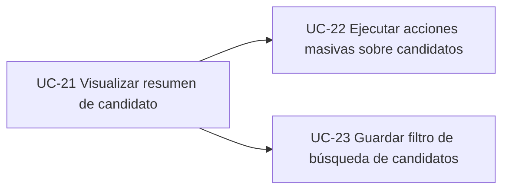
```mermaid
flowchart LR
  UC21[UC-21 Visualizar resumen de candidato] --> UC22[UC-22 Ejecutar acciones masivas sobre candidatos]
  UC21 --> UC23[UC-23 Guardar filtro de búsqueda de candidatos]
```

---

## Pipeline y Seguimiento

### UC-24 — Rankear candidatos automáticamente

**Nombre:** Rankear candidatos automáticamente

**Módulo:** Pipeline y Seguimiento

**Actor principal:** Recruiter

**Actores secundarios:** Sistema, Asistencia IA

**Precondiciones:**

* Existe una vacante activa.
* Existen postulaciones asociadas a la vacante.
* La vacante cuenta con información suficiente para comparación.
* La funcionalidad de asistencia IA está habilitada para el tenant.

**Flujo principal:**

1. El Recruiter ingresa al pipeline de una vacante.
2. El Recruiter solicita obtener un ranking de candidatos.
3. El sistema reúne la información relevante de la vacante y de las postulaciones.
4. La asistencia IA evalúa afinidad entre perfil y vacante.
5. El sistema asigna un puntaje y un orden sugerido a las postulaciones.
6. El sistema presenta el ranking junto con una explicación resumida por candidato.
7. El Recruiter revisa el ranking y decide cómo proceder.

**Flujos alternativos:**

* **A1. En paso 3, la vacante no tiene suficiente información**

  1. El sistema informa que no es posible generar un ranking confiable.
  2. El Recruiter puede completar la vacante y reintentar más tarde.

* **A2. En paso 4, la asistencia IA no devuelve resultado**

  1. El sistema informa que el ranking no pudo completarse.
  2. El pipeline permanece sin cambios automáticos.

**Postcondiciones:**

* Las postulaciones evaluadas quedan con puntaje y orden sugerido, cuando aplica.
* La ejecución queda registrada.

**Reglas de negocio:**

* El ranking sugerido no modifica por sí solo el estado del candidato.
* La puntuación debe estar asociada a una ejecución identificable y auditable.
* El sistema debe permitir diferenciar evaluación manual de sugerencia automática.
* La explicación debe ser visible solo a usuarios autorizados.

**Impacto en modelo de datos:**

* **Entidades afectadas:** `Application`, `JobOpening`, `Candidate`
* **Campos nuevos/modificados:** `Application.ai_score`, `Application.ai_rank`, `Application.ai_explanation`, `Application.ai_scored_at`
* **Entidades nuevas si aplica:** `AIRankingRun`, `AIRankingResult`

**Prioridad:** Alta — es una de las funcionalidades con mayor valor percibido y mayor impacto en time-to-hire.

**Dependencias:** UC-07, UC-21, UC-29

---

### UC-25 — Actualizar estado de candidatos automáticamente

**Nombre:** Actualizar estado de candidatos automáticamente

**Módulo:** Pipeline y Seguimiento

**Actor principal:** Sistema

**Actores secundarios:** Recruiter, Automatización

**Precondiciones:**

* Existe una regla de automatización activa.
* Existe una postulación elegible para evaluación.
* El evento que dispara la regla ocurrió.

**Flujo principal:**

1. El sistema detecta un evento relevante en una postulación.
2. El sistema identifica una regla activa aplicable.
3. El sistema valida que la postulación cumpla las condiciones de la regla.
4. El sistema actualiza el estado o etapa de la postulación.
5. El sistema registra la ejecución de la automatización.
6. El sistema deja visible al Recruiter el cambio realizado.

**Flujos alternativos:**

* **A1. En paso 3, la postulación no cumple las condiciones**

  1. El sistema no ejecuta cambios.
  2. El sistema registra que la regla fue evaluada sin efecto.

* **A2. En paso 4, el cambio automático entra en conflicto con una restricción**

  1. El sistema cancela la actualización.
  2. El sistema registra el motivo del bloqueo.
  3. El Recruiter puede revisar manualmente el caso.

**Postcondiciones:**

* La postulación cambia de estado o etapa, cuando corresponde.
* La ejecución queda trazada.

**Reglas de negocio:**

* Ninguna regla automática puede saltar etapas obligatorias definidas por la vacante.
* Las automatizaciones no deben sobrescribir decisiones manuales bloqueadas o finales.
* Todo cambio automático debe indicar origen y momento de ejecución.

**Impacto en modelo de datos:**

* **Entidades afectadas:** `Application`, `PipelineStage`, `ActivityLog`
* **Campos nuevos/modificados:** `Application.last_stage_change_at`, `Application.updated_by_type`
* **Entidades nuevas si aplica:** `AutomationExecutionLog`

**Prioridad:** Alta — disminuye carga operativa y estandariza el proceso.

**Dependencias:** UC-09, UC-30

---

### UC-26 — Monitorear SLA de pipeline

**Nombre:** Monitorear SLA de pipeline

**Módulo:** Pipeline y Seguimiento

**Actor principal:** Recruiter

**Actores secundarios:** Sistema, Admin

**Precondiciones:**

* Existen vacantes y postulaciones activas.
* Existen objetivos de tiempo configurados por etapa o vacante.

**Flujo principal:**

1. El Recruiter accede al tablero de seguimiento del pipeline.
2. El sistema calcula el tiempo transcurrido por postulación y por etapa.
3. El sistema compara el tiempo transcurrido contra el SLA definido.
4. El sistema resalta los casos dentro de objetivo, en riesgo o vencidos.
5. El Recruiter consulta los casos críticos y toma acción.

**Flujos alternativos:**

* **A1. En paso 3, una etapa no tiene SLA configurado**

  1. El sistema informa que el caso no puede evaluarse contra objetivo.
  2. El caso se muestra sin clasificación de cumplimiento.

**Postcondiciones:**

* El estado de cumplimiento del pipeline queda visible y actualizado.
* Los casos críticos pueden disparar acciones posteriores.

**Reglas de negocio:**

* El SLA debe medirse con base en la fecha de entrada a la etapa vigente.
* Los cálculos deben respetar zona horaria y tenant.
* El incumplimiento de SLA no altera automáticamente la postulación salvo regla configurada.

**Impacto en modelo de datos:**

* **Entidades afectadas:** `Application`, `PipelineStage`, `JobOpening`
* **Campos nuevos/modificados:** `Application.stage_entered_at`, `PipelineStage.sla_hours`
* **Entidades nuevas si aplica:** `SLAPolicy`, `SLABreachEvent`

**Prioridad:** Media — aporta control operativo, pero depende de madurez mínima del flujo.

**Dependencias:** UC-09, UC-30

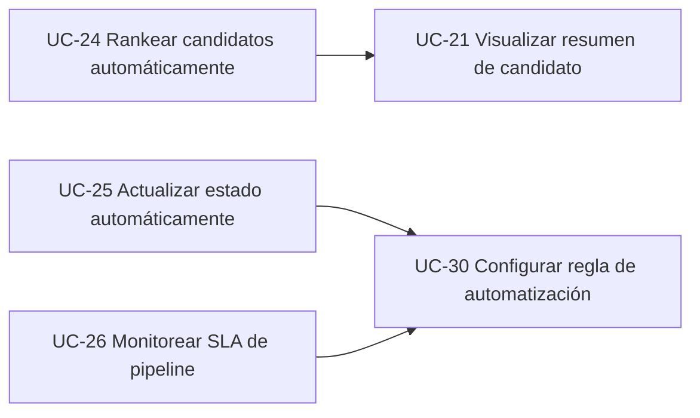
```mermaid
flowchart LR
  UC24[UC-24 Rankear candidatos automáticamente] --> UC21[UC-21 Visualizar resumen de candidato]
  UC25[UC-25 Actualizar estado automáticamente] --> UC30[UC-30 Configurar regla de automatización]
  UC26[UC-26 Monitorear SLA de pipeline] --> UC30
```

---

## Evaluación

### UC-27 — Evaluar candidato con scorecard estructurado

**Nombre:** Evaluar candidato con scorecard estructurado

**Módulo:** Evaluación

**Actor principal:** Interviewer

**Actores secundarios:** HiringManager, Recruiter, Sistema

**Precondiciones:**

* Existe una entrevista programada o finalizada.
* La vacante tiene scorecard definido o campos mínimos de evaluación.
* El actor tiene permiso para registrar evaluación.

**Flujo principal:**

1. El Interviewer accede a la entrevista o postulación asignada.
2. El Interviewer abre el formato de evaluación estructurada.
3. El sistema muestra criterios, escalas y campos cualitativos definidos.
4. El Interviewer registra su evaluación.
5. El Interviewer envía la scorecard.
6. El sistema guarda la evaluación y la vincula a la postulación.
7. El Recruiter y el HiringManager pueden consultar el resultado.

**Flujos alternativos:**

* **A1. En paso 5, faltan criterios obligatorios**

  1. El sistema informa los campos pendientes.
  2. El Interviewer completa la información antes de enviar.

**Postcondiciones:**

* La evaluación queda registrada de forma estructurada y trazable.

**Reglas de negocio:**

* Una scorecard enviada no debe alterarse sin trazabilidad posterior.
* Los criterios obligatorios dependen de la vacante o plantilla usada.
* El evaluador solo puede completar scorecards asignadas o habilitadas para su rol.

**Impacto en modelo de datos:**

* **Entidades afectadas:** `Interview`, `InterviewFeedback`, `Application`
* **Campos nuevos/modificados:** `InterviewFeedback.structured_score`, `InterviewFeedback.summary`, `InterviewFeedback.submitted_at`
* **Entidades nuevas si aplica:** `ScorecardTemplate`, `ScorecardCriterion`, `ScorecardResponse`

**Prioridad:** Alta — mejora consistencia y calidad de decisión de contratación.

**Dependencias:** UC-12, UC-14

---

### UC-28 — Consultar historial de actividad del candidato

**Nombre:** Consultar historial de actividad del candidato

**Módulo:** Evaluación

**Actor principal:** HiringManager

**Actores secundarios:** Recruiter, Sistema

**Precondiciones:**

* El candidato existe.
* El actor tiene permisos para consultar trazabilidad del candidato.

**Flujo principal:**

1. El HiringManager accede al detalle del candidato.
2. El HiringManager solicita ver el historial de actividad.
3. El sistema muestra una línea de tiempo con eventos relevantes.
4. El HiringManager revisa cambios de etapa, evaluaciones, comentarios y acciones recientes.
5. El HiringManager utiliza el historial para soportar su decisión.

**Flujos alternativos:**

* **A1. En paso 3, no existen eventos registrados**

  1. El sistema informa que no hay actividad disponible.
  2. El HiringManager puede volver al detalle general del candidato.

**Postcondiciones:**

* El historial fue consultado como apoyo a evaluación y toma de decisión.

**Reglas de negocio:**

* El historial debe mostrar eventos en orden cronológico consistente.
* La visibilidad de cada evento depende del rol del usuario.
* Los eventos automáticos y manuales deben distinguirse visualmente.

**Impacto en modelo de datos:**

* **Entidades afectadas:** `ActivityLog`, `Application`, `InterviewFeedback`, `Comment`
* **Campos nuevos/modificados:** `ActivityLog.event_type`, `ActivityLog.actor_type`, `ActivityLog.visibility_scope`
* **Entidades nuevas si aplica:** N/A si ya existe `ActivityLog`

**Prioridad:** Media — refuerza trazabilidad y colaboración, aunque depende de eventos ya instrumentados.

**Dependencias:** UC-21, UC-31, UC-32

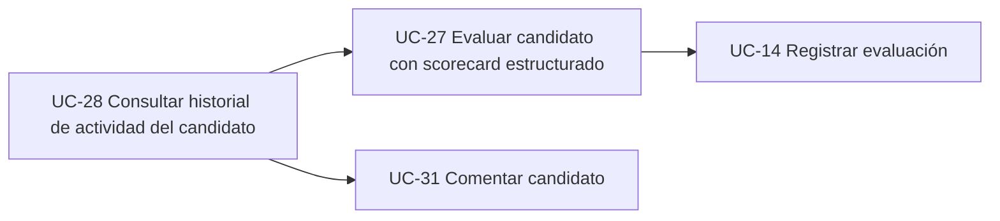
```mermaid
flowchart LR
  UC27[UC-27 Evaluar candidato con scorecard estructurado] --> UC14[UC-14 Registrar evaluación]
  UC28[UC-28 Consultar historial de actividad del candidato] --> UC27
  UC28 --> UC31[UC-31 Comentar candidato]
```

---

## Colaboración

### UC-31 — Comentar candidato

**Nombre:** Comentar candidato

**Módulo:** Colaboración

**Actor principal:** Recruiter

**Actores secundarios:** HiringManager, Interviewer, Sistema

**Precondiciones:**

* El candidato o postulación existe.
* El actor tiene permisos para colaborar sobre el registro.

**Flujo principal:**

1. El Recruiter accede al detalle del candidato o de la postulación.
2. El Recruiter abre la sección de comentarios.
3. El Recruiter redacta un comentario.
4. El Recruiter envía el comentario.
5. El sistema almacena el comentario y lo asocia al contexto correspondiente.
6. El sistema actualiza el historial de actividad.

**Flujos alternativos:**

* **A1. En paso 3, el comentario está vacío**

  1. El sistema informa que no es posible enviar un comentario sin contenido.
  2. El Recruiter corrige el contenido o cancela.

**Postcondiciones:**

* El comentario queda disponible para usuarios autorizados.

**Reglas de negocio:**

* Todo comentario debe quedar asociado a un candidato o a una postulación.
* Los comentarios pueden tener visibilidad interna, nunca hacia Candidate en este alcance.
* El autor y la fecha del comentario son obligatorios e inmutables.

**Impacto en modelo de datos:**

* **Entidades afectadas:** `Candidate`, `Application`
* **Campos nuevos/modificados:** N/A
* **Entidades nuevas si aplica:** `Comment`

**Prioridad:** Alta — habilita colaboración centralizada sin depender de canales externos.

**Dependencias:** UC-05, UC-07

---

### UC-32 — Mencionar colaborador en comentario

**Nombre:** Mencionar colaborador en comentario

**Módulo:** Colaboración

**Actor principal:** Recruiter

**Actores secundarios:** HiringManager, Interviewer, Sistema

**Precondiciones:**

* Existe un comentario nuevo o editable antes de envío.
* El actor tiene permisos para interactuar con usuarios del tenant.

**Flujo principal:**

1. El Recruiter redacta un comentario en el contexto de un candidato o postulación.
2. El Recruiter menciona a uno o más colaboradores.
3. El sistema identifica y valida los usuarios mencionados.
4. El Recruiter envía el comentario.
5. El sistema registra las menciones asociadas al comentario.
6. El sistema deja disponible la referencia para atención del colaborador mencionado.

**Flujos alternativos:**

* **A1. En paso 3, uno de los usuarios mencionados no es válido**

  1. El sistema informa que la mención no puede procesarse.
  2. El Recruiter corrige la mención antes de enviar.

**Postcondiciones:**

* El comentario queda publicado con sus menciones válidas asociadas.

**Reglas de negocio:**

* Solo pueden mencionarse usuarios activos del mismo tenant.
* Una mención no crea por sí sola una asignación formal, salvo regla adicional.
* Las menciones deben quedar trazadas individualmente.

**Impacto en modelo de datos:**

* **Entidades afectadas:** `Comment`, `User`
* **Campos nuevos/modificados:** N/A
* **Entidades nuevas si aplica:** `CommentMention`

**Prioridad:** Alta — mejora coordinación puntual entre recruiter y manager con bajo esfuerzo.

**Dependencias:** UC-31

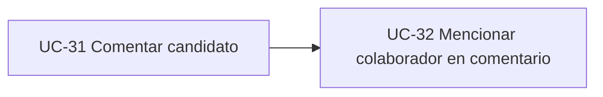
```mermaid
flowchart LR
  UC31[UC-31 Comentar candidato] --> UC32[UC-32 Mencionar colaborador en comentario]
```

---

## Automatización

### UC-30 — Configurar regla de automatización

**Nombre:** Configurar regla de automatización

**Módulo:** Automatización

**Actor principal:** Admin

**Actores secundarios:** Sistema, Recruiter

**Precondiciones:**

* El actor tiene permisos administrativos.
* El tenant tiene habilitado el módulo de automatización.

**Flujo principal:**

1. El Admin accede a la sección de automatizaciones.
2. El Admin crea una nueva regla.
3. El sistema solicita evento disparador, condiciones y acción.
4. El Admin define la regla y su alcance.
5. El Admin activa o guarda la regla.
6. El sistema valida consistencia de la configuración.
7. El sistema deja la regla disponible para ejecución futura.

**Flujos alternativos:**

* **A1. En paso 6, la regla es inconsistente**

  1. El sistema informa el conflicto de validación.
  2. El Admin corrige la configuración antes de guardar.

* **A2. En paso 5, el Admin decide guardar sin activar**

  1. El sistema registra la regla en estado inactivo.
  2. La regla no ejecuta acciones hasta ser activada.

**Postcondiciones:**

* La regla queda registrada en estado activo o inactivo.

**Reglas de negocio:**

* Toda regla debe definir un disparador, al menos una condición opcional y una acción.
* Una regla inactiva no debe ejecutarse.
* Las reglas no pueden afectar datos de otros tenants.
* Las reglas deben respetar permisos y estados permitidos del flujo de negocio.

**Impacto en modelo de datos:**

* **Entidades afectadas:** N/A del núcleo operativo
* **Campos nuevos/modificados:** N/A
* **Entidades nuevas si aplica:** `AutomationRule`, `AutomationCondition`, `AutomationAction`

**Prioridad:** Alta — es la base habilitadora de varias eficiencias del siguiente ciclo.

**Dependencias:** UC-18

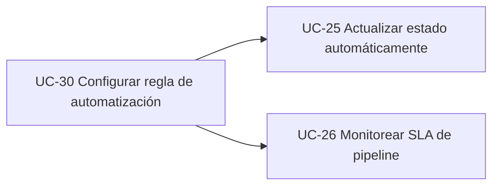
```mermaid
flowchart LR
  UC30[UC-30 Configurar regla de automatización] --> UC25[UC-25 Actualizar estado automáticamente]
  UC30 --> UC26[UC-26 Monitorear SLA de pipeline]
```

---

## Asistencia IA

### UC-29 — Resumir CV automáticamente

**Nombre:** Resumir CV automáticamente

**Módulo:** Asistencia IA

**Actor principal:** Sistema

**Actores secundarios:** Recruiter, Asistencia IA

**Precondiciones:**

* El candidato tiene CV o documento procesable asociado.
* La funcionalidad IA está habilitada para el tenant.
* El documento es legible por el sistema.

**Flujo principal:**

1. El sistema detecta un CV nuevo o solicita procesamiento sobre uno existente.
2. El sistema obtiene la información relevante del documento.
3. La asistencia IA genera un resumen del perfil del candidato.
4. El sistema guarda el resumen asociado al candidato.
5. El Recruiter consulta el resumen desde la vista del candidato.

**Flujos alternativos:**

* **A1. En paso 2, el documento no puede procesarse**

  1. El sistema informa que no fue posible generar el resumen.
  2. El Recruiter puede continuar con revisión manual.

**Postcondiciones:**

* El candidato queda con resumen generado, cuando el procesamiento es exitoso.

**Reglas de negocio:**

* El resumen IA debe identificarse como sugerencia y no como verdad absoluta.
* El resultado debe poder regenerarse si el CV cambia.
* La ausencia de resumen no impide continuar el flujo principal del ATS.

**Impacto en modelo de datos:**

* **Entidades afectadas:** `Candidate`, `Attachment`
* **Campos nuevos/modificados:** `Candidate.ai_summary`, `Candidate.ai_summary_status`, `Candidate.ai_summary_updated_at`
* **Entidades nuevas si aplica:** `AIProcessingLog`

**Prioridad:** Alta — reduce tiempo de lectura y acelera el screening inicial.

**Dependencias:** UC-05

---

### UC-33 — Generar preguntas de entrevista por IA

**Nombre:** Generar preguntas de entrevista por IA

**Módulo:** Asistencia IA

**Actor principal:** Interviewer

**Actores secundarios:** Recruiter, Sistema, Asistencia IA

**Precondiciones:**

* Existe una entrevista planificada o en preparación.
* El candidato y la vacante tienen información suficiente.
* La asistencia IA está habilitada para el tenant.

**Flujo principal:**

1. El Interviewer accede a la entrevista o postulación.
2. El Interviewer solicita preguntas sugeridas.
3. El sistema reúne la información relevante del candidato y de la vacante.
4. La asistencia IA propone preguntas alineadas al contexto.
5. El sistema presenta las preguntas sugeridas al Interviewer.
6. El Interviewer selecciona o ajusta las preguntas a utilizar.

**Flujos alternativos:**

* **A1. En paso 3, la información es insuficiente**

  1. El sistema informa que no puede generar sugerencias contextualizadas.
  2. El Interviewer puede continuar sin apoyo IA.

**Postcondiciones:**

* Las preguntas sugeridas quedan disponibles para consulta o uso en la entrevista.

**Reglas de negocio:**

* Las preguntas sugeridas no reemplazan la decisión del entrevistador.
* Debe ser posible distinguir entre preguntas sugeridas y preguntas finales adoptadas.
* El contenido generado debe limitarse al contexto de vacante y perfil disponibles.

**Impacto en modelo de datos:**

* **Entidades afectadas:** `Interview`, `Candidate`, `JobOpening`
* **Campos nuevos/modificados:** `Interview.ai_question_set`, `Interview.ai_question_generated_at`
* **Entidades nuevas si aplica:** `AIQuestionSet`

**Prioridad:** Media — aporta valor claro, aunque su dependencia operativa es menor que ranking o resumen.

**Dependencias:** UC-12, UC-29

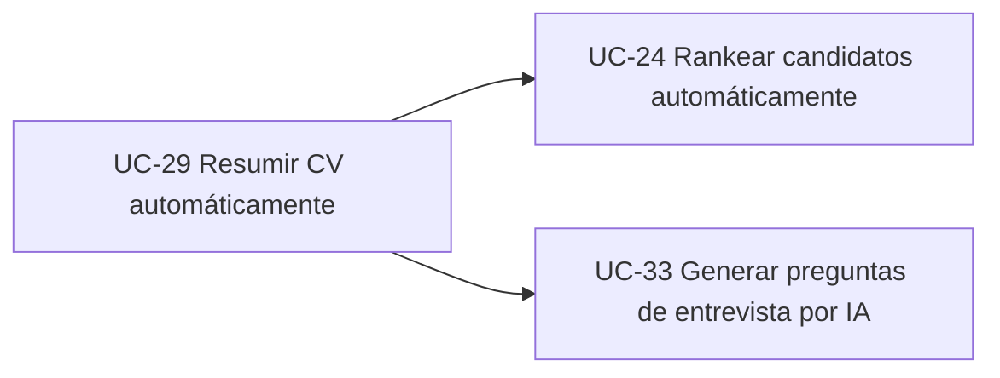
```mermaid
flowchart LR
  UC29[UC-29 Resumir CV automáticamente] --> UC24[UC-24 Rankear candidatos automáticamente]
  UC29 --> UC33[UC-33 Generar preguntas de entrevista por IA]
```

---

# Matriz de trazabilidad

| UC ID | Nombre                                          | Módulo                 | Actor         | Prioridad | Funcionalidad origen               |
| ----- | ----------------------------------------------- | ---------------------- | ------------- | --------- | ---------------------------------- |
| UC-21 | Visualizar resumen de candidato                 | Gestión de Candidatos  | Recruiter     | Alta      | Eficiencia para HR                 |
| UC-22 | Ejecutar acciones masivas sobre candidatos      | Gestión de Candidatos  | Recruiter     | Alta      | Eficiencia para HR                 |
| UC-23 | Guardar filtro de búsqueda de candidatos        | Gestión de Candidatos  | Recruiter     | Media     | Eficiencia para HR                 |
| UC-24 | Rankear candidatos automáticamente              | Pipeline y Seguimiento | Recruiter     | Alta      | Eficiencia para HR / Asistencia IA |
| UC-25 | Actualizar estado de candidatos automáticamente | Pipeline y Seguimiento | Sistema       | Alta      | Automatizaciones                   |
| UC-26 | Monitorear SLA de pipeline                      | Pipeline y Seguimiento | Recruiter     | Media     | Automatizaciones                   |
| UC-27 | Evaluar candidato con scorecard estructurado    | Evaluación             | Interviewer   | Alta      | Colaboración en tiempo real        |
| UC-28 | Consultar historial de actividad del candidato  | Evaluación             | HiringManager | Media     | Colaboración en tiempo real        |
| UC-29 | Resumir CV automáticamente                      | Asistencia IA          | Sistema       | Alta      | Asistencia de IA                   |
| UC-30 | Configurar regla de automatización              | Automatización         | Admin         | Alta      | Automatizaciones                   |
| UC-31 | Comentar candidato                              | Colaboración           | Recruiter     | Alta      | Colaboración en tiempo real        |
| UC-32 | Mencionar colaborador en comentario             | Colaboración           | Recruiter     | Alta      | Colaboración en tiempo real        |
| UC-33 | Generar preguntas de entrevista por IA          | Asistencia IA          | Interviewer   | Media     | Asistencia de IA                   |

# Recomendación de implementación inicial

Las **3 funcionalidades de mayor impacto para implementar primero** serían:

1. **UC-21 + UC-22 + UC-24** como paquete de eficiencia de screening
   Porque reducen tiempo de revisión, priorizan mejor y mejoran throughput del recruiter.

2. **UC-31 + UC-32 + UC-27** como paquete de colaboración y evaluación
   Porque centralizan feedback y mejoran calidad de decisión.

3. **UC-30 + UC-25** como base de automatización
   Porque habilitan escalabilidad operativa y reducen trabajo repetitivo.
---

### Resumen de alcance MVP

#### Prioridad Alta

* Crear Vacante
* Editar Vacante
* Cerrar Vacante
* Postular a Vacante
* Registrar Candidato Manualmente
* Consultar Perfil de Candidato
* Buscar Candidato
* Visualizar Pipeline de Vacante
* Mover Candidato de Etapa
* Descartar Candidato
* Marcar Candidato como Contratado
* Registrar Feedback de Candidato
* Registrar Evaluación de Entrevista
* Enviar Comunicación al Candidato
* Gestionar Usuarios
* Asignar Roles y Permisos Básicos

### Diagramas UML de Casos de Uso

#### Gestión de Vacantes

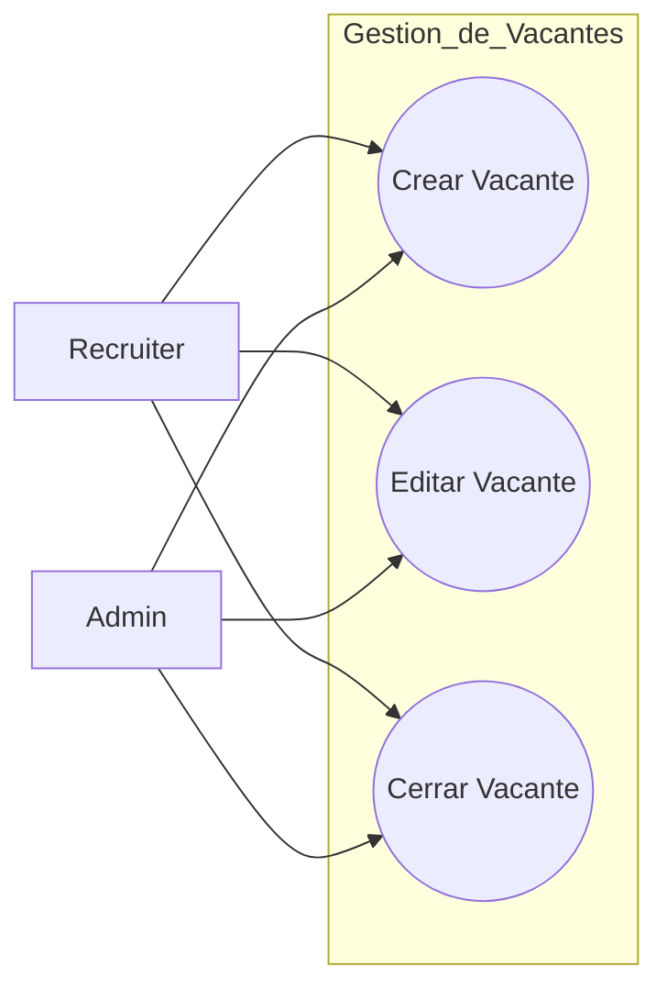
```mermaid
flowchart LR
    %% Módulo: Gestión de Vacantes
    Recruiter[Recruiter]
    Admin[Admin]

    subgraph Gestion_de_Vacantes
        UC1((Crear Vacante))
        UC2((Editar Vacante))
        UC3((Cerrar Vacante))
    end

    Recruiter --> UC1
    Recruiter --> UC2
    Recruiter --> UC3

    Admin --> UC1
    Admin --> UC2
    Admin --> UC3
```

#### Captura de Datos

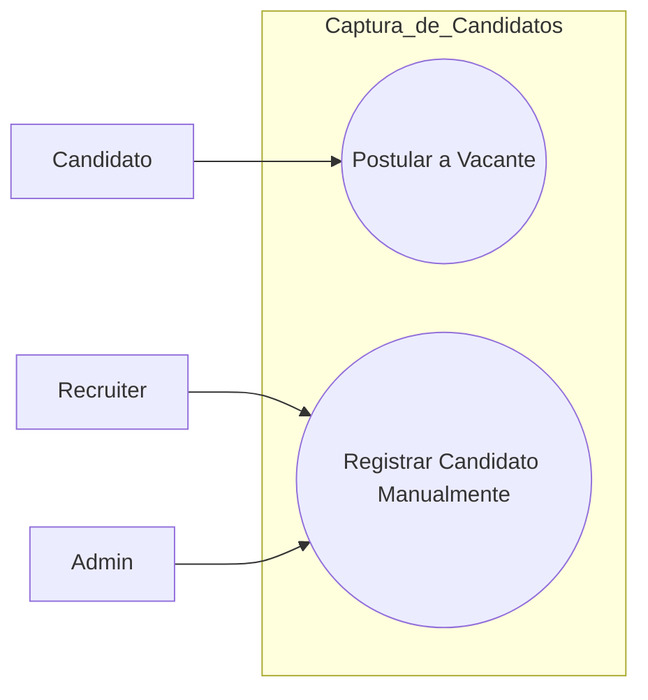
```mermaid
flowchart LR
    %% Módulo: Captura de Candidatos
    Candidato[Candidato]
    Recruiter[Recruiter]
    Admin[Admin]

    subgraph Captura_de_Candidatos
        UC4((Postular a Vacante))
        UC5((Registrar Candidato Manualmente))
    end

    Candidato --> UC4
    Recruiter --> UC5
    Admin --> UC5
```

#### Gestión de Candidatos

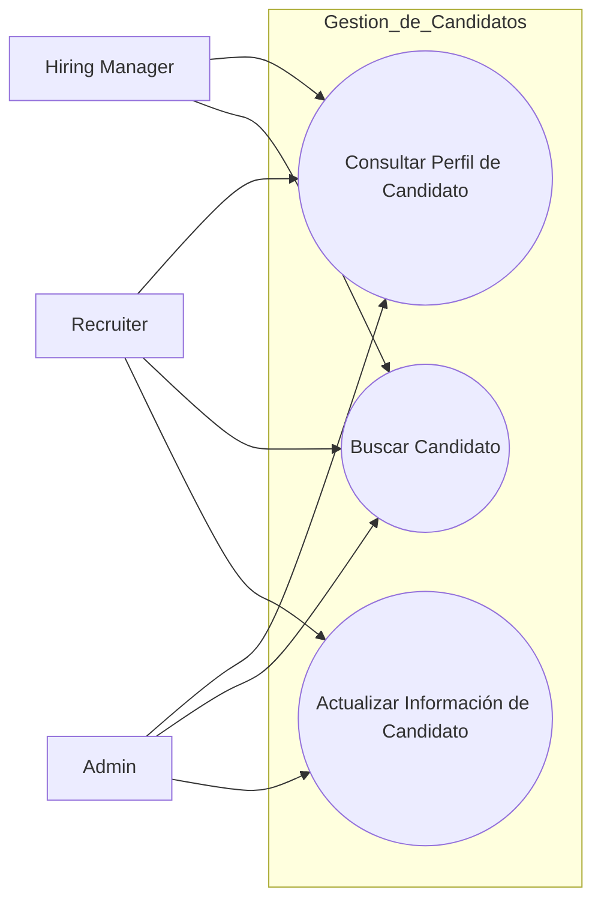
```mermaid
flowchart LR
    %% Módulo: Gestión de Candidatos
    Recruiter[Recruiter]
    HiringManager[Hiring Manager]
    Admin[Admin]

    subgraph Gestion_de_Candidatos
        UC6((Consultar Perfil de Candidato))
        UC7((Buscar Candidato))
        UC8((Actualizar Información de Candidato))
    end

    Recruiter --> UC6
    Recruiter --> UC7
    Recruiter --> UC8

    HiringManager --> UC6
    HiringManager --> UC7

    Admin --> UC6
    Admin --> UC7
    Admin --> UC8
```

#### Pipeline de Reclutamiento

```mermaid
flowchart LR
    %% Módulo: Gestión de Candidatos
    Recruiter[Recruiter]
    HiringManager[Hiring Manager]
    Admin[Admin]

    subgraph Gestion_de_Candidatos
        UC6((Consultar Perfil de Candidato))
        UC7((Buscar Candidato))
        UC8((Actualizar Información de Candidato))
    end

    Recruiter --> UC6
    Recruiter --> UC7
    Recruiter --> UC8

    HiringManager --> UC6
    HiringManager --> UC7

    Admin --> UC6
    Admin --> UC7
    Admin --> UC8
```

#### Evaluación y Colaboración

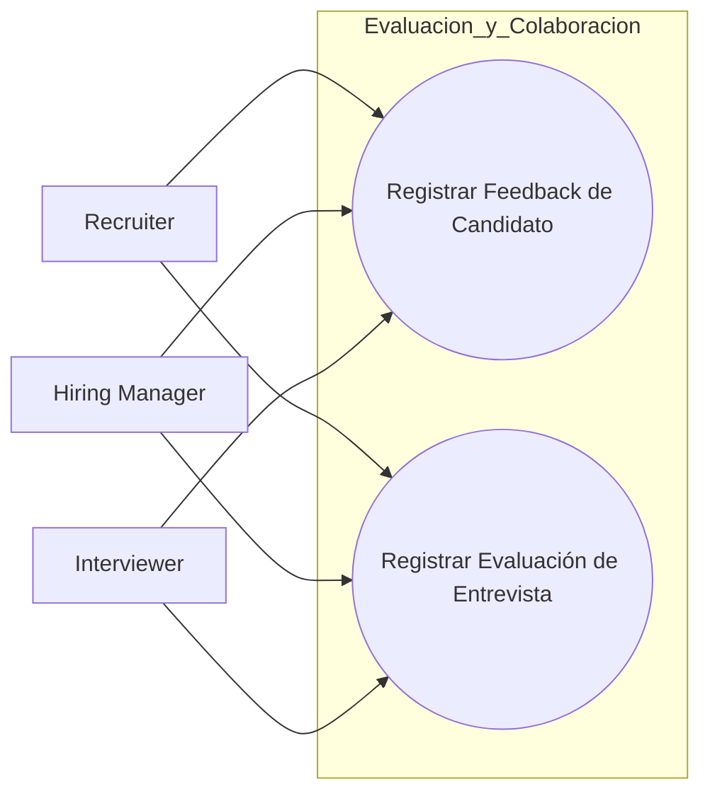
```mermaid
flowchart LR
    %% Módulo: Evaluación y Colaboración
    Recruiter[Recruiter]
    HiringManager[Hiring Manager]
    Interviewer[Interviewer]

    subgraph Evaluacion_y_Colaboracion
        UC13((Registrar Feedback de Candidato))
        UC14((Registrar Evaluación de Entrevista))
    end

    Recruiter --> UC13
    Recruiter --> UC14

    HiringManager --> UC13
    HiringManager --> UC14

    Interviewer --> UC13
    Interviewer --> UC14
```

#### Comunicación Operativa

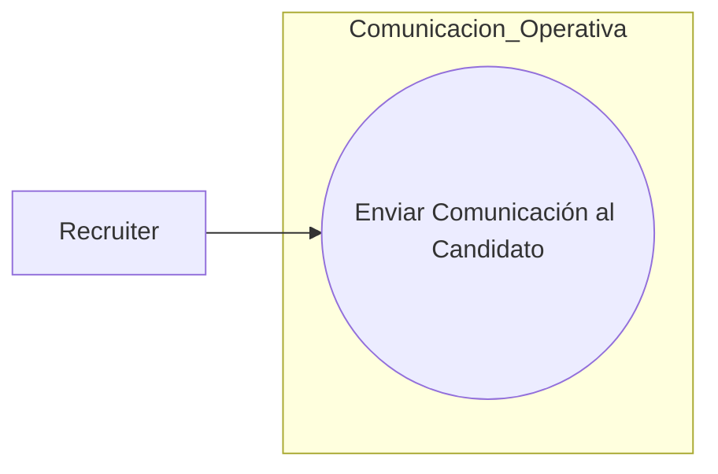
```mermaid
flowchart LR
    %% Módulo: Comunicación Operativa
    Recruiter[Recruiter]

    subgraph Comunicacion_Operativa
        UC15((Enviar Comunicación al Candidato))
    end

    Recruiter --> UC15
```

#### Administración Básica

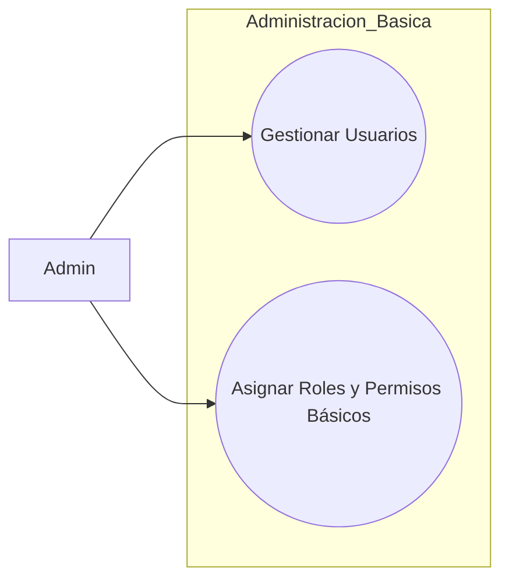
```mermaid
flowchart LR
    %% Módulo: Administración Básica
    Admin[Admin]

    subgraph Administracion_Basica
        UC16((Gestionar Usuarios))
        UC17((Asignar Roles y Permisos Básicos))
    end

    Admin --> UC16
    Admin --> UC17
```

---

## Modelo de Datos

> Fuente: 4-Data-Model.md

### Entidades principales del Modelo de Datos — ATS MVP (Versión inicial)

#### 1. Company

* **Descripción:** Representa a la organización cliente que utiliza el ATS. Actúa como límite de tenant en un modelo SaaS B2B.
* **Atributos clave:**

  * `id: UUID`
  * `name: string`
  * `slug: string`
  * `status: enum(Active, Inactive)`
  * `createdAt: datetime`
* **Relaciones principales:**

  * `Company 1 : N User`
  * `Company 1 : N JobOpening`
  * `Company 1 : N Candidate`
  * `Company 1 : N PipelineTemplate`
* **Reglas de negocio:**

  * El `slug` debe ser único por sistema.
  * Ninguna entidad operativa debe existir fuera de una `Company`.
  * Una `Company` inactiva no puede crear nuevas vacantes.

---

#### 2. User

* **Descripción:** Representa a un usuario interno autenticado del ATS, como recruiter, admin o hiring manager. Participa en operación, evaluación y comunicación.
* **Atributos clave:**

  * `id: UUID`
  * `companyId: UUID`
  * `fullName: string`
  * `email: string`
  * `role: enum(Admin, Recruiter, HiringManager, Interviewer)`
  * `status: enum(Active, Inactive)`
  * `createdAt: datetime`
* **Relaciones principales:**

  * `User N : 1 Company`
  * `User 1 : N JobOpening` (createdBy / ownedBy)
  * `User 1 : N Evaluation`
  * `User 1 : N Note`
  * `User 1 : N Communication`
* **Reglas de negocio:**

  * El `email` debe ser único dentro de una `Company`.
  * Solo usuarios activos pueden operar en el sistema.
  * El `role` determina permisos funcionales, no solo visibilidad.

---

#### 3. Candidate

* **Descripción:** Representa a una persona postulante dentro del ATS. Es un Aggregate Root reutilizable entre múltiples vacantes.
* **Atributos clave:**

  * `id: UUID`
  * `companyId: UUID`
  * `firstName: string`
  * `lastName: string`
  * `email: string`
  * `phone: string?`
  * `currentLocation: string?`
  * `resumeUrl: string?`
  * `createdAt: datetime`
* **Relaciones principales:**

  * `Candidate N : 1 Company`
  * `Candidate 1 : N Application`
  * `Candidate 1 : N Note`
  * `Candidate 1 : N Communication`
* **Reglas de negocio:**

  * Debe existir al menos un identificador de contacto principal, preferiblemente `email`.
  * Un candidato puede postular a múltiples vacantes.
  * El perfil del candidato no debe depender de una vacante específica.

---

#### 4. JobOpening

* **Descripción:** Representa una vacante abierta o cerrada dentro de la empresa. Es el Aggregate Root del proceso de reclutamiento por posición.
* **Atributos clave:**

  * `id: UUID`
  * `companyId: UUID`
  * `title: string`
  * `department: string?`
  * `location: string?`
  * `workMode: enum(Onsite, Hybrid, Remote)?`
  * `description: text`
  * `status: enum(Draft, Open, Closed)`
  * `createdByUserId: UUID`
  * `createdAt: datetime`
  * `closedAt: datetime?`
* **Relaciones principales:**

  * `JobOpening N : 1 Company`
  * `JobOpening N : 1 User` (createdBy)
  * `JobOpening 1 : N Application`
  * `JobOpening 1 : 1 PipelineTemplate` o `N : 1 PipelineTemplate`
* **Reglas de negocio:**

  * Solo vacantes en estado `Open` aceptan nuevas postulaciones.
  * Una vacante cerrada conserva historial pero no admite cambios operativos críticos.
  * Toda vacante debe estar asociada a un pipeline válido.

---

#### 5. PipelineTemplate

* **Descripción:** Define la estructura de etapas que usará una vacante. Permite estandarizar el flujo sin acoplarlo directamente a una sola postulación.
* **Atributos clave:**

  * `id: UUID`
  * `companyId: UUID`
  * `name: string`
  * `isDefault: boolean`
  * `createdAt: datetime`
* **Relaciones principales:**

  * `PipelineTemplate N : 1 Company`
  * `PipelineTemplate 1 : N PipelineStage`
  * `PipelineTemplate 1 : N JobOpening`
* **Reglas de negocio:**

  * Una empresa puede tener varios templates, pero solo uno por defecto.
  * Un template debe tener al menos una etapa.
  * El orden de etapas debe ser determinístico.

---

#### 6. PipelineStage

* **Descripción:** Representa una etapa definida dentro de un pipeline, como Applied, Screening o Interview. Funciona como entidad de referencia para ubicar cada aplicación.
* **Atributos clave:**

  * `id: UUID`
  * `pipelineTemplateId: UUID`
  * `name: string`
  * `sequence: integer`
  * `stageType: enum(Active, Rejected, Hired)`
* **Relaciones principales:**

  * `PipelineStage N : 1 PipelineTemplate`
  * `PipelineStage 1 : N Application`
* **Reglas de negocio:**

  * `sequence` debe ser único dentro de un `PipelineTemplate`.
  * Solo puede existir una etapa terminal de tipo `Hired` por pipeline.
  * Las etapas terminales no deben permitir movimiento posterior, salvo permiso explícito.

---

#### 7. Application

* **Descripción:** Representa la postulación de un candidato a una vacante específica. Es la entidad central para responder en qué etapa está cada candidato por vacante.
* **Atributos clave:**

  * `id: UUID`
  * `companyId: UUID`
  * `candidateId: UUID`
  * `jobOpeningId: UUID`
  * `currentStageId: UUID`
  * `status: enum(Active, Rejected, Hired, Withdrawn)`
  * `appliedAt: datetime`
  * `source: string?`
  * `rejectionReason: string?`
* **Relaciones principales:**

  * `Application N : 1 Company`
  * `Application N : 1 Candidate`
  * `Application N : 1 JobOpening`
  * `Application N : 1 PipelineStage` (currentStage)
  * `Application 1 : N StageTransition`
  * `Application 1 : N Evaluation`
  * `Application 1 : N Note`
  * `Application 1 : N Communication`
* **Reglas de negocio:**

  * Debe existir una sola `Application` activa por combinación `Candidate + JobOpening`.
  * Toda aplicación debe tener una etapa actual válida.
  * El `status` debe ser consistente con la naturaleza de `currentStageId`.

---

#### 8. StageTransition

* **Descripción:** Registra el historial de movimientos de una aplicación entre etapas. Permite trazabilidad operativa y auditoría básica del pipeline.
* **Atributos clave:**

  * `id: UUID`
  * `applicationId: UUID`
  * `fromStageId: UUID?`
  * `toStageId: UUID`
  * `changedByUserId: UUID`
  * `changedAt: datetime`
  * `comment: string?`
* **Relaciones principales:**

  * `StageTransition N : 1 Application`
  * `StageTransition N : 1 User` (changedBy)
  * `StageTransition N : 1 PipelineStage` (fromStage)
  * `StageTransition N : 1 PipelineStage` (toStage)
* **Reglas de negocio:**

  * Toda transición debe apuntar a una etapa perteneciente al pipeline de la vacante.
  * La primera transición puede tener `fromStageId = null`.
  * `changedAt` debe reflejar orden cronológico consistente por aplicación.

---

#### 9. Evaluation

* **Descripción:** Representa una valoración formal de un candidato dentro de una postulación. Captura quién evaluó, cuándo y con qué resultado.
* **Atributos clave:**

  * `id: UUID`
  * `applicationId: UUID`
  * `evaluatorUserId: UUID`
  * `stageId: UUID?`
  * `score: decimal?`
  * `recommendation: enum(StrongNo, No, Yes, StrongYes)`
  * `summary: text?`
  * `createdAt: datetime`
* **Relaciones principales:**

  * `Evaluation N : 1 Application`
  * `Evaluation N : 1 User` (evaluator)
  * `Evaluation N : 1 PipelineStage`
* **Reglas de negocio:**

  * Solo usuarios internos autorizados pueden emitir evaluaciones.
  * Una evaluación debe asociarse a una aplicación existente.
  * `recommendation` no puede quedar vacía si la evaluación se marca como completada.

---

#### 10. Note

* **Descripción:** Representa un comentario interno no visible al candidato. Sirve para colaboración contextual durante el proceso.
* **Atributos clave:**

  * `id: UUID`
  * `applicationId: UUID?`
  * `candidateId: UUID?`
  * `authorUserId: UUID`
  * `content: text`
  * `createdAt: datetime`
* **Relaciones principales:**

  * `Note N : 1 User` (author)
  * `Note N : 1 Candidate`
  * `Note N : 1 Application`
* **Reglas de negocio:**

  * Una nota debe asociarse al menos a `Candidate` o `Application`.
  * Las notas son siempre internas.
  * No deben eliminarse físicamente si afectan trazabilidad; preferible soft delete futuro.

---

#### 11. Communication

* **Descripción:** Registra cada comunicación enviada al candidato desde el ATS. Permite responder qué mensajes se enviaron y cuándo.
* **Atributos clave:**

  * `id: UUID`
  * `applicationId: UUID`
  * `candidateId: UUID`
  * `sentByUserId: UUID`
  * `channel: enum(Email)`
  * `subject: string`
  * `body: text`
  * `status: enum(Pending, Sent, Failed)`
  * `sentAt: datetime?`
  * `createdAt: datetime`
* **Relaciones principales:**

  * `Communication N : 1 Application`
  * `Communication N : 1 Candidate`
  * `Communication N : 1 User` (sentBy)
* **Reglas de negocio:**

  * Toda comunicación debe estar vinculada a una aplicación.
  * Solo comunicaciones con `status = Sent` deben tener `sentAt`.
  * El candidato asociado debe coincidir con el candidato de la aplicación.

---

#### 12. Role

* **Descripción:** Representa un rol de autorización del sistema. En MVP puede operar como catálogo simple para controlar acceso funcional.
* **Atributos clave:**

  * `id: UUID`
  * `name: string`
  * `code: string`
  * `createdAt: datetime`
* **Relaciones principales:**

  * `Role 1 : N User`
* **Reglas de negocio:**

  * `code` debe ser único por sistema o por tenant, según estrategia.
  * Un usuario debe tener un único rol principal en MVP.
  * Los permisos efectivos derivan del rol asignado.

---

### Value Objects sugeridos

#### 13. PersonName *(Value Object)*

* **Descripción:** Encapsula la representación del nombre de una persona. Evita dispersar reglas de formato en múltiples entidades.
* **Atributos clave:**

  * `firstName: string`
  * `lastName: string`
* **Relaciones principales:**

  * Embebido en `Candidate`
  * Embebido en `User`
* **Reglas de negocio:**

  * No debe existir vacío en ambas partes.
  * Debe persistirse normalizado para búsqueda y visualización.

#### 14. EmailAddress *(Value Object)*

* **Descripción:** Representa una dirección de correo validada. Centraliza reglas de formato y comparación.
* **Atributos clave:**

  * `value: string`
* **Relaciones principales:**

  * Embebido en `Candidate`
  * Embebido en `User`
* **Reglas de negocio:**

  * Debe almacenarse en formato normalizado.
  * Debe cumplir validación sintáctica antes de persistencia.

---

### Aggregate Roots recomendados

* **Company** → raíz del tenant
* **JobOpening** → raíz del proceso por vacante
* **Candidate** → raíz del perfil de postulante
* **Application** → raíz transaccional del vínculo Candidate-Vacante

---

### Decisiones de modelado clave (versión inicial)

#### 1. Etapa por candidato y vacante

La pregunta **"¿En qué etapa está cada candidato por vacante?"** se responde desde `Application.currentStageId`, respaldado por `StageTransition` para historial.

#### 2. Quién evaluó a quién y con qué resultado

La pregunta **"¿Quién evaluó a quién y con qué resultado?"** se responde desde `Evaluation`, relacionando:

* `evaluatorUserId`
* `applicationId`
* `score`
* `recommendation`

#### 3. Qué comunicaciones se enviaron y cuándo

La pregunta **"¿Qué comunicaciones se enviaron y cuándo?"** se responde desde `Communication`, usando:

* `applicationId`
* `candidateId`
* `channel`
* `status`
* `sentAt`

---

### Alcance MVP mínimo recomendado (versión inicial)

#### Core obligatorio

* Company
* User
* Role
* Candidate
* JobOpening
* PipelineTemplate
* PipelineStage
* Application
* StageTransition
* Evaluation
* Note
* Communication

#### Value Objects útiles desde el inicio

* PersonName
* EmailAddress

---

### Modelo de Datos — ATS MVP (Versión refinada Claude Sonnet 4.6)

#### Cambios aplicados al modelo original

Antes de las entidades, un resumen de las 5 modificaciones incorporadas:

**Cambio 1 — `Application.currentStageId` desnormalizado con regla explícita**
El campo existía pero sin ninguna regla de sincronización documentada. Se añade `stageUpdatedAt` y se establece como invariante que `currentStageId` debe actualizarse en la misma transacción que el `INSERT` a `StageTransition`. Esto evita desincronización en escrituras concurrentes.

**Cambio 2 — `Note` sin polimorfismo implícito**
El modelo original tenía `applicationId?: UUID` y `candidateId?: UUID` con la regla "al menos uno no null", lo cual no es constrainteable en base de datos relacional. Se reemplaza por `contextType: enum(Application, Candidate)` + `contextId: UUID`, patrón polimórfico explícito que sí admite `NOT NULL` y permite índices eficientes.

**Cambio 3 — Entidad `Role` eliminada, consolidada en enum de `User`**
El modelo tenía `User.role: enum` y además una entidad `Role` separada con su propia tabla, lo cual era una contradicción. Para MVP el enum es suficiente. La entidad `Role` queda documentada como deuda técnica para cuando se necesiten permisos granulares dinámicos.

**Cambio 4 — `Communication` con `scheduledAt` y alcance de canal documentado**
Se añade `scheduledAt: datetime?` para distinguir entre envío inmediato y programado. Se documenta explícitamente que `channel: enum(Email)` solo implementa `Email` en MVP, bloqueando sobrediseño prematuro en la capa de envío.

**Cambio 5 — `PipelineTemplate` con patrón snapshot al crear vacante**
El modelo original referenciaba el template vivo desde `JobOpening`, lo que significa que modificar un template afectaría vacantes ya abiertas. Se introduce el patrón snapshot: al crear una `JobOpening`, las etapas del template se copian como registros independientes con `jobOpeningId`. El campo `sourceTemplateId` queda solo como referencia de origen, sin acoplamiento operativo.

---

#### Entidades (versión refinada)

---

##### 1. Company

Representa a la organización cliente que utiliza el ATS. Actúa como límite de tenant en un modelo SaaS B2B.

| Atributo | Tipo | Notas |
|---|---|---|
| `id` | UUID | PK |
| `name` | string | |
| `slug` | string | único por sistema |
| `status` | enum(Active, Inactive) | |
| `createdAt` | datetime | |

**Relaciones**

- `Company 1 : N User`
- `Company 1 : N JobOpening`
- `Company 1 : N Candidate`
- `Company 1 : N PipelineTemplate`

**Reglas de negocio**

- El `slug` debe ser único por sistema.
- Ninguna entidad operativa puede existir fuera de una `Company`.
- Una `Company` inactiva no puede crear nuevas vacantes.

**Clasificación DDD:** Aggregate Root (raíz del tenant)

---

##### 2. User

Representa a un usuario interno autenticado del ATS. Participa en operación, evaluación y comunicación.

| Atributo | Tipo | Notas |
|---|---|---|
| `id` | UUID | PK |
| `companyId` | UUID | FK → Company |
| `fullName` | string | Ver Value Object `PersonName` |
| `email` | string | Ver Value Object `EmailAddress` |
| `role` | enum(Admin, Recruiter, HiringManager, Interviewer) | ⚠️ Cambio 3: único campo de rol, entidad `Role` eliminada en MVP |
| `status` | enum(Active, Inactive) | |
| `createdAt` | datetime | |

**Relaciones**

- `User N : 1 Company`
- `User 1 : N JobOpening` (createdBy)
- `User 1 : N Evaluation`
- `User 1 : N Note`
- `User 1 : N Communication`

**Reglas de negocio**

- El `email` debe ser único dentro de una `Company`.
- Solo usuarios con `status = Active` pueden operar en el sistema.
- El `role` determina permisos funcionales, no solo visibilidad.

**Deuda técnica documentada:** La entidad `Role` separada tiene sentido cuando se necesiten permisos granulares dinámicos (post-MVP).

**Clasificación DDD:** Entity

---

##### 3. Candidate

Representa a una persona postulante. Es un Aggregate Root reutilizable entre múltiples vacantes.

| Atributo | Tipo | Notas |
|---|---|---|
| `id` | UUID | PK |
| `companyId` | UUID | FK → Company |
| `firstName` | string | Ver Value Object `PersonName` |
| `lastName` | string | Ver Value Object `PersonName` |
| `email` | string | Ver Value Object `EmailAddress` |
| `phone` | string? | opcional |
| `currentLocation` | string? | opcional |
| `resumeUrl` | string? | opcional |
| `createdAt` | datetime | |

**Relaciones**

- `Candidate N : 1 Company`
- `Candidate 1 : N Application`
- `Candidate 1 : N Note`
- `Candidate 1 : N Communication`

**Reglas de negocio**

- Debe existir al menos un identificador de contacto principal, preferiblemente `email`.
- Un candidato puede postular a múltiples vacantes.
- El perfil no debe depender de una vacante específica.

**Clasificación DDD:** Aggregate Root

---

##### 4. JobOpening

Representa una vacante abierta o cerrada. Es el Aggregate Root del proceso de reclutamiento por posición.

| Atributo | Tipo | Notas |
|---|---|---|
| `id` | UUID | PK |
| `companyId` | UUID | FK → Company |
| `title` | string | |
| `department` | string? | opcional |
| `location` | string? | opcional |
| `workMode` | enum(Onsite, Hybrid, Remote)? | opcional |
| `description` | text | |
| `status` | enum(Draft, Open, Closed) | |
| `sourceTemplateId` | UUID? | ⚠️ Cambio 5: renombrado de `pipelineTemplateId`. Solo referencia de origen, sin acoplamiento operativo |
| `createdByUserId` | UUID | FK → User |
| `createdAt` | datetime | |
| `closedAt` | datetime? | opcional |

**Relaciones**

- `JobOpening N : 1 Company`
- `JobOpening N : 1 User` (createdBy)
- `JobOpening 1 : N Application`
- `JobOpening 1 : N PipelineStage` ⚠️ Cambio 5: las etapas se copian directamente a la vacante en el momento de creación

**Reglas de negocio**

- Solo vacantes con `status = Open` aceptan nuevas postulaciones.
- Al crear una vacante, se ejecuta un snapshot de las etapas del `PipelineTemplate` seleccionado: se hace `INSERT` de cada `PipelineStage` con `jobOpeningId = this.id`. Desde ese momento, las etapas son independientes del template original.
- Una vacante cerrada conserva historial pero no admite cambios operativos críticos.

**Clasificación DDD:** Aggregate Root

---

##### 5. PipelineTemplate

Define la estructura de etapas reutilizable. Sirve como punto de partida para nuevas vacantes, pero no controla las etapas de vacantes ya creadas.

| Atributo | Tipo | Notas |
|---|---|---|
| `id` | UUID | PK |
| `companyId` | UUID | FK → Company |
| `name` | string | |
| `isDefault` | boolean | |
| `createdAt` | datetime | |

**Relaciones**

- `PipelineTemplate N : 1 Company`
- `PipelineTemplate 1 : N PipelineStage` (etapas del template, no de la vacante)

**Reglas de negocio**

- Una empresa puede tener varios templates pero solo uno `isDefault = true`.
- Un template debe tener al menos una etapa.
- El orden de etapas debe ser determinístico (`sequence`).
- ⚠️ Cambio 5: modificar un template no afecta vacantes ya abiertas. Las etapas de las vacantes son copias independientes.

**Clasificación DDD:** Entity

---

##### 6. PipelineStage

Representa una etapa dentro de un pipeline. En el modelo anterior solo existía vinculada al template. Con el cambio 5, esta entidad sirve tanto para templates como para vacantes concretas, distinguidas por `ownerType`.

| Atributo | Tipo | Notas |
|---|---|---|
| `id` | UUID | PK |
| `ownerType` | enum(Template, JobOpening) | ⚠️ Cambio 5: distingue si la etapa pertenece a un template o a una vacante concreta |
| `ownerId` | UUID | FK → `PipelineTemplate.id` o `JobOpening.id` según `ownerType` |
| `name` | string | |
| `sequence` | integer | orden dentro del pipeline |
| `stageType` | enum(Active, Rejected, Hired) | |

**Relaciones**

- `PipelineStage N : 1 PipelineTemplate` (cuando `ownerType = Template`)
- `PipelineStage N : 1 JobOpening` (cuando `ownerType = JobOpening`)
- `PipelineStage 1 : N Application` (solo las de tipo JobOpening)

**Reglas de negocio**

- `sequence` debe ser único dentro del mismo `ownerId`.
- Solo puede existir una etapa `stageType = Hired` por pipeline.
- Las etapas terminales (`Hired`, `Rejected`) no permiten movimiento posterior salvo permiso explícito.
- Solo las etapas con `ownerType = JobOpening` pueden ser referenciadas por `Application.currentStageId`.

**Clasificación DDD:** Entity

---

##### 7. Application

Representa la postulación de un candidato a una vacante. Es la entidad transaccional central del sistema.

| Atributo | Tipo | Notas |
|---|---|---|
| `id` | UUID | PK |
| `companyId` | UUID | FK → Company |
| `candidateId` | UUID | FK → Candidate |
| `jobOpeningId` | UUID | FK → JobOpening |
| `currentStageId` | UUID | ⚠️ Cambio 1: campo desnormalizado para lectura rápida. Fuente de verdad = último `StageTransition` |
| `stageUpdatedAt` | datetime | ⚠️ Cambio 1: campo nuevo. Se actualiza en la misma tx que `StageTransition` |
| `status` | enum(Active, Rejected, Hired, Withdrawn) | |
| `appliedAt` | datetime | |
| `source` | string? | canal de origen |
| `rejectionReason` | string? | opcional |

**Relaciones**

- `Application N : 1 Company`
- `Application N : 1 Candidate`
- `Application N : 1 JobOpening`
- `Application N : 1 PipelineStage` (currentStage)
- `Application 1 : N StageTransition`
- `Application 1 : N Evaluation`
- `Application 1 : N Note`
- `Application 1 : N Communication`

**Reglas de negocio**

- Debe existir una sola `Application` activa por combinación `Candidate + JobOpening`.
- ⚠️ Cambio 1: `currentStageId` y `stageUpdatedAt` deben actualizarse atómicamente en la misma transacción que el `INSERT` a `StageTransition`. Nunca actualizar uno sin el otro.
- El `status` debe ser consistente con el `stageType` de `currentStageId`.

**Clasificación DDD:** Aggregate Root (raíz transaccional del vínculo Candidate-Vacante)

---

##### 8. StageTransition

Registra el historial de movimientos de una aplicación entre etapas. Fuente de verdad del pipeline.

| Atributo | Tipo | Notas |
|---|---|---|
| `id` | UUID | PK |
| `applicationId` | UUID | FK → Application |
| `fromStageId` | UUID? | null en la primera transición |
| `toStageId` | UUID | FK → PipelineStage |
| `changedByUserId` | UUID | FK → User |
| `changedAt` | datetime | |
| `comment` | string? | opcional |

**Relaciones**

- `StageTransition N : 1 Application`
- `StageTransition N : 1 User` (changedBy)
- `StageTransition N : 1 PipelineStage` (fromStage)
- `StageTransition N : 1 PipelineStage` (toStage)

**Reglas de negocio**

- Toda transición debe apuntar a una etapa perteneciente al `JobOpening` de la aplicación (no a etapas de template).
- La primera transición puede tener `fromStageId = null`.
- `changedAt` debe mantener orden cronológico consistente por aplicación.
- ⚠️ Cambio 1: todo `INSERT` en esta tabla debe ir acompañado de un `UPDATE` a `Application.currentStageId` y `Application.stageUpdatedAt` en la misma transacción.

**Clasificación DDD:** Entity

---

##### 9. Evaluation

Representa una valoración formal de un candidato dentro de una postulación.

| Atributo | Tipo | Notas |
|---|---|---|
| `id` | UUID | PK |
| `applicationId` | UUID | FK → Application |
| `evaluatorUserId` | UUID | FK → User |
| `stageId` | UUID? | etapa en que se realizó la evaluación |
| `score` | decimal? | opcional |
| `recommendation` | enum(StrongNo, No, Yes, StrongYes) | obligatorio si `completedAt` no es null |
| `summary` | text? | opcional |
| `createdAt` | datetime | |
| `completedAt` | datetime? | null = evaluación en borrador |

**Relaciones**

- `Evaluation N : 1 Application`
- `Evaluation N : 1 User` (evaluator)
- `Evaluation N : 1 PipelineStage`

**Reglas de negocio**

- Solo usuarios internos autorizados pueden emitir evaluaciones.
- `recommendation` no puede ser null si `completedAt` tiene valor.
- Una evaluación con `completedAt = null` se considera borrador y no cuenta para decisiones.

**Clasificación DDD:** Entity

---

##### 10. Note

Representa un comentario interno no visible al candidato.

| Atributo | Tipo | Notas |
|---|---|---|
| `id` | UUID | PK |
| `contextType` | enum(Application, Candidate) | ⚠️ Cambio 2: reemplaza los dos FK opcionales del modelo original |
| `contextId` | UUID | ⚠️ Cambio 2: FK hacia `Application.id` o `Candidate.id` según `contextType`. Siempre NOT NULL |
| `authorUserId` | UUID | FK → User |
| `content` | text | |
| `createdAt` | datetime | |

**Relaciones**

- `Note N : 1 User` (author)
- `Note N : 1 Candidate` (cuando `contextType = Candidate`)
- `Note N : 1 Application` (cuando `contextType = Application`)

**Reglas de negocio**

- `contextId` es siempre `NOT NULL`. El tipo de contexto lo determina `contextType`.
- Las notas son siempre internas; nunca visibles al candidato.
- No se eliminan físicamente; se recomienda soft delete para preservar trazabilidad.

**Por qué se cambió:** el patrón anterior con dos FK opcionales no puede expresarse como `NOT NULL` en base de datos, lo que obliga a validar la regla en código. El patrón `contextType + contextId` es un polimorfismo explícito que sí es constrainteable y más eficiente de indexar.

**Clasificación DDD:** Entity

---

##### 11. Communication

Registra cada comunicación enviada al candidato desde el ATS.

| Atributo | Tipo | Notas |
|---|---|---|
| `id` | UUID | PK |
| `applicationId` | UUID | FK → Application |
| `candidateId` | UUID | FK → Candidate |
| `sentByUserId` | UUID | FK → User |
| `channel` | enum(Email) | ⚠️ Cambio 4: MVP implementa solo Email. Enum preparado para extensión futura |
| `subject` | string | |
| `body` | text | |
| `status` | enum(Pending, Sent, Failed) | |
| `scheduledAt` | datetime? | ⚠️ Cambio 4: campo nuevo. Distingue envío inmediato de programado |
| `sentAt` | datetime? | null hasta que `status = Sent` |
| `createdAt` | datetime | |

**Relaciones**

- `Communication N : 1 Application`
- `Communication N : 1 Candidate`
- `Communication N : 1 User` (sentBy)

**Reglas de negocio**

- Toda comunicación debe estar vinculada a una aplicación.
- Solo comunicaciones con `status = Sent` deben tener `sentAt` con valor.
- Si `scheduledAt` tiene valor y `sentAt` es null, la comunicación está pendiente de envío programado.
- El `candidateId` debe coincidir con el candidato de la `Application` referenciada.
- ⚠️ Cambio 4: no implementar canales distintos a `Email` en MVP aunque el enum los permita en el futuro. La capa de envío solo necesita un proveedor de email.

**Clasificación DDD:** Entity

---

#### Value Objects (versión refinada)

##### PersonName

Encapsula la representación del nombre de una persona.

| Atributo | Tipo |
|---|---|
| `firstName` | string |
| `lastName` | string |

Embebido en `Candidate` y `User`. Ninguna de las dos partes puede estar vacía. Se normaliza para búsqueda y visualización.

---

##### EmailAddress

Representa una dirección de correo validada.

| Atributo | Tipo |
|---|---|
| `value` | string |

Embebido en `Candidate` y `User`. Se almacena normalizado (lowercase). Debe pasar validación sintáctica antes de persistencia.

---

#### Aggregate Roots (versión refinada)

| Entidad | Rol |
|---|---|
| `Company` | Raíz del tenant |
| `JobOpening` | Raíz del proceso por vacante |
| `Candidate` | Raíz del perfil de postulante |
| `Application` | Raíz transaccional del vínculo Candidate-Vacante |

---

#### Criterios de éxito del modelo

**¿En qué etapa está cada candidato por vacante?**
`Application.currentStageId` → `PipelineStage.name`. Historial completo en `StageTransition`.

**¿Quién evaluó a quién y con qué resultado?**
`Evaluation.evaluatorUserId` + `Evaluation.applicationId` + `Evaluation.recommendation` + `Evaluation.score`.

**¿Qué comunicaciones se enviaron y cuándo?**
`Communication` filtrado por `applicationId` o `candidateId`, ordenado por `sentAt`. Estado en `Communication.status`.

---

#### Alcance MVP (versión refinada)

##### Core obligatorio
`Company`, `User`, `Candidate`, `JobOpening`, `PipelineTemplate`, `PipelineStage`, `Application`, `StageTransition`, `Evaluation`, `Note`, `Communication`

##### Eliminado del MVP
`Role` como entidad separada — reemplazada por el enum en `User`.

##### Value Objects útiles desde el inicio
`PersonName`, `EmailAddress`

---
## Cambios basado en nuevas funcionalidades
> Fuente: /new-features/3-Data-Model.md
 continuación propongo una **extensión conservadora y retrocompatible** del modelo ATS, manteniendo intactos los contratos base y agregando solo campos y entidades estrictamente necesarios para soportar los nuevos UC de eficiencia HR, colaboración, automatización e IA definidos en tu archivo. La propuesta parte del modelo actual multi-tenant con `Company` como límite de tenant, `Application` como raíz transaccional y `PipelineStage`/`StageTransition` como fuente de verdad del pipeline, además de los nuevos UC 21–33 que piden ranking IA, reglas automáticas, comentarios, menciones, scorecards e historial de actividad. 

---

## Resumen de cambios

| Entidad                 | Tipo de cambio                 | Funcionalidad                                    | Impacto en modelo existente |
| ----------------------- | ------------------------------ | ------------------------------------------------ | --------------------------- |
| Candidate               | Extensión de entidad existente | Eficiencia HR / Asistencia IA                    | Bajo                        |
| Application             | Extensión de entidad existente | Eficiencia HR / Automatizaciones / Asistencia IA | Medio                       |
| PipelineStage           | Extensión de entidad existente | Automatizaciones                                 | Bajo                        |
| Evaluation              | Extensión de entidad existente | Colaboración / Evaluación                        | Medio                       |
| JobOpening              | Extensión de entidad existente | Eficiencia HR                                    | Bajo                        |
| SavedFilter             | Nueva entidad                  | Eficiencia HR                                    | Bajo                        |
| BulkOperation           | Nueva entidad                  | Eficiencia HR                                    | Medio                       |
| BulkOperationItem       | Nueva entidad                  | Eficiencia HR                                    | Bajo                        |
| ActivityEvent           | Nueva entidad                  | Colaboración en tiempo real / Eficiencia HR      | Medio                       |
| CandidateViewEvent      | Nueva entidad                  | Colaboración en tiempo real / Eficiencia HR      | Bajo                        |
| CommentThread           | Nueva entidad                  | Colaboración en tiempo real                      | Bajo                        |
| Comment                 | Nueva entidad                  | Colaboración en tiempo real                      | Medio                       |
| CommentMention          | Nueva entidad                  | Colaboración en tiempo real                      | Bajo                        |
| UserNotification        | Nueva entidad                  | Colaboración en tiempo real                      | Bajo                        |
| AutomationRule          | Nueva entidad                  | Automatizaciones                                 | Medio                       |
| AutomationCondition     | Nueva entidad                  | Automatizaciones                                 | Bajo                        |
| AutomationAction        | Nueva entidad                  | Automatizaciones                                 | Bajo                        |
| AutomationExecution     | Nueva entidad                  | Automatizaciones                                 | Alto                        |
| AutomationExecutionItem | Nueva entidad                  | Automatizaciones                                 | Medio                       |
| SlaPolicy               | Nueva entidad                  | Automatizaciones / Eficiencia HR                 | Medio                       |
| SlaBreachEvent          | Nueva entidad                  | Automatizaciones / Eficiencia HR                 | Bajo                        |
| AiSuggestion            | Nueva entidad                  | Asistencia IA                                    | Alto                        |
| AiGenerationRun         | Nueva entidad                  | Asistencia IA                                    | Medio                       |
| AiSuggestionFeedback    | Nueva entidad                  | Asistencia IA                                    | Bajo                        |
| ScorecardTemplate       | Nueva entidad                  | Colaboración en tiempo real                      | Medio                       |
| ScorecardCriterion      | Nueva entidad                  | Colaboración en tiempo real                      | Bajo                        |
| ScorecardResponse       | Nueva entidad                  | Colaboración en tiempo real                      | Medio                       |
| JsonRuleOperand         | Value Object nuevo             | Automatizaciones                                 | Bajo                        |
| LlmUsage                | Value Object nuevo             | Asistencia IA                                    | Bajo                        |

---

## Extensiones a entidades existentes

### Candidate

| Campo                   | Tipo                                 | Notas                                          |
| ----------------------- | ------------------------------------ | ---------------------------------------------- |
| ⚠️ `profileCompletion`  | integer                              | porcentaje 0–100 para resumen operativo        |
| ⚠️ `lastViewedAt`       | datetime?                            | última visualización por algún usuario interno |
| ⚠️ `aiSummary`          | text?                                | resumen vigente generado por IA                |
| ⚠️ `aiSummaryStatus`    | enum(Pending, Ready, Failed, Stale)? | estado del último resumen IA                   |
| ⚠️ `aiSummaryUpdatedAt` | datetime?                            | marca temporal del último resumen IA           |

**Motivo del cambio:** soportar UC-21 y UC-29 sin depender de joins complejos sobre logs o ejecuciones históricas.

**Compatibilidad:** retrocompatible.
**Migración:** sí, por adición de columnas nullable o con default.

---

### Application

| Campo                  | Tipo                                | Notas                                           |
| ---------------------- | ----------------------------------- | ----------------------------------------------- |
| ⚠️ `lastActivityAt`    | datetime?                           | última actividad relevante sobre la postulación |
| ⚠️ `lastViewedAt`      | datetime?                           | última visualización del detalle de postulación |
| ⚠️ `bulkUpdatedAt`     | datetime?                           | última operación masiva aplicada                |
| ⚠️ `bulkUpdateBatchId` | UUID?                               | referencia lógica a `BulkOperation`             |
| ⚠️ `stageEnteredAt`    | datetime?                           | inicio de permanencia en etapa actual para SLA  |
| ⚠️ `lastStageChangeAt` | datetime?                           | redundancia explícita para queries operativas   |
| ⚠️ `updatedByType`     | enum(User, Automation, AI, System)? | origen de la última actualización relevante     |
| ⚠️ `aiScore`           | decimal?                            | score vigente sugerido por IA                   |
| ⚠️ `aiRank`            | integer?                            | posición sugerida dentro de una vacante         |
| ⚠️ `aiExplanation`     | text?                               | justificación resumida del score                |
| ⚠️ `aiScoredAt`        | datetime?                           | fecha del score vigente                         |

**Motivo del cambio:** resolver lectura rápida para UC-22, UC-24, UC-25 y UC-26, manteniendo el historial detallado en entidades nuevas.

**Compatibilidad:** retrocompatible.
**Migración:** sí.

---

### PipelineStage

| Campo         | Tipo     | Notas                                   |
| ------------- | -------- | --------------------------------------- |
| ⚠️ `slaHours` | integer? | objetivo máximo de permanencia en etapa |

**Motivo del cambio:** permitir SLA simple por etapa sin obligar a una tabla adicional para escenarios básicos.

**Compatibilidad:** retrocompatible.
**Migración:** sí.

---

### Evaluation

| Campo                    | Tipo      | Notas                                               |
| ------------------------ | --------- | --------------------------------------------------- |
| ⚠️ `scorecardTemplateId` | UUID?     | plantilla aplicada, si corresponde                  |
| ⚠️ `submittedAt`         | datetime? | fecha de envío formal                               |
| ⚠️ `structuredScore`     | decimal?  | score agregado derivado de respuestas estructuradas |

**Motivo del cambio:** soportar UC-27 sin romper el contrato actual de evaluación.

**Compatibilidad:** retrocompatible.
**Migración:** sí.

---

### JobOpening

| Campo                           | Tipo     | Notas                                 |
| ------------------------------- | -------- | ------------------------------------- |
| ⚠️ `targetTimeToHireDays`       | integer? | métrica objetivo de eficiencia        |
| ⚠️ `defaultScorecardTemplateId` | UUID?    | plantilla por defecto para evaluación |

**Motivo del cambio:** mejorar configuración operacional por vacante y reducir joins de configuración.

**Compatibilidad:** retrocompatible.
**Migración:** sí.

---

## Nuevas entidades por módulo funcional

## Módulo: Eficiencia HR

### SavedFilter

**Tipo:** Nueva entidad

**Justificación:** permite persistir criterios de búsqueda reutilizables para recruiters y equipos, alineado con UC-23.

| Atributo      | Tipo                                     | Notas                  |
| ------------- | ---------------------------------------- | ---------------------- |
| `id`          | UUID                                     | PK                     |
| `companyId`   | UUID                                     | FK → Company           |
| `ownerUserId` | UUID                                     | FK → User              |
| `module`      | enum(Candidate, Application, JobOpening) | contexto funcional     |
| `name`        | string                                   | único por owner+module |
| `visibility`  | enum(Private, Shared)                    | alcance                |
| `filterJson`  | jsonb                                    | criterios serializados |
| `sortJson`    | jsonb?                                   | orden persistido       |
| `createdAt`   | datetime                                 |                        |
| `updatedAt`   | datetime                                 |                        |

**Relaciones**

* `SavedFilter N : 1 Company`
* `SavedFilter N : 1 User`

**Reglas de negocio**

* El `name` debe ser único por `ownerUserId + module`.
* Un filtro `Shared` solo puede ser creado por roles autorizados.
* `filterJson` no puede estar vacío.
* El filtro nunca puede referenciar datos de otra `Company`.

**Clasificación DDD:** Entity

**Funcionalidad que habilita:** Eficiencia para departamentos de HR

---

### BulkOperation

**Tipo:** Nueva entidad

**Justificación:** agrupa una acción masiva como unidad auditable y consultable para UC-22.

| Atributo            | Tipo                                                                     | Notas            |
| ------------------- | ------------------------------------------------------------------------ | ---------------- |
| `id`                | UUID                                                                     | PK               |
| `companyId`         | UUID                                                                     | FK → Company     |
| `requestedByUserId` | UUID                                                                     | FK → User        |
| `targetType`        | enum(Application, Candidate)                                             | alcance del lote |
| `operationType`     | enum(MoveStage, Reject, Tag, Assign, Archive)                            | acción ejecutada |
| `payloadJson`       | jsonb                                                                    | parámetros       |
| `status`            | enum(Pending, Running, Completed, PartiallyCompleted, Failed, Cancelled) |                  |
| `requestedAt`       | datetime                                                                 |                  |
| `completedAt`       | datetime?                                                                |                  |
| `successCount`      | integer                                                                  | default 0        |
| `failureCount`      | integer                                                                  | default 0        |

**Relaciones**

* `BulkOperation N : 1 Company`
* `BulkOperation N : 1 User`
* `BulkOperation 1 : N BulkOperationItem`

**Reglas de negocio**

* El lote no puede mezclar entidades de distintas compañías.
* `payloadJson` debe ser coherente con `operationType`.
* Un lote `Completed` no puede reabrirse.
* Debe conservarse aunque algunas filas fallen.

**Clasificación DDD:** Aggregate Root

**Funcionalidad que habilita:** Eficiencia para departamentos de HR

---

### BulkOperationItem

**Tipo:** Nueva entidad

**Justificación:** permite trazabilidad por registro afectado dentro de una operación masiva.

| Atributo          | Tipo                                    | Notas                         |
| ----------------- | --------------------------------------- | ----------------------------- |
| `id`              | UUID                                    | PK                            |
| `bulkOperationId` | UUID                                    | FK → BulkOperation            |
| `targetId`        | UUID                                    | id de Application o Candidate |
| `status`          | enum(Pending, Success, Failed, Skipped) |                               |
| `message`         | string?                                 | detalle de resultado          |
| `processedAt`     | datetime?                               |                               |

**Relaciones**

* `BulkOperationItem N : 1 BulkOperation`

**Reglas de negocio**

* Cada item pertenece a un solo lote.
* `targetId` debe corresponder con `BulkOperation.targetType`.
* Solo un resultado final por item.

**Clasificación DDD:** Entity

**Funcionalidad que habilita:** Eficiencia para departamentos de HR

---

## Módulo: Colaboración en tiempo real

### ActivityEvent

**Tipo:** Nueva entidad

**Justificación:** centraliza actividad cronológica para responder quién vio, comentó, movió o automatizó una postulación sin inferencias complejas. Esto se alinea con la necesidad de trazabilidad y visibilidad del historial descrita para UC-21, UC-28, UC-31 y UC-32. 

| Atributo          | Tipo                                                                                                                | Notas                        |
| ----------------- | ------------------------------------------------------------------------------------------------------------------- | ---------------------------- |
| `id`              | UUID                                                                                                                | PK                           |
| `companyId`       | UUID                                                                                                                | FK → Company                 |
| `contextType`     | enum(Application, Candidate, JobOpening)                                                                            |                              |
| `contextId`       | UUID                                                                                                                |                              |
| `eventType`       | enum(Viewed, Commented, Mentioned, StageChanged, EvaluationSubmitted, BulkUpdated, AutomationExecuted, AiSuggested) |                              |
| `actorType`       | enum(User, Automation, AI, System)                                                                                  |                              |
| `actorUserId`     | UUID?                                                                                                               | FK → User, null si no aplica |
| `metadataJson`    | jsonb?                                                                                                              | payload corto                |
| `visibilityScope` | enum(Internal, HiringTeam, AdminOnly)                                                                               |                              |
| `occurredAt`      | datetime                                                                                                            |                              |

**Relaciones**

* `ActivityEvent N : 1 Company`
* `ActivityEvent N : 1 User` (opcional)

**Reglas de negocio**

* `contextType + contextId` siempre deben apuntar a una entidad del mismo tenant.
* `actorUserId` es obligatorio cuando `actorType = User`.
* `occurredAt` es inmutable.
* `metadataJson` no debe contener contenido fuente sensible redundante.

**Clasificación DDD:** Entity

**Funcionalidad que habilita:** Colaboración en tiempo real entre reclutadores y managers

---

### CandidateViewEvent

**Tipo:** Nueva entidad

**Justificación:** desacopla la analítica de visualización del timeline general y permite métricas precisas de “quién ha visto y cuándo”.

| Atributo       | Tipo                                                           | Notas        |
| -------------- | -------------------------------------------------------------- | ------------ |
| `id`           | UUID                                                           | PK           |
| `companyId`    | UUID                                                           | FK → Company |
| `viewerUserId` | UUID                                                           | FK → User    |
| `contextType`  | enum(Candidate, Application)                                   |              |
| `contextId`    | UUID                                                           |              |
| `viewedAt`     | datetime                                                       |              |
| `sourceModule` | enum(CandidateList, CandidateDetail, PipelineBoard, Dashboard) |              |

**Relaciones**

* `CandidateViewEvent N : 1 Company`
* `CandidateViewEvent N : 1 User`

**Reglas de negocio**

* Solo usuarios activos pueden generar vistas.
* No consolida ni sobreescribe eventos previos.
* Toda vista debe respetar tenant.

**Clasificación DDD:** Entity

**Funcionalidad que habilita:** Colaboración en tiempo real entre reclutadores y managers

---

### CommentThread

**Tipo:** Nueva entidad

**Justificación:** separa el hilo colaborativo del contenido del comentario y permite extender comentarios en tiempo real sin sobrecargar `Note`.

| Atributo           | Tipo                         | Notas        |
| ------------------ | ---------------------------- | ------------ |
| `id`               | UUID                         | PK           |
| `companyId`        | UUID                         | FK → Company |
| `contextType`      | enum(Application, Candidate) |              |
| `contextId`        | UUID                         |              |
| `status`           | enum(Open, Resolved)         |              |
| `createdByUserId`  | UUID                         | FK → User    |
| `createdAt`        | datetime                     |              |
| `resolvedAt`       | datetime?                    |              |
| `resolvedByUserId` | UUID?                        | FK → User    |

**Relaciones**

* `CommentThread N : 1 Company`
* `CommentThread N : 1 User` (creator)
* `CommentThread 1 : N Comment`

**Reglas de negocio**

* Un thread no puede cruzar contextos.
* Solo usuarios autorizados pueden resolver un thread.
* Un thread `Resolved` puede reabrirse solo con trazabilidad.

**Clasificación DDD:** Entity

**Funcionalidad que habilita:** Colaboración en tiempo real entre reclutadores y managers

---

### Comment

**Tipo:** Nueva entidad

**Justificación:** soporta comentarios colaborativos distintos de `Note`, con visibilidad, menciones y trazabilidad.

| Atributo          | Tipo                                  | Notas              |
| ----------------- | ------------------------------------- | ------------------ |
| `id`              | UUID                                  | PK                 |
| `companyId`       | UUID                                  | FK → Company       |
| `threadId`        | UUID                                  | FK → CommentThread |
| `authorUserId`    | UUID                                  | FK → User          |
| `body`            | text                                  |                    |
| `visibilityScope` | enum(Internal, HiringTeam, AdminOnly) |                    |
| `createdAt`       | datetime                              |                    |
| `editedAt`        | datetime?                             |                    |
| `deletedAt`       | datetime?                             | soft delete        |

**Relaciones**

* `Comment N : 1 Company`
* `Comment N : 1 CommentThread`
* `Comment N : 1 User`
* `Comment 1 : N CommentMention`

**Reglas de negocio**

* `body` no puede estar vacío.
* El autor no cambia.
* `deletedAt` no elimina menciones históricas.
* Todo comentario hereda el contexto del thread.

**Clasificación DDD:** Entity

**Funcionalidad que habilita:** Colaboración en tiempo real entre reclutadores y managers

---

### CommentMention

**Tipo:** Nueva entidad

**Justificación:** permite direccionar colaboración puntual y rastrear a quién se mencionó en cada comentario, según UC-32. El archivo establece que las menciones deben quedar trazadas individualmente y solo pueden dirigirse a usuarios activos del mismo tenant. 

| Atributo             | Tipo                           | Notas        |
| -------------------- | ------------------------------ | ------------ |
| `id`                 | UUID                           | PK           |
| `commentId`          | UUID                           | FK → Comment |
| `mentionedUserId`    | UUID                           | FK → User    |
| `createdAt`          | datetime                       |              |
| `notificationStatus` | enum(Pending, Delivered, Read) |              |

**Relaciones**

* `CommentMention N : 1 Comment`
* `CommentMention N : 1 User`

**Reglas de negocio**

* Solo se puede mencionar un `User` activo de la misma `Company`.
* Una misma combinación `commentId + mentionedUserId` no se duplica.
* La mención no asigna ownership por sí sola.

**Clasificación DDD:** Entity

**Funcionalidad que habilita:** Colaboración en tiempo real entre reclutadores y managers

---

### UserNotification

**Tipo:** Nueva entidad

**Justificación:** soporta entrega interna de menciones, cambios y alertas sin integrar canales externos fuera del alcance MVP.

| Atributo     | Tipo                                                                                           | Notas        |
| ------------ | ---------------------------------------------------------------------------------------------- | ------------ |
| `id`         | UUID                                                                                           | PK           |
| `companyId`  | UUID                                                                                           | FK → Company |
| `userId`     | UUID                                                                                           | FK → User    |
| `type`       | enum(Mention, CommentReply, AutomationAlert, SlaAlert, EvaluationSubmitted, AiSuggestionReady) |              |
| `sourceType` | enum(CommentMention, Comment, AutomationExecution, SlaBreachEvent, AiSuggestion)               |              |
| `sourceId`   | UUID                                                                                           |              |
| `status`     | enum(Unread, Read, Dismissed)                                                                  |              |
| `createdAt`  | datetime                                                                                       |              |
| `readAt`     | datetime?                                                                                      |              |

**Relaciones**

* `UserNotification N : 1 Company`
* `UserNotification N : 1 User`

**Reglas de negocio**

* Toda notificación pertenece a un único usuario.
* `readAt` solo existe cuando `status = Read`.
* No se crean notificaciones cross-tenant.

**Clasificación DDD:** Entity

**Funcionalidad que habilita:** Colaboración en tiempo real entre reclutadores y managers

---

### ScorecardTemplate

**Tipo:** Nueva entidad

**Justificación:** formaliza scorecards reutilizables por vacante para UC-27.

| Atributo          | Tipo                   | Notas        |
| ----------------- | ---------------------- | ------------ |
| `id`              | UUID                   | PK           |
| `companyId`       | UUID                   | FK → Company |
| `name`            | string                 |              |
| `status`          | enum(Active, Inactive) |              |
| `createdByUserId` | UUID                   | FK → User    |
| `createdAt`       | datetime               |              |

**Relaciones**

* `ScorecardTemplate N : 1 Company`
* `ScorecardTemplate N : 1 User`
* `ScorecardTemplate 1 : N ScorecardCriterion`
* `ScorecardTemplate 1 : N Evaluation`

**Reglas de negocio**

* Debe tener al menos un criterio activo.
* Un template inactivo no puede asignarse a nuevas vacantes.
* El template pertenece a una sola compañía.

**Clasificación DDD:** Aggregate Root

**Funcionalidad que habilita:** Colaboración en tiempo real entre reclutadores y managers

---

### ScorecardCriterion

**Tipo:** Nueva entidad

**Justificación:** representa criterios estructurados y ordenados del scorecard.

| Atributo              | Tipo     | Notas                  |
| --------------------- | -------- | ---------------------- |
| `id`                  | UUID     | PK                     |
| `scorecardTemplateId` | UUID     | FK → ScorecardTemplate |
| `name`                | string   |                        |
| `description`         | string?  |                        |
| `sequence`            | integer  |                        |
| `isRequired`          | boolean  |                        |
| `weight`              | decimal? | opcional               |
| `scaleMin`            | integer? |                        |
| `scaleMax`            | integer? |                        |

**Relaciones**

* `ScorecardCriterion N : 1 ScorecardTemplate`
* `ScorecardCriterion 1 : N ScorecardResponse`

**Reglas de negocio**

* `sequence` único por template.
* `weight` debe ser positivo cuando exista.
* `scaleMin <= scaleMax`.

**Clasificación DDD:** Entity

**Funcionalidad que habilita:** Colaboración en tiempo real entre reclutadores y managers

---

### ScorecardResponse

**Tipo:** Nueva entidad

**Justificación:** permite almacenar respuestas estructuradas por evaluación y criterio.

| Atributo       | Tipo     | Notas                   |
| -------------- | -------- | ----------------------- |
| `id`           | UUID     | PK                      |
| `evaluationId` | UUID     | FK → Evaluation         |
| `criterionId`  | UUID     | FK → ScorecardCriterion |
| `score`        | decimal? |                         |
| `comment`      | text?    |                         |
| `createdAt`    | datetime |                         |

**Relaciones**

* `ScorecardResponse N : 1 Evaluation`
* `ScorecardResponse N : 1 ScorecardCriterion`

**Reglas de negocio**

* Solo una respuesta por `evaluationId + criterionId`.
* Los criterios requeridos deben existir antes de `Evaluation.submittedAt`.
* `score` debe respetar la escala del criterio.

**Clasificación DDD:** Entity

**Funcionalidad que habilita:** Colaboración en tiempo real entre reclutadores y managers

---

## Módulo: Automatizaciones

### AutomationRule

**Tipo:** Nueva entidad

**Justificación:** modela reglas configurables por tenant para UC-30 y sirve como raíz estable del agregado de automatización. El caso de uso exige un disparador, condiciones y acción, y la regla puede quedar activa o inactiva sin hardcodear lógica en el esquema. 

| Atributo          | Tipo                                                                                                                                      | Notas                     |
| ----------------- | ----------------------------------------------------------------------------------------------------------------------------------------- | ------------------------- |
| `id`              | UUID                                                                                                                                      | PK                        |
| `companyId`       | UUID                                                                                                                                      | FK → Company              |
| `name`            | string                                                                                                                                    |                           |
| `description`     | string?                                                                                                                                   |                           |
| `scopeType`       | enum(Global, JobOpening, PipelineStage)                                                                                                   |                           |
| `scopeId`         | UUID?                                                                                                                                     | id contextual según scope |
| `triggerType`     | enum(ApplicationCreated, StageChanged, EvaluationSubmitted, SlaBreached, AiSuggestionAccepted, CommunicationFailed, ScheduledTimeReached) |                           |
| `status`          | enum(Active, Inactive)                                                                                                                    |                           |
| `createdByUserId` | UUID                                                                                                                                      | FK → User                 |
| `createdAt`       | datetime                                                                                                                                  |                           |
| `updatedAt`       | datetime                                                                                                                                  |                           |

**Relaciones**

* `AutomationRule N : 1 Company`
* `AutomationRule N : 1 User`
* `AutomationRule 1 : N AutomationCondition`
* `AutomationRule 1 : N AutomationAction`
* `AutomationRule 1 : N AutomationExecution`

**Reglas de negocio**

* Debe existir al menos una acción.
* La regla inactiva no ejecuta.
* `scopeId` es obligatorio cuando `scopeType != Global`.
* Toda regla aplica solo dentro de su `Company`.

**Clasificación DDD:** Aggregate Root

**Funcionalidad que habilita:** Automatizaciones

---

### AutomationCondition

**Tipo:** Nueva entidad

**Justificación:** desacopla condiciones evaluables de la regla principal.

| Atributo           | Tipo                                                                    | Notas                  |
| ------------------ | ----------------------------------------------------------------------- | ---------------------- |
| `id`               | UUID                                                                    | PK                     |
| `automationRuleId` | UUID                                                                    | FK → AutomationRule    |
| `sequence`         | integer                                                                 | orden de evaluación    |
| `fieldPath`        | string                                                                  | ej. application.status |
| `operator`         | enum(Eq, Neq, Gt, Gte, Lt, Lte, In, NotIn, Exists, ChangedTo, Contains) |                        |
| `valueJson`        | jsonb                                                                   | operando               |
| `logicalJoin`      | enum(AND, OR)                                                           | unión con la siguiente |

**Relaciones**

* `AutomationCondition N : 1 AutomationRule`

**Reglas de negocio**

* `sequence` único por regla.
* `valueJson` debe ser compatible con `operator`.
* `logicalJoin` no aplica en la última condición pero puede persistirse por uniformidad.

**Clasificación DDD:** Entity

**Funcionalidad que habilita:** Automatizaciones

---

### AutomationAction

**Tipo:** Nueva entidad

**Justificación:** define acciones ejecutables configurables sin hardcodear reglas por tenant.

| Atributo           | Tipo                                                                                                             | Notas               |
| ------------------ | ---------------------------------------------------------------------------------------------------------------- | ------------------- |
| `id`               | UUID                                                                                                             | PK                  |
| `automationRuleId` | UUID                                                                                                             | FK → AutomationRule |
| `sequence`         | integer                                                                                                          |                     |
| `actionType`       | enum(UpdateApplicationStatus, MoveToStage, CreateNotification, CreateTask, ScheduleCommunication, MarkSlaBreach) |                     |
| `configJson`       | jsonb                                                                                                            | parámetros          |

**Relaciones**

* `AutomationAction N : 1 AutomationRule`

**Reglas de negocio**

* `sequence` único por regla.
* `configJson` debe cumplir el contrato de `actionType`.
* Las acciones no pueden cruzar tenant.

**Clasificación DDD:** Entity

**Funcionalidad que habilita:** Automatizaciones

---

### AutomationExecution

**Tipo:** Nueva entidad

**Justificación:** responde directamente qué automatizaciones se dispararon, sobre qué contexto y con qué resultado, que es uno de los criterios de éxito del modelo. El archivo pide poder consultar disparos de automatización por vacante y resultado sin lógica fuera del esquema. 

| Atributo            | Tipo                                                                   | Notas                |
| ------------------- | ---------------------------------------------------------------------- | -------------------- |
| `id`                | UUID                                                                   | PK                   |
| `companyId`         | UUID                                                                   | FK → Company         |
| `automationRuleId`  | UUID                                                                   | FK → AutomationRule  |
| `jobOpeningId`      | UUID?                                                                  | FK → JobOpening      |
| `applicationId`     | UUID?                                                                  | FK → Application     |
| `triggeredByType`   | enum(System, User, Scheduler)                                          |                      |
| `triggeredByUserId` | UUID?                                                                  | FK → User            |
| `triggerEventType`  | string                                                                 | evento materializado |
| `status`            | enum(Skipped, Running, Succeeded, PartiallySucceeded, Failed, Blocked) |                      |
| `resultSummary`     | string?                                                                |                      |
| `startedAt`         | datetime                                                               |                      |
| `finishedAt`        | datetime?                                                              |                      |

**Relaciones**

* `AutomationExecution N : 1 Company`
* `AutomationExecution N : 1 AutomationRule`
* `AutomationExecution N : 1 JobOpening` (opcional)
* `AutomationExecution N : 1 Application` (opcional)
* `AutomationExecution 1 : N AutomationExecutionItem`

**Reglas de negocio**

* Debe existir al menos `jobOpeningId` o `applicationId`.
* `finishedAt` obligatorio en estados terminales.
* El `status` es inmutable una vez terminal, salvo compensación explícita con nueva ejecución.

**Clasificación DDD:** Aggregate Root

**Funcionalidad que habilita:** Automatizaciones

---

### AutomationExecutionItem

**Tipo:** Nueva entidad

**Justificación:** descompone el resultado por acción ejecutada dentro de una ejecución.

| Atributo                | Tipo                                      | Notas                    |
| ----------------------- | ----------------------------------------- | ------------------------ |
| `id`                    | UUID                                      | PK                       |
| `automationExecutionId` | UUID                                      | FK → AutomationExecution |
| `automationActionId`    | UUID                                      | FK → AutomationAction    |
| `status`                | enum(Succeeded, Failed, Skipped, Blocked) |                          |
| `message`               | string?                                   |                          |
| `payloadJson`           | jsonb?                                    | resultado puntual        |
| `executedAt`            | datetime                                  |                          |

**Relaciones**

* `AutomationExecutionItem N : 1 AutomationExecution`
* `AutomationExecutionItem N : 1 AutomationAction`

**Reglas de negocio**

* Una fila por acción ejecutada por ejecución.
* `payloadJson` no debe duplicar todo el estado del agregado.
* `executedAt` es obligatorio.

**Clasificación DDD:** Entity

**Funcionalidad que habilita:** Automatizaciones

---

### SlaPolicy

**Tipo:** Nueva entidad

**Justificación:** complementa `PipelineStage.slaHours` para políticas avanzadas por vacante, departamento o etapa sin romper el modelo base.

| Atributo          | Tipo                   | Notas              |
| ----------------- | ---------------------- | ------------------ |
| `id`              | UUID                   | PK                 |
| `companyId`       | UUID                   | FK → Company       |
| `jobOpeningId`    | UUID?                  | FK → JobOpening    |
| `pipelineStageId` | UUID?                  | FK → PipelineStage |
| `name`            | string                 |                    |
| `thresholdHours`  | integer                |                    |
| `warningHours`    | integer?               |                    |
| `status`          | enum(Active, Inactive) |                    |
| `createdAt`       | datetime               |                    |

**Relaciones**

* `SlaPolicy N : 1 Company`
* `SlaPolicy N : 1 JobOpening` (opcional)
* `SlaPolicy N : 1 PipelineStage` (opcional)
* `SlaPolicy 1 : N SlaBreachEvent`

**Reglas de negocio**

* Debe existir `jobOpeningId` o `pipelineStageId`.
* `warningHours` debe ser menor que `thresholdHours` cuando exista.
* Solo políticas activas participan en monitoreo.

**Clasificación DDD:** Entity

**Funcionalidad que habilita:** Automatizaciones

---

### SlaBreachEvent

**Tipo:** Nueva entidad

**Justificación:** registra incumplimientos concretos para alertas y métricas operativas.

| Atributo          | Tipo                               | Notas              |
| ----------------- | ---------------------------------- | ------------------ |
| `id`              | UUID                               | PK                 |
| `companyId`       | UUID                               | FK → Company       |
| `slaPolicyId`     | UUID                               | FK → SlaPolicy     |
| `applicationId`   | UUID                               | FK → Application   |
| `jobOpeningId`    | UUID                               | FK → JobOpening    |
| `pipelineStageId` | UUID                               | FK → PipelineStage |
| `status`          | enum(Open, Acknowledged, Resolved) |                    |
| `breachedAt`      | datetime                           |                    |
| `resolvedAt`      | datetime?                          |                    |

**Relaciones**

* `SlaBreachEvent N : 1 Company`
* `SlaBreachEvent N : 1 SlaPolicy`
* `SlaBreachEvent N : 1 Application`
* `SlaBreachEvent N : 1 JobOpening`
* `SlaBreachEvent N : 1 PipelineStage`

**Reglas de negocio**

* Una brecha abierta por aplicación+etapa no debe duplicarse.
* `resolvedAt` requiere `status = Resolved`.
* Toda brecha referencia una policy válida.

**Clasificación DDD:** Entity

**Funcionalidad que habilita:** Automatizaciones

---

## Módulo: Asistencia IA

### AiGenerationRun

**Tipo:** Nueva entidad

**Justificación:** registra cada ejecución con LLM de manera auditable y neutral al proveedor, tal como exigen las restricciones del archivo. Debe guardar `provider`, `modelVersion` y métricas de tokens sin asumir proveedor concreto. 

| Atributo           | Tipo                                                                                 | Notas                      |
| ------------------ | ------------------------------------------------------------------------------------ | -------------------------- |
| `id`               | UUID                                                                                 | PK                         |
| `companyId`        | UUID                                                                                 | FK → Company               |
| `contextType`      | enum(Candidate, Application, Interview, JobOpening)                                  |                            |
| `contextId`        | UUID                                                                                 |                            |
| `purpose`          | enum(ResumeSummary, CandidateRanking, InterviewQuestions, RecommendationExplanation) |                            |
| `provider`         | string                                                                               | genérico                   |
| `modelVersion`     | string                                                                               | genérico                   |
| `promptText`       | text                                                                                 | prompt materializado       |
| `responseText`     | text?                                                                                | respuesta cruda o resumida |
| `promptTokens`     | integer?                                                                             |                            |
| `completionTokens` | integer?                                                                             |                            |
| `status`           | enum(Pending, Succeeded, Failed, Cancelled)                                          |                            |
| `startedAt`        | datetime                                                                             |                            |
| `completedAt`      | datetime?                                                                            |                            |

**Relaciones**

* `AiGenerationRun N : 1 Company`
* `AiGenerationRun 1 : N AiSuggestion`

**Reglas de negocio**

* Toda ejecución debe tener `purpose`.
* `provider` y `modelVersion` son obligatorios en ejecuciones iniciadas.
* Las ejecuciones fallidas pueden no tener `responseText`.
* No se usa para persistir secretos ni credenciales.

**Clasificación DDD:** Aggregate Root

**Funcionalidad que habilita:** Asistencia de IA en diversas tareas

---

### AiSuggestion

**Tipo:** Nueva entidad

**Justificación:** representa una sugerencia consumible por negocio, separada del log de ejecución, para responder qué sugirió la IA y si fue aceptado o no. Esto cubre ranking, resumen y preguntas sugeridas de los UC de IA. 

| Atributo            | Tipo                                                                                     | Notas                 |
| ------------------- | ---------------------------------------------------------------------------------------- | --------------------- |
| `id`                | UUID                                                                                     | PK                    |
| `companyId`         | UUID                                                                                     | FK → Company          |
| `aiGenerationRunId` | UUID                                                                                     | FK → AiGenerationRun  |
| `contextType`       | enum(Candidate, Application, Interview)                                                  |                       |
| `contextId`         | UUID                                                                                     |                       |
| `suggestionType`    | enum(ResumeSummary, CandidateScore, CandidateRank, InterviewQuestionSet, Recommendation) |                       |
| `title`             | string?                                                                                  |                       |
| `contentJson`       | jsonb                                                                                    | payload de sugerencia |
| `status`            | enum(Generated, Accepted, Rejected, Superseded, Expired)                                 |                       |
| `acceptedByUserId`  | UUID?                                                                                    | FK → User             |
| `acceptedAt`        | datetime?                                                                                |                       |
| `createdAt`         | datetime                                                                                 |                       |

**Relaciones**

* `AiSuggestion N : 1 Company`
* `AiSuggestion N : 1 AiGenerationRun`
* `AiSuggestion N : 1 User` (acceptedBy, opcional)
* `AiSuggestion 1 : N AiSuggestionFeedback`

**Reglas de negocio**

* Una sugerencia aceptada debe tener `acceptedByUserId` y `acceptedAt`.
* `contentJson` debe cumplir el contrato de `suggestionType`.
* La aceptación no siempre implica escritura automática en la entidad de dominio; puede requerir aplicación explícita.

**Clasificación DDD:** Entity

**Funcionalidad que habilita:** Asistencia de IA en diversas tareas

---

### AiSuggestionFeedback

**Tipo:** Nueva entidad

**Justificación:** captura aceptación, rechazo y feedback explícito para mejorar trazabilidad y UX.

| Atributo         | Tipo                                         | Notas             |
| ---------------- | -------------------------------------------- | ----------------- |
| `id`             | UUID                                         | PK                |
| `aiSuggestionId` | UUID                                         | FK → AiSuggestion |
| `userId`         | UUID                                         | FK → User         |
| `decision`       | enum(Accepted, Rejected, EditedBeforeAccept) |                   |
| `feedbackText`   | text?                                        |                   |
| `createdAt`      | datetime                                     |                   |

**Relaciones**

* `AiSuggestionFeedback N : 1 AiSuggestion`
* `AiSuggestionFeedback N : 1 User`

**Reglas de negocio**

* Debe existir una decisión por fila.
* Puede haber múltiples feedbacks, pero solo una aceptación final vigente.
* El usuario debe pertenecer a la misma compañía.

**Clasificación DDD:** Entity

**Funcionalidad que habilita:** Asistencia de IA en diversas tareas

---

## Value Objects nuevos

### JsonRuleOperand

**Tipo:** Value Object nuevo

**Justificación:** encapsula estructura de operandos configurables reutilizada en `AutomationCondition.valueJson` y `AutomationAction.configJson`.

| Atributo    | Tipo   | Notas                               |
| ----------- | ------ | ----------------------------------- |
| `kind`      | string | scalar, array, range, reference     |
| `value`     | jsonb  | contenido                           |
| `valueType` | string | string, number, boolean, date, uuid |

**Relaciones**

* Embebido en `AutomationCondition`
* Embebido en `AutomationAction`

**Reglas de negocio**

* `valueType` debe ser coherente con `value`.
* `kind = range` requiere dos extremos.

**Clasificación DDD:** Value Object

**Funcionalidad que habilita:** Automatizaciones

---

### LlmUsage

**Tipo:** Value Object nuevo

**Justificación:** encapsula telemetría reutilizable de uso del modelo en ejecuciones IA.

| Atributo           | Tipo    | Notas |
| ------------------ | ------- | ----- |
| `provider`         | string  |       |
| `modelVersion`     | string  |       |
| `promptTokens`     | integer |       |
| `completionTokens` | integer |       |

**Relaciones**

* Embebido conceptualmente en `AiGenerationRun`

**Reglas de negocio**

* Tokens no negativos.
* `provider` y `modelVersion` obligatorios.

**Clasificación DDD:** Value Object

**Funcionalidad que habilita:** Asistencia de IA en diversas tareas

---

## Aggregate Roots nuevos o promovidos

| Entidad             | Motivo                                                                                   |
| ------------------- | ---------------------------------------------------------------------------------------- |
| BulkOperation       | necesita encapsular items, estado global y auditoría del lote como una unidad de negocio |
| AutomationRule      | es la unidad de configuración administrable por tenant, con condiciones y acciones hijas |
| AutomationExecution | es la unidad auditable de disparo y resultado, clave para reporting y troubleshooting    |
| AiGenerationRun     | encapsula ciclo completo de invocación IA y desacopla logs de sugerencias aplicables     |
| ScorecardTemplate   | gobierna criterios reutilizables y su evolución por compañía                             |

---

## Decisiones de modelado clave

### Eficiencia HR

**Alternativas consideradas**

* Guardar todo en campos calculados dentro de `Application`
* Agregar entidades específicas para filtros y lotes

**Decisión tomada**
Agregar `SavedFilter`, `BulkOperation` y `BulkOperationItem`, y solo unos pocos campos denormalizados en `Application`.

**Razón técnica o de negocio**
Permite trazabilidad y reintentos sin contaminar el agregado `Application` con semántica de batch.

---

### Colaboración en tiempo real

**Alternativas consideradas**

* Reutilizar `Note` para comentarios colaborativos
* Crear un subdominio de colaboración separado

**Decisión tomada**
Mantener `Note` como comentario interno simple y crear `CommentThread`, `Comment`, `CommentMention`, `UserNotification` y `ActivityEvent`.

**Razón técnica o de negocio**
`Note` ya tiene un contrato claro y minimalista; colaboración en tiempo real necesita visibilidad, menciones, lectura y timeline, que son preocupaciones diferentes.

---

### Automatizaciones

**Alternativas consideradas**

* Hardcodear reglas en servicios
* Persistir una única tabla `AutomationRule` con JSON monolítico

**Decisión tomada**
Usar agregado `AutomationRule` + `AutomationCondition` + `AutomationAction`, y separado `AutomationExecution` + `AutomationExecutionItem`.

**Razón técnica o de negocio**
Separa configuración de ejecución, mejora auditabilidad y permite queries directas sobre disparos y resultados por vacante.

---

### Asistencia IA

**Alternativas consideradas**

* Guardar solo columnas en `Candidate`, `Application` e `Interview`
* Guardar solo un log genérico de prompts

**Decisión tomada**
Combinar columnas denormalizadas de lectura rápida con `AiGenerationRun`, `AiSuggestion` y `AiSuggestionFeedback`.

**Razón técnica o de negocio**
Se resuelve UX rápida y, al mismo tiempo, se mantiene historial neutral al proveedor, auditable y apto para aceptación/rechazo humano.

---
## EDR - Nuevas Integraciones

erDiagram

    %% =========================
    %% Tenant and Administration
    %% =========================
    Company {
        uuid id PK
        string name
        string slug
        string status
        datetime createdAt
    }

    User {
        uuid id PK
        uuid companyId FK
        string fullName
        string email
        string role
        string status
        datetime createdAt
    }

    %% =========================
    %% Candidate Management
    %% =========================
    Candidate {
        uuid id PK
        uuid companyId FK
        string firstName
        string lastName
        string email
        string phone
        string currentLocation
        string resumeUrl
        int profileCompletion
        datetime lastViewedAt
        text aiSummary
        string aiSummaryStatus
        datetime aiSummaryUpdatedAt
        datetime createdAt
    }

    SavedFilter {
        uuid id PK
        uuid companyId FK
        uuid ownerUserId FK
        string module
        string name
        string visibility
        text filterJson
        text sortJson
        datetime createdAt
        datetime updatedAt
    }

    CandidateViewEvent {
        uuid id PK
        uuid companyId FK
        uuid viewerUserId FK
        string contextType
        uuid contextId FK
        string sourceModule
        datetime viewedAt
    }

    %% =========================
    %% Job Openings and Pipeline
    %% =========================
    JobOpening {
        uuid id PK
        uuid companyId FK
        string title
        string department
        string location
        string workMode
        text description
        string status
        uuid sourceTemplateId FK
        uuid createdByUserId FK
        int targetTimeToHireDays
        uuid defaultScorecardTemplateId FK
        datetime createdAt
        datetime closedAt
    }

    PipelineTemplate {
        uuid id PK
        uuid companyId FK
        string name
        boolean isDefault
        datetime createdAt
    }

    PipelineStage {
        uuid id PK
        string ownerType
        uuid ownerId FK
        string name
        int sequence
        string stageType
        int slaHours
    }

    Application {
        uuid id PK
        uuid companyId FK
        uuid candidateId FK
        uuid jobOpeningId FK
        uuid currentStageId FK
        datetime stageUpdatedAt
        string status
        datetime appliedAt
        string source
        string rejectionReason
        datetime lastActivityAt
        datetime lastViewedAt
        datetime bulkUpdatedAt
        uuid bulkUpdateBatchId FK
        datetime stageEnteredAt
        datetime lastStageChangeAt
        string updatedByType
        decimal aiScore
        int aiRank
        text aiExplanation
        datetime aiScoredAt
    }

    StageTransition {
        uuid id PK
        uuid applicationId FK
        uuid fromStageId FK
        uuid toStageId FK
        uuid changedByUserId FK
        datetime changedAt
        string comment
    }

    BulkOperation {
        uuid id PK
        uuid companyId FK
        uuid requestedByUserId FK
        string targetType
        string operationType
        text payloadJson
        string status
        int successCount
        int failureCount
        datetime requestedAt
        datetime completedAt
    }

    BulkOperationItem {
        uuid id PK
        uuid bulkOperationId FK
        uuid targetId FK
        string status
        string message
        datetime processedAt
    }

    SlaPolicy {
        uuid id PK
        uuid companyId FK
        uuid jobOpeningId FK
        uuid pipelineStageId FK
        string name
        int thresholdHours
        int warningHours
        string status
        datetime createdAt
    }

    SlaBreachEvent {
        uuid id PK
        uuid companyId FK
        uuid slaPolicyId FK
        uuid applicationId FK
        uuid jobOpeningId FK
        uuid pipelineStageId FK
        string status
        datetime breachedAt
        datetime resolvedAt
    }

    %% =========================
    %% Evaluation and Collaboration
    %% =========================
    Evaluation {
        uuid id PK
        uuid applicationId FK
        uuid evaluatorUserId FK
        uuid stageId FK
        uuid scorecardTemplateId FK
        decimal score
        decimal structuredScore
        string recommendation
        text summary
        datetime createdAt
        datetime completedAt
        datetime submittedAt
    }

    ScorecardTemplate {
        uuid id PK
        uuid companyId FK
        string name
        string status
        uuid createdByUserId FK
        datetime createdAt
    }

    ScorecardCriterion {
        uuid id PK
        uuid scorecardTemplateId FK
        string name
        string description
        int sequence
        boolean isRequired
        decimal weight
        int scaleMin
        int scaleMax
    }

    ScorecardResponse {
        uuid id PK
        uuid evaluationId FK
        uuid criterionId FK
        decimal score
        text comment
        datetime createdAt
    }

    Note {
        uuid id PK
        string contextType
        uuid contextId FK
        uuid authorUserId FK
        text content
        datetime createdAt
    }

    CommentThread {
        uuid id PK
        uuid companyId FK
        string contextType
        uuid contextId FK
        string status
        uuid createdByUserId FK
        uuid resolvedByUserId FK
        datetime createdAt
        datetime resolvedAt
    }

    Comment {
        uuid id PK
        uuid companyId FK
        uuid threadId FK
        uuid authorUserId FK
        text body
        string visibilityScope
        datetime createdAt
        datetime editedAt
        datetime deletedAt
    }

    CommentMention {
        uuid id PK
        uuid commentId FK
        uuid mentionedUserId FK
        string notificationStatus
        datetime createdAt
    }

    UserNotification {
        uuid id PK
        uuid companyId FK
        uuid userId FK
        string type
        string sourceType
        uuid sourceId FK
        string status
        datetime createdAt
        datetime readAt
    }

    ActivityEvent {
        uuid id PK
        uuid companyId FK
        string contextType
        uuid contextId FK
        string eventType
        string actorType
        uuid actorUserId FK
        string visibilityScope
        text metadataJson
        datetime occurredAt
    }

    %% =========================
    %% Communication
    %% =========================
    Communication {
        uuid id PK
        uuid applicationId FK
        uuid candidateId FK
        uuid sentByUserId FK
        string channel
        string subject
        text body
        string status
        datetime scheduledAt
        datetime sentAt
        datetime createdAt
    }

    %% =========================
    %% Automation
    %% =========================
    AutomationRule {
        uuid id PK
        uuid companyId FK
        string name
        string description
        string scopeType
        uuid scopeId FK
        string triggerType
        string status
        uuid createdByUserId FK
        datetime createdAt
        datetime updatedAt
    }

    AutomationCondition {
        uuid id PK
        uuid automationRuleId FK
        int sequence
        string fieldPath
        string operator
        text valueJson
        string logicalJoin
    }

    AutomationAction {
        uuid id PK
        uuid automationRuleId FK
        int sequence
        string actionType
        text configJson
    }

    AutomationExecution {
        uuid id PK
        uuid companyId FK
        uuid automationRuleId FK
        uuid jobOpeningId FK
        uuid applicationId FK
        string triggeredByType
        uuid triggeredByUserId FK
        string triggerEventType
        string status
        string resultSummary
        datetime startedAt
        datetime finishedAt
    }

    AutomationExecutionItem {
        uuid id PK
        uuid automationExecutionId FK
        uuid automationActionId FK
        string status
        string message
        text payloadJson
        datetime executedAt
    }

    %% =========================
    %% AI Assistance
    %% =========================
    AiGenerationRun {
        uuid id PK
        uuid companyId FK
        string contextType
        uuid contextId FK
        string purpose
        string provider
        string modelVersion
        text promptText
        text responseText
        int promptTokens
        int completionTokens
        string status
        datetime startedAt
        datetime completedAt
    }

    AiSuggestion {
        uuid id PK
        uuid companyId FK
        uuid aiGenerationRunId FK
        string contextType
        uuid contextId FK
        string suggestionType
        string title
        text contentJson
        string status
        uuid acceptedByUserId FK
        datetime acceptedAt
        datetime createdAt
    }

    AiSuggestionFeedback {
        uuid id PK
        uuid aiSuggestionId FK
        uuid userId FK
        string decision
        text feedbackText
        datetime createdAt
    }

    %% =========================
    %% Relationships
    %% =========================
    Company ||--o{ User : crear
    Company ||--o{ Candidate : pertenecer
    Company ||--o{ JobOpening : contener
    Company ||--o{ PipelineTemplate : definir
    Company ||--o{ Application : contener
    Company ||--o{ SavedFilter : configurar
    Company ||--o{ CandidateViewEvent : registrar
    Company ||--o{ BulkOperation : agrupar
    Company ||--o{ SlaPolicy : definir
    Company ||--o{ SlaBreachEvent : registrar
    Company ||--o{ CommentThread : contener
    Company ||--o{ Comment : contener
    Company ||--o{ UserNotification : emitir
    Company ||--o{ ActivityEvent : registrar
    Company ||--o{ AutomationRule : definir
    Company ||--o{ AutomationExecution : registrar
    Company ||--o{ AiGenerationRun : ejecutar
    Company ||--o{ AiSuggestion : almacenar
    Company ||--o{ ScorecardTemplate : definir

    User ||--o{ JobOpening : crear
    User ||--o{ StageTransition : ejecutar
    User ||--o{ Evaluation : emitir
    User ||--o{ Note : redactar
    User ||--o{ Communication : enviar
    User ||--o{ SavedFilter : guardar
    User ||--o{ CandidateViewEvent : visualizar
    User ||--o{ BulkOperation : solicitar
    User ||--o{ CommentThread : iniciar
    User ||--o{ Comment : redactar
    User ||--o{ CommentMention : ser_mencionado
    User ||--o{ UserNotification : recibir
    User ||--o{ ActivityEvent : originar
    User ||--o{ AutomationRule : configurar
    User ||--o{ AutomationExecution : disparar
    User ||--o{ AiSuggestion : aceptar
    User ||--o{ AiSuggestionFeedback : responder
    User ||--o{ ScorecardTemplate : crear

    Candidate ||--o{ Application : postular
    Candidate ||--o{ Communication : recibir

    PipelineTemplate ||--o{ PipelineStage : definir

    JobOpening ||--o{ Application : recibir
    JobOpening ||--o{ PipelineStage : copiar
    JobOpening ||--o{ SlaPolicy : parametrizar
    JobOpening ||--o{ SlaBreachEvent : afectar
    JobOpening ||--o{ AutomationExecution : contextualizar

    PipelineStage ||--o{ Application : ubicar
    PipelineStage o|--o{ StageTransition : originar
    PipelineStage ||--o{ StageTransition : destinar
    PipelineStage o|--o{ Evaluation : contextualizar
    PipelineStage ||--o{ SlaPolicy : limitar
    PipelineStage ||--o{ SlaBreachEvent : incumplir

    Application ||--o{ StageTransition : registrar
    Application ||--o{ Evaluation : acumular
    Application ||--o{ Communication : registrar
    Application ||--o{ SlaBreachEvent : incumplir
    Application ||--o{ AutomationExecution : disparar

    BulkOperation ||--o{ BulkOperationItem : detallar

    ScorecardTemplate ||--o{ ScorecardCriterion : definir
    ScorecardTemplate ||--o{ Evaluation : estructurar

    Evaluation ||--o{ ScorecardResponse : responder
    ScorecardCriterion ||--o{ ScorecardResponse : evaluar

    CommentThread ||--o{ Comment : contener
    Comment ||--o{ CommentMention : mencionar

    AutomationRule ||--o{ AutomationCondition : evaluar
    AutomationRule ||--o{ AutomationAction : ejecutar
    AutomationRule ||--o{ AutomationExecution : disparar
    AutomationExecution ||--o{ AutomationExecutionItem : detallar
    AutomationAction ||--o{ AutomationExecutionItem : resultar

    SlaPolicy ||--o{ SlaBreachEvent : disparar

    AiGenerationRun ||--o{ AiSuggestion : producir
    AiSuggestion ||--o{ AiSuggestionFeedback : recibir

---

## Impacto en modelo existente

| Entidad existente | Tipo de impacto      | Descripción del cambio                                                                    | Requiere migración |
| ----------------- | -------------------- | ----------------------------------------------------------------------------------------- | ------------------ |
| Company           | Ninguno              | sin cambios estructurales; sigue como límite de tenant para nuevas entidades              | No                 |
| User              | Relacional indirecto | nuevas FKs desde filtros, lotes, comentarios, menciones, reglas, ejecuciones, sugerencias | No                 |
| Candidate         | Extensión menor      | completitud de perfil, resumen IA y marcas de visualización                               | Sí                 |
| JobOpening        | Extensión menor      | objetivo de tiempo y scorecard por defecto                                                | Sí                 |
| PipelineTemplate  | Ninguno              | sin cambios                                                                               | No                 |
| PipelineStage     | Extensión menor      | `slaHours` opcional                                                                       | Sí                 |
| Application       | Extensión media      | actividad, batch, SLA y campos denormalizados IA/automatización                           | Sí                 |
| StageTransition   | Ninguno              | se mantiene como fuente de verdad del pipeline                                            | No                 |
| Evaluation        | Extensión media      | scorecard estructurado y metadata de envío                                                | Sí                 |
| Note              | Ninguno              | se conserva como nota interna simple                                                      | No                 |
| Communication     | Ninguno              | sin cambios adicionales en esta extensión                                                 | No                 |

## Cierre

Con esta extensión, el modelo puede responder de forma directa:

* **Qué automatizaciones se dispararon para una vacante y con qué resultado** mediante `AutomationExecution` y `AutomationExecutionItem`.
* **Qué sugerencias IA se generaron y cuáles fueron aceptadas** mediante `AiSuggestion` y `AiSuggestionFeedback`.
* **Quién vio y comentó una postulación y cuándo** mediante `CandidateViewEvent`, `Comment`, `CommentMention` y `ActivityEvent`.
* **Qué métricas de eficiencia existen por vacante, recruiter y departamento** combinando `Application`, `BulkOperation`, `SlaBreachEvent`, `CandidateViewEvent` y timestamps denormalizados. Todo esto sigue respetando el modelo multi-tenant y evita romper los contratos base que ya definiste en el archivo.
---

## Diseño del Sistema a Alto Nivel

> Fuente: 5-High-Level-Design.md

### 1. Diagrama de Contexto (C4 Nivel 1)

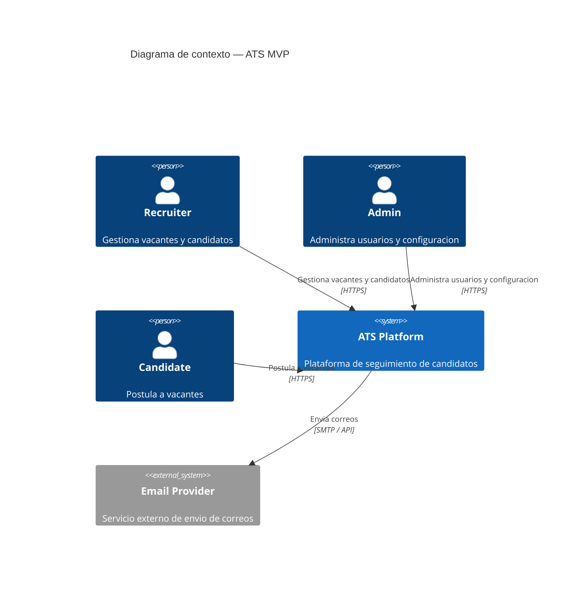
```mermaid
%% C4 Nivel 1 - Diagrama de Contexto
C4Context
    title Diagrama de contexto — ATS MVP

    Person(recruiter, "Recruiter", "Gestiona vacantes y candidatos")
    Person(admin, "Admin", "Administra usuarios y configuracion")
    Person(candidate, "Candidate", "Postula a vacantes")

    System(ats, "ATS Platform", "Plataforma de seguimiento de candidatos")

    System_Ext(emailProvider, "Email Provider", "Servicio externo de envio de correos")

    Rel(recruiter, ats, "Gestiona vacantes y candidatos", "HTTPS")
    Rel(admin, ats, "Administra usuarios y configuracion", "HTTPS")
    Rel(candidate, ats, "Postula a vacantes", "HTTPS")
    Rel(ats, emailProvider, "Envia correos", "SMTP / API")
```

#### Explicación

Este diagrama define el ATS como una **caja negra central**, mostrando únicamente actores externos. Se prioriza claridad funcional: Recruiters y Admins operan internamente, mientras el Candidate interactúa solo vía aplicación. El Email Provider es la única integración externa del MVP, lo cual reduce complejidad inicial. Esta separación permite evolucionar integraciones sin afectar el core del sistema.

---

### 2. Diagrama de Contenedores (C4 Nivel 2)

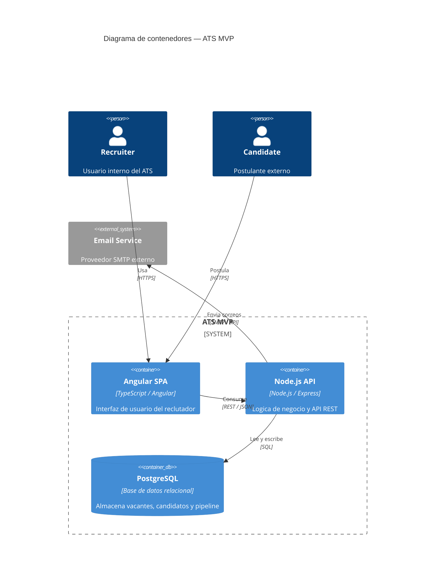
```mermaid
C4Container
    title Diagrama de contenedores — ATS MVP

    Person(recruiter, "Recruiter", "Usuario interno del ATS")
    Person(candidate, "Candidate", "Postulante externo")

    System_Boundary(ats, "ATS MVP") {
        Container(frontend, "Angular SPA", "TypeScript / Angular", "Interfaz de usuario del reclutador")
        Container(backend, "Node.js API", "Node.js / Express", "Logica de negocio y API REST")
        ContainerDb(db, "PostgreSQL", "Base de datos relacional", "Almacena vacantes, candidatos y pipeline")
    }

    System_Ext(email, "Email Service", "Proveedor SMTP externo")

    Rel(recruiter, frontend, "Usa", "HTTPS")
    Rel(candidate, frontend, "Postula", "HTTPS")
    Rel(frontend, backend, "Consume", "REST / JSON")
    Rel(backend, db, "Lee y escribe", "SQL")
    Rel(backend, email, "Envia correos", "SMTP / API")
```

#### Explicación

Aquí se define una arquitectura clásica **3-tier desacoplada**. El frontend Angular es una SPA que consume la API REST, manteniendo lógica de negocio únicamente en backend. PostgreSQL actúa como fuente única de verdad, consistente con los aggregates definidos (Application, Candidate, JobOpening). El servicio de email está separado para permitir retries, colas futuras o cambio de proveedor sin afectar la API.

---

### 3. Diagrama de Componentes del Backend (C4 Nivel 3)

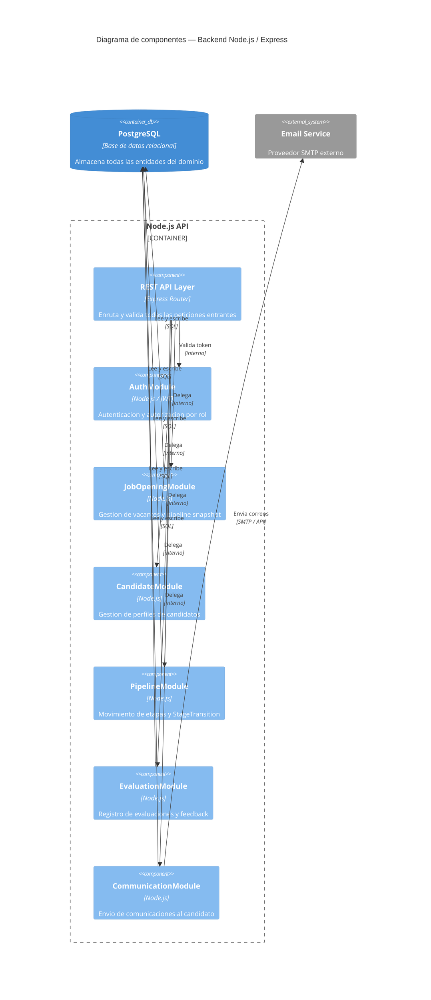
```mermaid
C4Component
    title Diagrama de componentes — Backend Node.js / Express

    Container_Boundary(backend, "Node.js API") {
        Component(api, "REST API Layer", "Express Router", "Enruta y valida todas las peticiones entrantes")
        Component(authModule, "AuthModule", "Node.js / JWT", "Autenticacion y autorizacion por rol")
        Component(jobModule, "JobOpeningModule", "Node.js", "Gestion de vacantes y pipeline snapshot")
        Component(candidateModule, "CandidateModule", "Node.js", "Gestion de perfiles de candidatos")
        Component(pipelineModule, "PipelineModule", "Node.js", "Movimiento de etapas y StageTransition")
        Component(evaluationModule, "EvaluationModule", "Node.js", "Registro de evaluaciones y feedback")
        Component(communicationModule, "CommunicationModule", "Node.js", "Envio de comunicaciones al candidato")
    }

    ContainerDb(db, "PostgreSQL", "Base de datos relacional", "Almacena todas las entidades del dominio")
    System_Ext(email, "Email Service", "Proveedor SMTP externo")

    Rel(api, authModule, "Valida token", "interno")
    Rel(api, jobModule, "Delega", "interno")
    Rel(api, candidateModule, "Delega", "interno")
    Rel(api, pipelineModule, "Delega", "interno")
    Rel(api, evaluationModule, "Delega", "interno")
    Rel(api, communicationModule, "Delega", "interno")

    Rel(jobModule, db, "Lee y escribe", "SQL")
    Rel(candidateModule, db, "Lee y escribe", "SQL")
    Rel(pipelineModule, db, "Lee y escribe", "SQL")
    Rel(evaluationModule, db, "Lee y escribe", "SQL")
    Rel(communicationModule, db, "Lee y escribe", "SQL")
    Rel(communicationModule, email, "Envia correos", "SMTP / API")
```

#### Explicación

El backend sigue un enfoque **modular por dominio (DDD-lite)** alineado a los Aggregate Roots del modelo. Cada módulo encapsula lógica, validaciones y acceso a datos de su contexto. `PipelineModule` es crítico porque coordina `StageTransition` y consistencia con `Application`. `AuthModule` centraliza seguridad y multi-tenant enforcement. Esta estructura permite escalar a microservicios en el futuro si es necesario, sin cambiar el modelo mental actual.

---

### 4. Diagrama de Secuencia — Flujo Principal

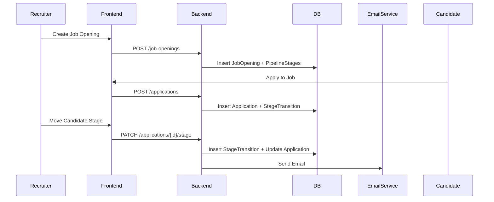
```mermaid
%% Secuencia - Flujo Principal ATS
sequenceDiagram
    participant Recruiter
    participant Frontend
    participant Backend
    participant DB
    participant EmailService

    Recruiter->>Frontend: Create Job Opening
    Frontend->>Backend: POST /job-openings
    Backend->>DB: Insert JobOpening + PipelineStages

    Candidate->>Frontend: Apply to Job
    Frontend->>Backend: POST /applications
    Backend->>DB: Insert Application + StageTransition

    Recruiter->>Frontend: Move Candidate Stage
    Frontend->>Backend: PATCH /applications/{id}/stage
    Backend->>DB: Insert StageTransition + Update Application

    Backend->>EmailService: Send Email
```

#### Explicación

Este flujo muestra el **happy path completo del ATS**. La clave arquitectónica es que `StageTransition` es la fuente de verdad, mientras `Application.currentStageId` es un cache consistente (actualizado en la misma transacción). El envío de email ocurre después de eventos clave (ej. cambio de etapa). Este diseño garantiza trazabilidad completa del pipeline sin sacrificar performance en lecturas.

---

### 5. Diagrama de Flujo — Ciclo de Vida de Application

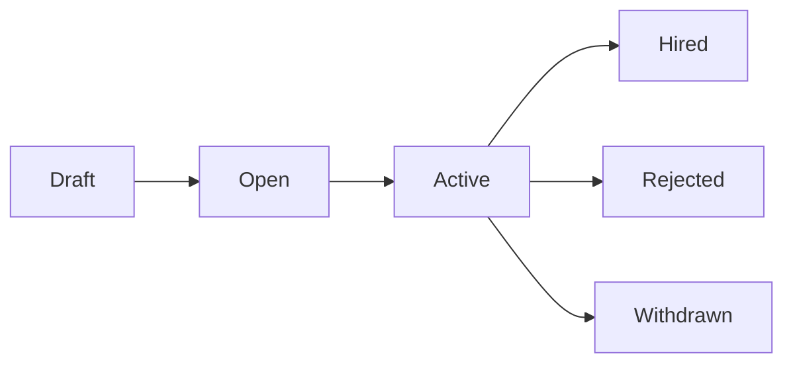
```mermaid
%% Flujo - Lifecycle Application
flowchart LR
    Draft --> Open
    Open --> Active
    Active --> Hired
    Active --> Rejected
    Active --> Withdrawn
```

#### Explicación

El ciclo de vida refleja claramente la naturaleza transaccional de `Application`. El estado `Active` representa participación en pipeline (con stages). Las salidas (`Hired`, `Rejected`, `Withdrawn`) están alineadas con `stageType` del pipeline, garantizando consistencia entre estado y etapa. Este modelo evita estados ambiguos y simplifica lógica de negocio en frontend y backend.

---

### Decisiones Arquitectónicas Clave (Resumen Ejecutivo)

#### 1. Multi-tenant por `Company`

* Aislamiento lógico con `companyId` en todas las entidades
* Escalable sin necesidad de múltiples bases en MVP

#### 2. Consistencia fuerte en pipeline

* `StageTransition` = source of truth
* `Application.currentStageId` = optimized read model

#### 3. Modularización backend (DDD-aligned)

* Cada módulo corresponde a un dominio claro
* Facilita mantenimiento y evolución

#### 4. Arquitectura simple pero extensible

* Monolito modular → preparado para microservicios
* Email desacoplado desde el inicio

#### 5. Stack balanceado

* Angular → rapidez en UI empresarial
* Node.js → velocidad de desarrollo + I/O eficiente
* PostgreSQL → integridad + flexibilidad (JSONB futuro)

---

### Si quieres ir al siguiente nivel

Te recomendaría que el siguiente paso sea uno de estos (dime cuál quieres):

1. **Diseñar los endpoints REST exactos (contract-first)**
2. **Definir arquitectura de carpetas (Angular + Node)**
3. **Agregar event-driven design (outbox pattern para emails)**
4. **Diseñar estrategia de escalabilidad en AWS (ALB, ECS, RDS)**

Porque aquí ya tienes algo importante:
👉 Esto ya es **kickoff-ready para equipo técnico real** 🚀

---
## Nuevas Funcionalidades
> Fuente: /new-features/4-High-Level-Design.md

# 1. Diagrama de Contexto (C4 Nivel 1)

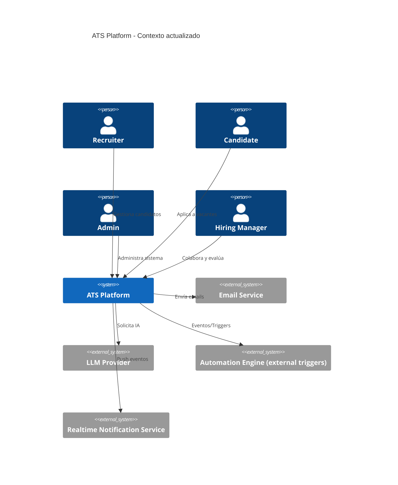
```mermaid
C4Context
    title ATS Platform - Contexto actualizado

    Person(recruiter, "Recruiter")
    Person(candidate, "Candidate")
    Person(admin, "Admin")
    Person(manager, "Hiring Manager")

    System(ats, "ATS Platform")

    System_Ext(email, "Email Service")
    System_Ext(llm, "LLM Provider")
    System_Ext(automation, "Automation Engine (external triggers)")
    System_Ext(realtime, "Realtime Notification Service")

    Rel(recruiter, ats, "Gestiona candidatos")
    Rel(manager, ats, "Colabora y evalúa")
    Rel(candidate, ats, "Aplica a vacantes")
    Rel(admin, ats, "Administra sistema")

    Rel(ats, email, "Envía emails")
    Rel(ats, llm, "Solicita IA")
    Rel(ats, automation, "Eventos/Triggers")
    Rel(ats, realtime, "Push eventos")
```

### Decisiones clave

* **LLM como sistema externo vs integrado** → Se desacopla como proveedor externo
  → Permite cambiar proveedor sin afectar core
  → Impacto: introduce capa gateway interna

* **Realtime como servicio separado vs polling** → Se usa push-based
  → Mejora UX y eficiencia
  → Impacto: nuevo contenedor obligatorio

---

# 2. Diagrama de Contenedores (C4 Nivel 2)

```mermaid
C4Container
    title ATS Platform - Contenedores extendidos

    Person(recruiter)
    
    Container(spa, "Angular SPA", "Frontend")
    Container(api, "Node.js API", "Backend REST")

    ContainerDb(db, "PostgreSQL", "Database")
    Container(email, "Email Service", "External")

    Container(ws, "WebSocket/SSE Server", "Realtime")
    Container(auto, "Automation Engine", "Rules & Triggers")
    Container(ai, "AI Gateway Service", "LLM abstraction")
    Container(metrics, "Metrics Service", "Analytics")

    System_Ext(llm, "LLM Provider")

    Rel(recruiter, spa, "Uses")
    Rel(spa, api, "REST")

    Rel(api, db, "SQL")
    Rel(api, email, "SMTP/API")

    Rel(api, ws, "Publish events")
    Rel(ws, spa, "Push updates")

    Rel(api, auto, "Emit domain events")
    Rel(auto, api, "Trigger actions")

    Rel(api, ai, "AI requests")
    Rel(ai, llm, "LLM API")

    Rel(api, metrics, "Send events")
    Rel(metrics, db, "Store aggregates")
```

### Decisiones clave

* **WebSocket separado vs embebido** → Separado
  → Escalabilidad independiente
  → Impacto: nuevo deployment unit

* **Automation Engine desacoplado** → Event-driven
  → Evita acoplamiento con PipelineModule
  → Impacto: comunicación por eventos

* **AI Gateway vs llamada directa** → Gateway
  → Abstracción total del proveedor
  → Impacto: nuevo servicio intermedio

---

# 3. Diagrama de Componentes (C4 Nivel 3 - Backend)

```mermaid
C4Component
    title Node.js API - Nuevos módulos

    Container(api, "Node.js API")

    Component(auth, "AuthModule")
    Component(candidate, "CandidateModule")
    Component(pipeline, "PipelineModule")
    Component(eval, "EvaluationModule")

    Component(collab, "CollaborationModule")
    Component(auto, "AutomationModule")
    Component(ai, "AIAssistantModule")
    Component(metrics, "MetricsModule")

    ContainerDb(db, "PostgreSQL")
    Container(ws, "WebSocket Server")
    Container(ai_srv, "AI Gateway")
    Container(auto_srv, "Automation Engine")

    Rel(collab, ws, "Emit events")
    Rel(collab, db, "Store comments")

    Rel(auto, auto_srv, "Send triggers")
    Rel(auto_srv, pipeline, "Invoke actions")

    Rel(ai, ai_srv, "Request AI")
    Rel(ai, db, "Store suggestions")

    Rel(metrics, db, "Read/Write metrics")

    Rel(pipeline, auto, "Emit events")
    Rel(candidate, ai, "Provide data context")
```

### Decisiones clave

* **AutomationModule vs lógica en Pipeline** → Separado
  → Mantiene single responsibility
  → Impacto: eventos de dominio obligatorios

* **AIAssistantModule como gateway interno** → No acoplado a provider
  → Permite multi-provider
  → Impacto: nuevo modelo de datos (AI suggestions)

---

# 4. Secuencia — Automatización

```mermaid
sequenceDiagram
    participant Candidate
    participant API
    participant AutomationModule
    participant AutomationEngine
    participant EmailService

    Candidate->>API: Avanza etapa
    API->>AutomationModule: Emit event
    AutomationModule->>AutomationEngine: Evaluate rules
    AutomationEngine-->>AutomationModule: Trigger action
    AutomationModule->>EmailService: Send email
    AutomationModule->>API: Update pipeline
```

### Decisiones clave

* **Evaluación fuera del core**
  → Permite reglas dinámicas
  → Impacto: motor configurable

---

# 5. Secuencia — Asistencia IA

```mermaid
sequenceDiagram
    participant Recruiter
    participant API
    participant AIAssistant
    participant AIGateway
    participant LLM

    Recruiter->>API: Request suggestion
    API->>AIAssistant: Build context
    AIAssistant->>AIGateway: Send prompt
    AIGateway->>LLM: API call
    LLM-->>AIGateway: Response
    AIGateway-->>AIAssistant: Processed result
    AIAssistant->>API: Store suggestion
    API-->>Recruiter: Return suggestion
```

### Decisiones clave

* **Context building en backend vs frontend**
  → Seguridad + consistencia
  → Impacto: uso intensivo de CandidateModule

---

# 6. Secuencia — Colaboración en tiempo real

```mermaid
sequenceDiagram
    participant Manager
    participant API
    participant WS
    participant Recruiter
    participant DB

    Manager->>API: Add comment
    API->>DB: Save comment
    API->>WS: Emit event
    WS-->>Recruiter: Push notification
```

### Decisiones clave

* **Persistencia antes del evento**
  → Garantiza consistencia
  → Impacto: orden estricto en flujo

---

# 7. Flujo — Ciclo de vida de Automatización

```mermaid
flowchart TD
    A[Configurada] --> B[Activa]
    B --> C[Trigger detectado]
    C --> D[Condiciones evaluadas]
    D --> E[Acción ejecutada]
    E --> F{Resultado}
    F -->|Éxito| G[Historial registrado]
    F -->|Falla| H[Error registrado]
```

### Decisiones clave

* **Estado explícito vs implícito**
  → Facilita debugging
  → Impacto: tabla de AutomationHistory

---

# 🔎 Conclusión directa para el equipo

Respondiendo las preguntas clave:

### 1. ¿Qué contenedor nuevo necesitas para realtime?

👉 **WebSocket/SSE Server**

---

### 2. ¿Cómo se comunica automatización sin acoplarse?

👉 Mediante **eventos de dominio desde PipelineModule → AutomationModule → Automation Engine**

---

### 3. ¿Dónde vive la lógica de IA?

👉 En **AIAssistantModule + AI Gateway (abstracción total del provider)**

---

### 4. Flujo completo de IA

👉 Recruiter → API → AIAssistant → AI Gateway → LLM → respuesta → almacenamiento → UI

---

Si quieres, en el siguiente paso podemos bajar esto a:

* contratos API (OpenAPI)
* eventos de dominio exactos
* diseño de tablas nuevas (AI suggestions, automation logs, metrics)

o incluso convertirlo en **tasks listas para sprint (Jira-ready)**.

---

## Anexos — Diagramas Complementarios

> Fuente: 6-Anex-charts.md

### Lean Canvas

```mermaid
flowchart TB
    subgraph L1[" "]
        A["Problemas<br/>• Procesos manuales<br/>• Pérdida de candidatos<br/>• Falta de visibilidad<br/>• Mala colaboración"]
        B["Solución<br/>• Gestión de vacantes<br/>• Formulario de aplicación<br/>• Perfil de candidato<br/>• Pipeline<br/>• Evaluación y feedback<br/>• Comunicación básica"]
        C["Propuesta de Valor Única<br/>ATS simple para centralizar reclutamiento, ordenar el pipeline y acelerar contrataciones"]
        D["Ventaja Competitiva<br/>• Fácil adopción<br/>• Flujo claro<br/>• Base mínima pero funcional"]
        E["Segmentos de Clientes<br/>• Startups en crecimiento<br/>• PyMEs<br/>• Empresas con contratación frecuente"]
    end

    subgraph L2[" "]
        F["Métricas Clave<br/>• Time to hire<br/>• Candidatos por vacante<br/>• Conversión por etapa<br/>• Tiempo en etapa"]
        G["Canales<br/>• Venta directa B2B<br/>• Sitio web<br/>• Demo comercial<br/>• Referidos"]
    end

    subgraph L3[" "]
        H["Estructura de Costos<br/>• Desarrollo<br/>• Infraestructura cloud<br/>• Soporte<br/>• Mantenimiento"]
        I["Fuentes de Ingreso<br/>• Suscripción mensual<br/>• Plan por usuarios<br/>• Plan por vacantes"]
    end

    A --> B
    B --> C
    D --> C
    E --> C
    C --> F
    C --> G
    B --> H
    E --> I
```

### CJM — Customer Journey Map

```mermaid
journey
    title Customer Journey Map - Implementación y uso inicial de un ATS
    section Descubrimiento
      Identifica problemas en reclutamiento: 4: Empresa
      Busca opciones de ATS en el mercado: 3: Empresa
      Compara beneficios y casos de uso: 3: Empresa
    section Evaluación
      Solicita demo o prueba: 4: Empresa, Ventas
      Evalúa funcionalidades clave: 3: Empresa
      Valida costo, facilidad de uso y adopción: 2: Empresa
      Alinea decisión con stakeholders internos: 2: Empresa, Hiring Manager, Finanzas
    section Compra
      Selecciona proveedor ATS: 4: Empresa
      Define plan y licencias: 3: Empresa, Ventas
      Confirma contratación del servicio: 5: Empresa, Ventas
    section Onboarding
      Crea cuenta y configura empresa: 4: Empresa, Customer Success
      Define usuarios y roles: 3: Empresa
      Configura pipeline de reclutamiento: 3: Empresa
      Crea primeras vacantes: 4: Empresa
    section Adopción Inicial
      Publica vacantes activas: 5: Empresa
      Recibe primeras aplicaciones: 5: Empresa, Candidato
      Revisa perfiles y CVs: 4: Empresa
      Mueve candidatos por etapas: 4: Empresa
    section Colaboración
      Coordina entrevistas con el equipo: 3: Empresa, Hiring Manager
      Registra feedback y evaluaciones: 4: Hiring Manager, Entrevistador
      Consolida notas internas y decisiones: 4: Empresa
    section Decisión
      Compara candidatos finalistas: 4: Empresa, Hiring Manager
      Selecciona candidato ideal: 5: Empresa
      Envía oferta o rechazo: 4: Empresa, Candidato
    section Optimización
      Revisa métricas del proceso: 3: Empresa
      Detecta cuellos de botella: 2: Empresa
      Ajusta etapas y flujo de trabajo: 4: Empresa
      Reutiliza base de candidatos para nuevas vacantes: 5: Empresa
```

### Diagrama Entidad-Relación — Versión ChatGPT

```mermaid
erDiagram

    %% =========================
    %% Tenant and Administration
    %% =========================
    Company {
        uuid id PK
        string name
        string slug
        string status
        datetime createdAt
    }

    User {
        uuid id PK
        uuid companyId FK
        string fullName
        string email
        string role
        string status
        datetime createdAt
    }

    %% =========================
    %% Candidate Management
    %% =========================
    Candidate {
        uuid id PK
        uuid companyId FK
        string firstName
        string lastName
        string email
        string phone
        string currentLocation
        string resumeUrl
        datetime createdAt
    }

    %% =========================
    %% Job Openings and Pipeline
    %% =========================
    JobOpening {
        uuid id PK
        uuid companyId FK
        uuid pipelineTemplateId FK
        uuid createdByUserId FK
        string title
        string department
        string location
        string workMode
        text description
        string status
        datetime createdAt
        datetime closedAt
    }

    PipelineTemplate {
        uuid id PK
        uuid companyId FK
        string name
        boolean isDefault
        datetime createdAt
    }

    PipelineStage {
        uuid id PK
        uuid pipelineTemplateId FK
        string name
        int sequence
        string stageType
    }

    Application {
        uuid id PK
        uuid companyId FK
        uuid candidateId FK
        uuid jobOpeningId FK
        uuid currentStageId FK
        string status
        datetime appliedAt
        string source
        string rejectionReason
    }

    StageTransition {
        uuid id PK
        uuid applicationId FK
        uuid fromStageId FK
        uuid toStageId FK
        uuid changedByUserId FK
        datetime changedAt
        string comment
    }

    %% =========================
    %% Evaluation and Collaboration
    %% =========================
    Evaluation {
        uuid id PK
        uuid applicationId FK
        uuid evaluatorUserId FK
        uuid stageId FK
        decimal score
        string recommendation
        text summary
        datetime createdAt
    }

    Note {
        uuid id PK
        uuid applicationId FK
        uuid candidateId FK
        uuid authorUserId FK
        text content
        datetime createdAt
    }

    %% =========================
    %% Communication
    %% =========================
    Communication {
        uuid id PK
        uuid applicationId FK
        uuid candidateId FK
        uuid sentByUserId FK
        string channel
        string subject
        text body
        string status
        datetime sentAt
        datetime createdAt
    }

    %% =========================
    %% Relationships
    %% =========================
    Company ||--o{ User : "tener"
    Company ||--o{ Candidate : "tener"
    Company ||--o{ JobOpening : "tener"
    Company ||--o{ PipelineTemplate : "tener"
    Company ||--o{ Application : "contener"

    User ||--o{ JobOpening : "crear"
    User ||--o{ StageTransition : "ejecutar"
    User ||--o{ Evaluation : "emitir"
    User ||--o{ Note : "redactar"
    User ||--o{ Communication : "enviar"

    Candidate ||--o{ Application : "postular"
    Candidate ||--o{ Note : "recibir"
    Candidate ||--o{ Communication : "recibir"

    PipelineTemplate ||--o{ PipelineStage : "definir"
    PipelineTemplate ||--o{ JobOpening : "estructurar"

    JobOpening ||--o{ Application : "recibir"

    PipelineStage ||--o{ Application : "ubicar"
    PipelineStage ||--o{ StageTransition : "originar"
    PipelineStage ||--o{ StageTransition : "destinar"
    PipelineStage ||--o{ Evaluation : "contextualizar"

    Application ||--o{ StageTransition : "registrar"
    Application ||--o{ Evaluation : "acumular"
    Application ||--o{ Note : "acumular"
    Application ||--o{ Communication : "registrar"
```

### Diagrama Entidad-Relación — Versión Claude Sonnet 4.6

```mermaid
erDiagram

    %% =========================
    %% Tenant and Administration
    %% =========================
    Company {
        uuid id PK
        string name
        string slug
        string status
        datetime createdAt
    }

    User {
        uuid id PK
        uuid companyId FK
        string fullName
        string email
        string role
        string status
        datetime createdAt
    }

    %% =========================
    %% Candidate Management
    %% =========================
    Candidate {
        uuid id PK
        uuid companyId FK
        string firstName
        string lastName
        string email
        string phone
        string currentLocation
        string resumeUrl
        datetime createdAt
    }

    %% =========================
    %% Job Openings and Pipeline
    %% =========================
    JobOpening {
        uuid id PK
        uuid companyId FK
        string title
        string department
        string location
        string workMode
        text description
        string status
        uuid sourceTemplateId FK
        uuid createdByUserId FK
        datetime createdAt
        datetime closedAt
    }

    PipelineTemplate {
        uuid id PK
        uuid companyId FK
        string name
        boolean isDefault
        datetime createdAt
    }

    PipelineStage {
        uuid id PK
        string ownerType
        uuid ownerId FK
        string name
        int sequence
        string stageType
    }

    Application {
        uuid id PK
        uuid companyId FK
        uuid candidateId FK
        uuid jobOpeningId FK
        uuid currentStageId FK
        datetime stageUpdatedAt
        string status
        datetime appliedAt
        string source
        string rejectionReason
    }

    StageTransition {
        uuid id PK
        uuid applicationId FK
        uuid fromStageId FK
        uuid toStageId FK
        uuid changedByUserId FK
        datetime changedAt
        string comment
    }

    %% =========================
    %% Evaluation and Collaboration
    %% =========================
    Evaluation {
        uuid id PK
        uuid applicationId FK
        uuid evaluatorUserId FK
        uuid stageId FK
        decimal score
        string recommendation
        text summary
        datetime createdAt
        datetime completedAt
    }

    Note {
        uuid id PK
        string contextType
        uuid contextId FK
        uuid authorUserId FK
        text content
        datetime createdAt
    }

    %% =========================
    %% Communication
    %% =========================
    Communication {
        uuid id PK
        uuid applicationId FK
        uuid candidateId FK
        uuid sentByUserId FK
        string channel
        string subject
        text body
        string status
        datetime scheduledAt
        datetime sentAt
        datetime createdAt
    }

    %% =========================
    %% Relationships
    %% =========================
    Company ||--o{ User : crear
    Company ||--o{ Candidate : pertenecer
    Company ||--o{ JobOpening : contener
    Company ||--o{ PipelineTemplate : definir
    Company ||--o{ Application : contener

    User ||--o{ JobOpening : crear
    User ||--o{ StageTransition : ejecutar
    User ||--o{ Evaluation : emitir
    User ||--o{ Note : redactar
    User ||--o{ Communication : enviar

    Candidate ||--o{ Application : postular
    Candidate ||--o{ Communication : recibir

    PipelineTemplate ||--o{ PipelineStage : definir

    JobOpening ||--o{ Application : recibir
    JobOpening ||--o{ PipelineStage : copiar

    PipelineStage ||--o{ Application : ubicar
    PipelineStage o|--o{ StageTransition : originar
    PipelineStage ||--o{ StageTransition : destinar
    PipelineStage o|--o{ Evaluation : contextualizar

    Application ||--o{ StageTransition : registrar
    Application ||--o{ Evaluation : acumular
    Application ||--o{ Communication : registrar
```

---

## Glosario

| Término | Definición |
|---|---|
| **Admin** | Rol de usuario con permisos totales de administración del sistema, incluyendo gestión de usuarios, roles y configuración. |
| **Aggregate Root** | Concepto de DDD. Entidad raíz que controla el acceso a un conjunto de objetos relacionados (aggregate). En el ATS: `Company`, `JobOpening`, `Candidate`, `Application`. |
| **Application** | Postulación de un candidato a una vacante específica. Entidad transaccional central que registra el estado y el historial del proceso. |
| **ATS** | Applicant Tracking System. Sistema de seguimiento de candidatos para gestionar procesos de reclutamiento de forma centralizada y eficiente. |
| **B2B** | Business to Business. Modelo comercial donde el cliente del sistema es una empresa, no un consumidor final. |
| **C4 Model** | Modelo de arquitectura de software de 4 niveles: Contexto, Contenedores, Componentes y Código. Usado para documentar la arquitectura del ATS. |
| **Candidate** | Persona postulante registrada en el ATS. Aggregate Root reutilizable que puede postular a múltiples vacantes. |
| **Candidate Experience** | Experiencia del candidato durante el proceso de reclutamiento, incluyendo comunicación, claridad del proceso y tiempos de respuesta. |
| **CJM** | Customer Journey Map. Diagrama que representa las etapas y experiencias de un usuario (empresa o candidato) al interactuar con el sistema ATS. |
| **Communication** | Entidad que registra cada mensaje enviado al candidato desde el ATS, incluyendo canal, estado y fecha de envío. |
| **Company** | Organización cliente del ATS. Actúa como límite de tenant en el modelo SaaS B2B. Todas las entidades operativas pertenecen a una Company. |
| **Compliance** | Cumplimiento de normativas legales relacionadas con datos personales y procesos de contratación (GDPR, EEOC, etc.). |
| **Conversion Rate** | Métrica que mide el porcentaje de candidatos que avanzan de una etapa a la siguiente en el pipeline. |
| **Customer Success** | Equipo responsable de acompañar al cliente en la adopción y uso exitoso del ATS. |
| **DDD** | Domain-Driven Design. Enfoque de diseño de software centrado en el dominio del negocio. El modelo de datos del ATS aplica conceptos de DDD como Aggregate Root, Entity y Value Object. |
| **Draft** | Estado inicial de una vacante (`JobOpening`) antes de ser publicada para recibir postulaciones. |
| **EEOC** | Equal Employment Opportunity Commission. Organismo regulatorio de EE.UU. que establece reglas de no discriminación en contratación. |
| **EmailAddress** | Value Object que encapsula y valida una dirección de correo electrónico. Embebido en `Candidate` y `User`. |
| **Employer Branding** | Imagen y reputación de una empresa como empleador. Un ATS bien implementado mejora el employer branding mediante una experiencia de candidato positiva. |
| **Entity** | Concepto de DDD. Objeto del dominio con identidad propia que persiste en el tiempo. Ejemplos: `User`, `PipelineStage`, `Evaluation`. |
| **Evaluation** | Valoración formal de un candidato dentro de una postulación, realizada por un evaluador interno. Incluye score y recomendación estructurada. |
| **FK** | Foreign Key. Clave foránea que establece una relación entre dos tablas en la base de datos. |
| **Funnel** | Embudo de conversión de candidatos a través de las etapas del pipeline (de aplicación a contratación). |
| **GDPR** | General Data Protection Regulation. Normativa europea de protección de datos personales aplicable al almacenamiento y tratamiento de información de candidatos. |
| **Hiring Manager** | Usuario interno responsable de la decisión de contratación. Participa en evaluación de candidatos y puede mover candidatos en el pipeline. |
| **HRIS** | Human Resource Information System. Sistema de información de recursos humanos con el que el ATS puede integrarse. |
| **Interviewer** | Usuario interno que realiza entrevistas y registra evaluaciones y feedback sobre candidatos. |
| **JobOpening** | Vacante de empleo. Aggregate Root del proceso de reclutamiento por posición. Puede estar en estado Draft, Open o Closed. |
| **JWT** | JSON Web Token. Estándar de autenticación utilizado por el backend del ATS para validar sesiones de usuario. |
| **Kanban** | Metodología de visualización de flujo de trabajo mediante tablero con columnas. El pipeline del ATS funciona como un tablero Kanban. |
| **Lean Canvas** | Herramienta de modelado de negocio que resume en un diagrama los problemas, soluciones, propuesta de valor, segmentos de clientes y métricas clave. |
| **MVP** | Minimum Viable Product. Versión mínima del sistema con las funcionalidades esenciales para operar y entregar valor. |
| **Multi-tenant** | Arquitectura donde un único sistema sirve a múltiples clientes (tenants), con aislamiento lógico por `companyId`. |
| **Note** | Comentario interno asociado a un candidato o postulación, visible solo para el equipo interno. Nunca visible al candidato. |
| **Onboarding** | Proceso de configuración inicial del ATS por parte del cliente: creación de usuarios, roles, pipeline y primeras vacantes. |
| **PipelineStage** | Etapa dentro de un pipeline (ej. Applied, Screening, Interview, Hired). Puede pertenecer a un template o a una vacante concreta. |
| **PipelineTemplate** | Plantilla reutilizable de etapas de reclutamiento. Al crear una vacante, las etapas del template se copian como registros independientes (patrón snapshot). |
| **PK** | Primary Key. Clave primaria que identifica de forma única cada registro en una tabla. |
| **PostgreSQL** | Base de datos relacional utilizada como almacén persistente del sistema ATS. |
| **Recruiter** | Usuario interno principal del ATS. Gestiona vacantes, candidatos, pipeline y comunicaciones. |
| **REST** | Representational State Transfer. Estilo arquitectónico utilizado para la API del backend del ATS. |
| **ROI** | Return on Investment. Retorno sobre la inversión. Métrica de negocio que justifica la adopción de un ATS. |
| **SaaS** | Software as a Service. Modelo de distribución de software donde el ATS se entrega como servicio en la nube con suscripción. |
| **Scorecard** | Plantilla de evaluación estructurada usada en entrevistas para calificar candidatos de forma consistente. |
| **Snapshot** | Copia inmutable de datos en un momento dado. En el ATS, al crear una vacante se realiza un snapshot de las etapas del PipelineTemplate. |
| **Soft delete** | Eliminación lógica: el registro se marca como eliminado pero no se borra físicamente, preservando la trazabilidad. |
| **SPA** | Single Page Application. Tipo de aplicación web que carga una sola página HTML y actualiza el contenido dinámicamente. El frontend del ATS usa Angular como SPA. |
| **SMTP** | Simple Mail Transfer Protocol. Protocolo de envío de correos electrónicos utilizado por el servicio de comunicación del ATS. |
| **Source of Hire** | Fuente de origen de un candidato (LinkedIn, portal propio, referido, etc.). Métrica analítica del ATS. |
| **StageTransition** | Registro histórico de cada movimiento de un candidato entre etapas del pipeline. Fuente de verdad del pipeline. |
| **Tenant** | Cliente individual en una arquitectura SaaS multi-tenant. En el ATS, cada `Company` representa un tenant. |
| **Time-to-hire** | Métrica de reclutamiento que mide el tiempo promedio desde la apertura de una vacante hasta la contratación efectiva. |
| **UUID** | Universally Unique Identifier. Identificador único universal utilizado como clave primaria en todas las entidades del modelo de datos. |
| **Value Object** | Concepto de DDD. Objeto sin identidad propia cuyo valor es su contenido. Ejemplos en el ATS: `PersonName`, `EmailAddress`. |
| **Withdrawn** | Estado de una postulación cuando el candidato se retira voluntariamente del proceso. |
