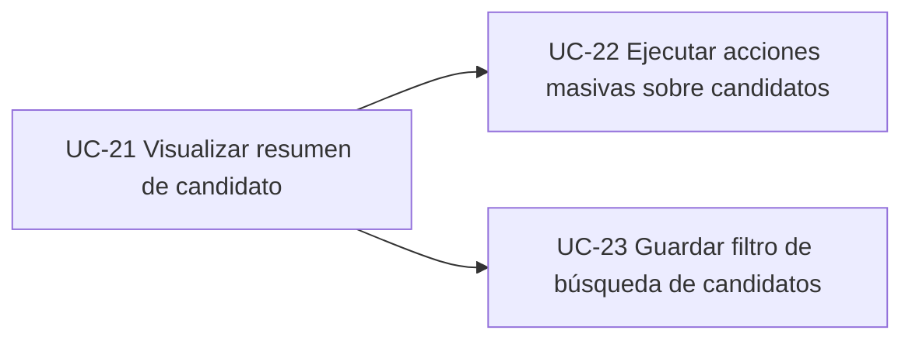
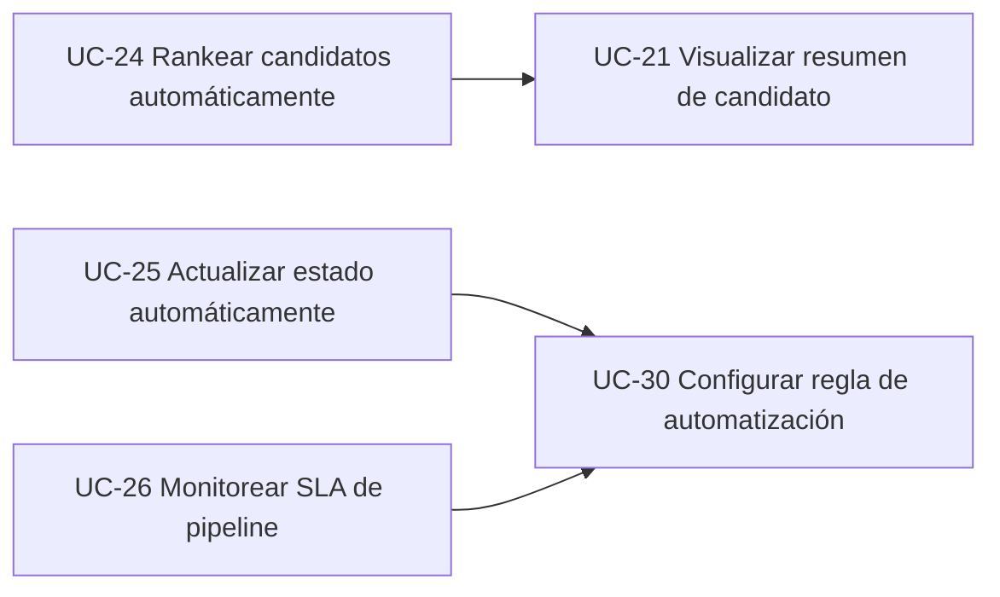
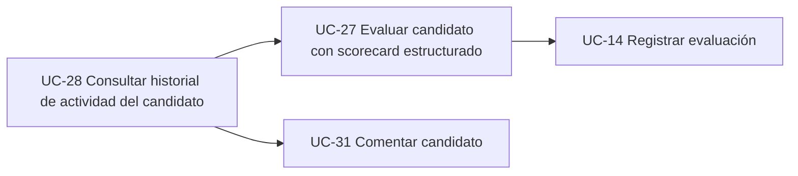
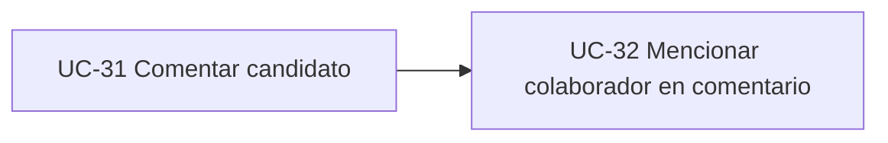
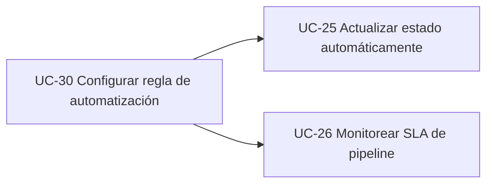
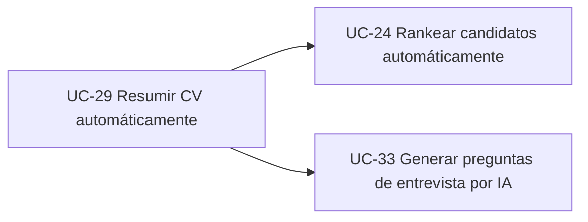

# Supuestos de trabajo

Para no bloquear la definición por los placeholders no provistos, asumo lo siguiente del ATS existente:

* El último caso de uso existente es **UC-20**.
* Ya existen casos base equivalentes a:

  * **UC-03 Gestionar vacante**
  * **UC-05 Registrar candidato**
  * **UC-07 Postular candidato a vacante**
  * **UC-09 Avanzar candidato en pipeline**
  * **UC-12 Programar entrevista**
  * **UC-14 Registrar evaluación**
  * **UC-16 Enviar comunicación**
  * **UC-18 Administrar usuarios y configuración**
* El modelo de datos ya contiene, al menos, entidades equivalentes a:
  `Tenant`, `User`, `Candidate`, `JobOpening/Vacancy`, `Application`, `Interview`, `InterviewFeedback`, `Note`, `Attachment`, `PipelineStage`.

Con base en eso, continúo la numeración desde **UC-21**. Si me compartes los IDs reales existentes, te lo dejo homologado 1:1.

---

# Casos de uso detallados para el siguiente ciclo del ATS

## Gestión de Candidatos

### UC-21 — Visualizar resumen de candidato

**Nombre:** Visualizar resumen de candidato

**Módulo:** Gestión de Candidatos

**Actor principal:** Recruiter

**Actores secundarios:** HiringManager, Sistema

**Precondiciones:**

* El candidato existe en el tenant.
* El actor tiene permisos para consultar candidatos.
* El candidato tiene al menos una postulación o perfil registrado.

**Flujo principal:**

1. El Recruiter accede al listado de candidatos o postulaciones.
2. El Recruiter selecciona un candidato.
3. El sistema muestra una vista consolidada con los datos principales del candidato.
4. El sistema presenta información relevante del perfil, experiencia, documentos, vacantes relacionadas y estado actual en pipeline.
5. El Recruiter revisa el resumen y toma una decisión operativa inicial.
6. El sistema registra la consulta en el historial de actividad.

**Flujos alternativos:**

* **A1. En paso 3, el candidato no tiene información suficiente**

  1. El sistema muestra el resumen con los datos disponibles.
  2. El sistema marca secciones incompletas como pendientes.
  3. El Recruiter puede continuar la revisión o salir del resumen.

**Postcondiciones:**

* El resumen del candidato fue consultado.
* La actividad queda trazada en el historial del candidato.

**Reglas de negocio:**

* Solo se muestran candidatos del tenant activo.
* La información visible depende del rol del usuario.
* El resumen debe incluir el estado vigente de la postulación más reciente o prioritaria.
* Si un candidato tiene múltiples postulaciones, la vista debe distinguir claramente cada una.

**Impacto en modelo de datos:**

* **Entidades afectadas:** `Candidate`, `Application`, `Interview`, `Note`, `Attachment`
* **Campos nuevos/modificados:** `Candidate.profile_completion`, `Candidate.last_viewed_at` (opcional), `Application.last_activity_at`
* **Entidades nuevas si aplica:** `CandidateActivityLog` o reutilización de `ActivityLog`

**Prioridad:** Alta — reduce fricción operativa inmediata y acelera la revisión inicial de candidatos.

**Dependencias:** UC-05, UC-07

---

### UC-22 — Ejecutar acciones masivas sobre candidatos

**Nombre:** Ejecutar acciones masivas sobre candidatos

**Módulo:** Gestión de Candidatos

**Actor principal:** Recruiter

**Actores secundarios:** Sistema

**Precondiciones:**

* Existen candidatos o postulaciones visibles en una búsqueda o listado.
* El actor tiene permisos para modificar postulaciones.
* Las postulaciones seleccionadas pertenecen al mismo tenant.

**Flujo principal:**

1. El Recruiter aplica filtros sobre el listado de candidatos o postulaciones.
2. El Recruiter selecciona múltiples registros.
3. El Recruiter elige una acción masiva permitida.
4. El sistema valida que la acción sea aplicable a todos los registros seleccionados.
5. El Recruiter confirma la ejecución.
6. El sistema aplica la acción a cada registro válido.
7. El sistema informa el resultado consolidado de la operación.
8. El sistema registra la operación en el historial de actividad.

**Flujos alternativos:**

* **A1. En paso 4, algunos registros no cumplen las condiciones**

  1. El sistema separa los registros válidos e inválidos.
  2. El sistema informa el motivo de exclusión de los inválidos.
  3. El Recruiter decide continuar solo con los válidos o cancelar.

* **A2. En paso 5, el Recruiter cancela la confirmación**

  1. El sistema no ejecuta cambios.
  2. El listado permanece sin modificación.

**Postcondiciones:**

* Las postulaciones válidas fueron actualizadas según la acción seleccionada.
* Queda evidencia de la acción masiva realizada.

**Reglas de negocio:**

* Las acciones masivas permitidas deben estar definidas por rol.
* No se pueden ejecutar acciones masivas sobre registros bloqueados o archivados, salvo permiso explícito.
* Una misma operación masiva debe dejar trazabilidad por cada registro afectado.
* La acción debe ser consistente con el estado actual del pipeline.

**Impacto en modelo de datos:**

* **Entidades afectadas:** `Application`, `Candidate`, `ActivityLog`
* **Campos nuevos/modificados:** `Application.bulk_updated_at`, `Application.bulk_update_batch_id` (opcional)
* **Entidades nuevas si aplica:** `BulkOperation`, `BulkOperationItem`

**Prioridad:** Alta — incrementa productividad de HR con esfuerzo razonable.

**Dependencias:** UC-07, UC-09

---

### UC-23 — Guardar filtro de búsqueda de candidatos

**Nombre:** Guardar filtro de búsqueda de candidatos

**Módulo:** Gestión de Candidatos

**Actor principal:** Recruiter

**Actores secundarios:** Sistema

**Precondiciones:**

* El actor tiene permisos para consultar candidatos.
* Existe una búsqueda o combinación de filtros activa.

**Flujo principal:**

1. El Recruiter define criterios de búsqueda y filtrado.
2. El Recruiter solicita guardar el filtro actual.
3. El sistema solicita nombre y visibilidad del filtro.
4. El Recruiter confirma el guardado.
5. El sistema almacena el filtro asociado al usuario o al tenant, según corresponda.
6. El sistema deja el filtro disponible para reutilización futura.

**Flujos alternativos:**

* **A1. En paso 4, ya existe un filtro con el mismo nombre**

  1. El sistema informa el conflicto.
  2. El Recruiter elige reemplazarlo o asignar otro nombre.

**Postcondiciones:**

* El filtro queda disponible para uso posterior.

**Reglas de negocio:**

* Los filtros privados solo son visibles para su creador.
* Los filtros compartidos requieren permiso adicional.
* El filtro debe conservar criterios, orden y contexto de módulo.

**Impacto en modelo de datos:**

* **Entidades afectadas:** Ninguna obligatoria del núcleo transaccional
* **Campos nuevos/modificados:** N/A
* **Entidades nuevas si aplica:** `SavedFilter`

**Prioridad:** Media — mejora eficiencia, aunque no es bloqueante para el flujo principal.

**Dependencias:** UC-05, UC-07

---

## Pipeline y Seguimiento

### UC-24 — Rankear candidatos automáticamente

**Nombre:** Rankear candidatos automáticamente

**Módulo:** Pipeline y Seguimiento

**Actor principal:** Recruiter

**Actores secundarios:** Sistema, Asistencia IA

**Precondiciones:**

* Existe una vacante activa.
* Existen postulaciones asociadas a la vacante.
* La vacante cuenta con información suficiente para comparación.
* La funcionalidad de asistencia IA está habilitada para el tenant.

**Flujo principal:**

1. El Recruiter ingresa al pipeline de una vacante.
2. El Recruiter solicita obtener un ranking de candidatos.
3. El sistema reúne la información relevante de la vacante y de las postulaciones.
4. La asistencia IA evalúa afinidad entre perfil y vacante.
5. El sistema asigna un puntaje y un orden sugerido a las postulaciones.
6. El sistema presenta el ranking junto con una explicación resumida por candidato.
7. El Recruiter revisa el ranking y decide cómo proceder.

**Flujos alternativos:**

* **A1. En paso 3, la vacante no tiene suficiente información**

  1. El sistema informa que no es posible generar un ranking confiable.
  2. El Recruiter puede completar la vacante y reintentar más tarde.

* **A2. En paso 4, la asistencia IA no devuelve resultado**

  1. El sistema informa que el ranking no pudo completarse.
  2. El pipeline permanece sin cambios automáticos.

**Postcondiciones:**

* Las postulaciones evaluadas quedan con puntaje y orden sugerido, cuando aplica.
* La ejecución queda registrada.

**Reglas de negocio:**

* El ranking sugerido no modifica por sí solo el estado del candidato.
* La puntuación debe estar asociada a una ejecución identificable y auditable.
* El sistema debe permitir diferenciar evaluación manual de sugerencia automática.
* La explicación debe ser visible solo a usuarios autorizados.

**Impacto en modelo de datos:**

* **Entidades afectadas:** `Application`, `JobOpening`, `Candidate`
* **Campos nuevos/modificados:** `Application.ai_score`, `Application.ai_rank`, `Application.ai_explanation`, `Application.ai_scored_at`
* **Entidades nuevas si aplica:** `AIRankingRun`, `AIRankingResult`

**Prioridad:** Alta — es una de las funcionalidades con mayor valor percibido y mayor impacto en time-to-hire.

**Dependencias:** UC-07, UC-21, UC-29

---

### UC-25 — Actualizar estado de candidatos automáticamente

**Nombre:** Actualizar estado de candidatos automáticamente

**Módulo:** Pipeline y Seguimiento

**Actor principal:** Sistema

**Actores secundarios:** Recruiter, Automatización

**Precondiciones:**

* Existe una regla de automatización activa.
* Existe una postulación elegible para evaluación.
* El evento que dispara la regla ocurrió.

**Flujo principal:**

1. El sistema detecta un evento relevante en una postulación.
2. El sistema identifica una regla activa aplicable.
3. El sistema valida que la postulación cumpla las condiciones de la regla.
4. El sistema actualiza el estado o etapa de la postulación.
5. El sistema registra la ejecución de la automatización.
6. El sistema deja visible al Recruiter el cambio realizado.

**Flujos alternativos:**

* **A1. En paso 3, la postulación no cumple las condiciones**

  1. El sistema no ejecuta cambios.
  2. El sistema registra que la regla fue evaluada sin efecto.

* **A2. En paso 4, el cambio automático entra en conflicto con una restricción**

  1. El sistema cancela la actualización.
  2. El sistema registra el motivo del bloqueo.
  3. El Recruiter puede revisar manualmente el caso.

**Postcondiciones:**

* La postulación cambia de estado o etapa, cuando corresponde.
* La ejecución queda trazada.

**Reglas de negocio:**

* Ninguna regla automática puede saltar etapas obligatorias definidas por la vacante.
* Las automatizaciones no deben sobrescribir decisiones manuales bloqueadas o finales.
* Todo cambio automático debe indicar origen y momento de ejecución.

**Impacto en modelo de datos:**

* **Entidades afectadas:** `Application`, `PipelineStage`, `ActivityLog`
* **Campos nuevos/modificados:** `Application.last_stage_change_at`, `Application.updated_by_type`
* **Entidades nuevas si aplica:** `AutomationExecutionLog`

**Prioridad:** Alta — disminuye carga operativa y estandariza el proceso.

**Dependencias:** UC-09, UC-30

---

### UC-26 — Monitorear SLA de pipeline

**Nombre:** Monitorear SLA de pipeline

**Módulo:** Pipeline y Seguimiento

**Actor principal:** Recruiter

**Actores secundarios:** Sistema, Admin

**Precondiciones:**

* Existen vacantes y postulaciones activas.
* Existen objetivos de tiempo configurados por etapa o vacante.

**Flujo principal:**

1. El Recruiter accede al tablero de seguimiento del pipeline.
2. El sistema calcula el tiempo transcurrido por postulación y por etapa.
3. El sistema compara el tiempo transcurrido contra el SLA definido.
4. El sistema resalta los casos dentro de objetivo, en riesgo o vencidos.
5. El Recruiter consulta los casos críticos y toma acción.

**Flujos alternativos:**

* **A1. En paso 3, una etapa no tiene SLA configurado**

  1. El sistema informa que el caso no puede evaluarse contra objetivo.
  2. El caso se muestra sin clasificación de cumplimiento.

**Postcondiciones:**

* El estado de cumplimiento del pipeline queda visible y actualizado.
* Los casos críticos pueden disparar acciones posteriores.

**Reglas de negocio:**

* El SLA debe medirse con base en la fecha de entrada a la etapa vigente.
* Los cálculos deben respetar zona horaria y tenant.
* El incumplimiento de SLA no altera automáticamente la postulación salvo regla configurada.

**Impacto en modelo de datos:**

* **Entidades afectadas:** `Application`, `PipelineStage`, `JobOpening`
* **Campos nuevos/modificados:** `Application.stage_entered_at`, `PipelineStage.sla_hours`
* **Entidades nuevas si aplica:** `SLAPolicy`, `SLABreachEvent`

**Prioridad:** Media — aporta control operativo, pero depende de madurez mínima del flujo.

**Dependencias:** UC-09, UC-30

---

## Evaluación

### UC-27 — Evaluar candidato con scorecard estructurado

**Nombre:** Evaluar candidato con scorecard estructurado

**Módulo:** Evaluación

**Actor principal:** Interviewer

**Actores secundarios:** HiringManager, Recruiter, Sistema

**Precondiciones:**

* Existe una entrevista programada o finalizada.
* La vacante tiene scorecard definido o campos mínimos de evaluación.
* El actor tiene permiso para registrar evaluación.

**Flujo principal:**

1. El Interviewer accede a la entrevista o postulación asignada.
2. El Interviewer abre el formato de evaluación estructurada.
3. El sistema muestra criterios, escalas y campos cualitativos definidos.
4. El Interviewer registra su evaluación.
5. El Interviewer envía la scorecard.
6. El sistema guarda la evaluación y la vincula a la postulación.
7. El Recruiter y el HiringManager pueden consultar el resultado.

**Flujos alternativos:**

* **A1. En paso 5, faltan criterios obligatorios**

  1. El sistema informa los campos pendientes.
  2. El Interviewer completa la información antes de enviar.

**Postcondiciones:**

* La evaluación queda registrada de forma estructurada y trazable.

**Reglas de negocio:**

* Una scorecard enviada no debe alterarse sin trazabilidad posterior.
* Los criterios obligatorios dependen de la vacante o plantilla usada.
* El evaluador solo puede completar scorecards asignadas o habilitadas para su rol.

**Impacto en modelo de datos:**

* **Entidades afectadas:** `Interview`, `InterviewFeedback`, `Application`
* **Campos nuevos/modificados:** `InterviewFeedback.structured_score`, `InterviewFeedback.summary`, `InterviewFeedback.submitted_at`
* **Entidades nuevas si aplica:** `ScorecardTemplate`, `ScorecardCriterion`, `ScorecardResponse`

**Prioridad:** Alta — mejora consistencia y calidad de decisión de contratación.

**Dependencias:** UC-12, UC-14

---

### UC-28 — Consultar historial de actividad del candidato

**Nombre:** Consultar historial de actividad del candidato

**Módulo:** Evaluación

**Actor principal:** HiringManager

**Actores secundarios:** Recruiter, Sistema

**Precondiciones:**

* El candidato existe.
* El actor tiene permisos para consultar trazabilidad del candidato.

**Flujo principal:**

1. El HiringManager accede al detalle del candidato.
2. El HiringManager solicita ver el historial de actividad.
3. El sistema muestra una línea de tiempo con eventos relevantes.
4. El HiringManager revisa cambios de etapa, evaluaciones, comentarios y acciones recientes.
5. El HiringManager utiliza el historial para soportar su decisión.

**Flujos alternativos:**

* **A1. En paso 3, no existen eventos registrados**

  1. El sistema informa que no hay actividad disponible.
  2. El HiringManager puede volver al detalle general del candidato.

**Postcondiciones:**

* El historial fue consultado como apoyo a evaluación y toma de decisión.

**Reglas de negocio:**

* El historial debe mostrar eventos en orden cronológico consistente.
* La visibilidad de cada evento depende del rol del usuario.
* Los eventos automáticos y manuales deben distinguirse visualmente.

**Impacto en modelo de datos:**

* **Entidades afectadas:** `ActivityLog`, `Application`, `InterviewFeedback`, `Comment`
* **Campos nuevos/modificados:** `ActivityLog.event_type`, `ActivityLog.actor_type`, `ActivityLog.visibility_scope`
* **Entidades nuevas si aplica:** N/A si ya existe `ActivityLog`

**Prioridad:** Media — refuerza trazabilidad y colaboración, aunque depende de eventos ya instrumentados.

**Dependencias:** UC-21, UC-31, UC-32

---

## Colaboración

### UC-31 — Comentar candidato

**Nombre:** Comentar candidato

**Módulo:** Colaboración

**Actor principal:** Recruiter

**Actores secundarios:** HiringManager, Interviewer, Sistema

**Precondiciones:**

* El candidato o postulación existe.
* El actor tiene permisos para colaborar sobre el registro.

**Flujo principal:**

1. El Recruiter accede al detalle del candidato o de la postulación.
2. El Recruiter abre la sección de comentarios.
3. El Recruiter redacta un comentario.
4. El Recruiter envía el comentario.
5. El sistema almacena el comentario y lo asocia al contexto correspondiente.
6. El sistema actualiza el historial de actividad.

**Flujos alternativos:**

* **A1. En paso 3, el comentario está vacío**

  1. El sistema informa que no es posible enviar un comentario sin contenido.
  2. El Recruiter corrige el contenido o cancela.

**Postcondiciones:**

* El comentario queda disponible para usuarios autorizados.

**Reglas de negocio:**

* Todo comentario debe quedar asociado a un candidato o a una postulación.
* Los comentarios pueden tener visibilidad interna, nunca hacia Candidate en este alcance.
* El autor y la fecha del comentario son obligatorios e inmutables.

**Impacto en modelo de datos:**

* **Entidades afectadas:** `Candidate`, `Application`
* **Campos nuevos/modificados:** N/A
* **Entidades nuevas si aplica:** `Comment`

**Prioridad:** Alta — habilita colaboración centralizada sin depender de canales externos.

**Dependencias:** UC-05, UC-07

---

### UC-32 — Mencionar colaborador en comentario

**Nombre:** Mencionar colaborador en comentario

**Módulo:** Colaboración

**Actor principal:** Recruiter

**Actores secundarios:** HiringManager, Interviewer, Sistema

**Precondiciones:**

* Existe un comentario nuevo o editable antes de envío.
* El actor tiene permisos para interactuar con usuarios del tenant.

**Flujo principal:**

1. El Recruiter redacta un comentario en el contexto de un candidato o postulación.
2. El Recruiter menciona a uno o más colaboradores.
3. El sistema identifica y valida los usuarios mencionados.
4. El Recruiter envía el comentario.
5. El sistema registra las menciones asociadas al comentario.
6. El sistema deja disponible la referencia para atención del colaborador mencionado.

**Flujos alternativos:**

* **A1. En paso 3, uno de los usuarios mencionados no es válido**

  1. El sistema informa que la mención no puede procesarse.
  2. El Recruiter corrige la mención antes de enviar.

**Postcondiciones:**

* El comentario queda publicado con sus menciones válidas asociadas.

**Reglas de negocio:**

* Solo pueden mencionarse usuarios activos del mismo tenant.
* Una mención no crea por sí sola una asignación formal, salvo regla adicional.
* Las menciones deben quedar trazadas individualmente.

**Impacto en modelo de datos:**

* **Entidades afectadas:** `Comment`, `User`
* **Campos nuevos/modificados:** N/A
* **Entidades nuevas si aplica:** `CommentMention`

**Prioridad:** Alta — mejora coordinación puntual entre recruiter y manager con bajo esfuerzo.

**Dependencias:** UC-31

---

## Automatización

### UC-30 — Configurar regla de automatización

**Nombre:** Configurar regla de automatización

**Módulo:** Automatización

**Actor principal:** Admin

**Actores secundarios:** Sistema, Recruiter

**Precondiciones:**

* El actor tiene permisos administrativos.
* El tenant tiene habilitado el módulo de automatización.

**Flujo principal:**

1. El Admin accede a la sección de automatizaciones.
2. El Admin crea una nueva regla.
3. El sistema solicita evento disparador, condiciones y acción.
4. El Admin define la regla y su alcance.
5. El Admin activa o guarda la regla.
6. El sistema valida consistencia de la configuración.
7. El sistema deja la regla disponible para ejecución futura.

**Flujos alternativos:**

* **A1. En paso 6, la regla es inconsistente**

  1. El sistema informa el conflicto de validación.
  2. El Admin corrige la configuración antes de guardar.

* **A2. En paso 5, el Admin decide guardar sin activar**

  1. El sistema registra la regla en estado inactivo.
  2. La regla no ejecuta acciones hasta ser activada.

**Postcondiciones:**

* La regla queda registrada en estado activo o inactivo.

**Reglas de negocio:**

* Toda regla debe definir un disparador, al menos una condición opcional y una acción.
* Una regla inactiva no debe ejecutarse.
* Las reglas no pueden afectar datos de otros tenants.
* Las reglas deben respetar permisos y estados permitidos del flujo de negocio.

**Impacto en modelo de datos:**

* **Entidades afectadas:** N/A del núcleo operativo
* **Campos nuevos/modificados:** N/A
* **Entidades nuevas si aplica:** `AutomationRule`, `AutomationCondition`, `AutomationAction`

**Prioridad:** Alta — es la base habilitadora de varias eficiencias del siguiente ciclo.

**Dependencias:** UC-18

---

## Asistencia IA

### UC-29 — Resumir CV automáticamente

**Nombre:** Resumir CV automáticamente

**Módulo:** Asistencia IA

**Actor principal:** Sistema

**Actores secundarios:** Recruiter, Asistencia IA

**Precondiciones:**

* El candidato tiene CV o documento procesable asociado.
* La funcionalidad IA está habilitada para el tenant.
* El documento es legible por el sistema.

**Flujo principal:**

1. El sistema detecta un CV nuevo o solicita procesamiento sobre uno existente.
2. El sistema obtiene la información relevante del documento.
3. La asistencia IA genera un resumen del perfil del candidato.
4. El sistema guarda el resumen asociado al candidato.
5. El Recruiter consulta el resumen desde la vista del candidato.

**Flujos alternativos:**

* **A1. En paso 2, el documento no puede procesarse**

  1. El sistema informa que no fue posible generar el resumen.
  2. El Recruiter puede continuar con revisión manual.

**Postcondiciones:**

* El candidato queda con resumen generado, cuando el procesamiento es exitoso.

**Reglas de negocio:**

* El resumen IA debe identificarse como sugerencia y no como verdad absoluta.
* El resultado debe poder regenerarse si el CV cambia.
* La ausencia de resumen no impide continuar el flujo principal del ATS.

**Impacto en modelo de datos:**

* **Entidades afectadas:** `Candidate`, `Attachment`
* **Campos nuevos/modificados:** `Candidate.ai_summary`, `Candidate.ai_summary_status`, `Candidate.ai_summary_updated_at`
* **Entidades nuevas si aplica:** `AIProcessingLog`

**Prioridad:** Alta — reduce tiempo de lectura y acelera el screening inicial.

**Dependencias:** UC-05

---

### UC-33 — Generar preguntas de entrevista por IA

**Nombre:** Generar preguntas de entrevista por IA

**Módulo:** Asistencia IA

**Actor principal:** Interviewer

**Actores secundarios:** Recruiter, Sistema, Asistencia IA

**Precondiciones:**

* Existe una entrevista planificada o en preparación.
* El candidato y la vacante tienen información suficiente.
* La asistencia IA está habilitada para el tenant.

**Flujo principal:**

1. El Interviewer accede a la entrevista o postulación.
2. El Interviewer solicita preguntas sugeridas.
3. El sistema reúne la información relevante del candidato y de la vacante.
4. La asistencia IA propone preguntas alineadas al contexto.
5. El sistema presenta las preguntas sugeridas al Interviewer.
6. El Interviewer selecciona o ajusta las preguntas a utilizar.

**Flujos alternativos:**

* **A1. En paso 3, la información es insuficiente**

  1. El sistema informa que no puede generar sugerencias contextualizadas.
  2. El Interviewer puede continuar sin apoyo IA.

**Postcondiciones:**

* Las preguntas sugeridas quedan disponibles para consulta o uso en la entrevista.

**Reglas de negocio:**

* Las preguntas sugeridas no reemplazan la decisión del entrevistador.
* Debe ser posible distinguir entre preguntas sugeridas y preguntas finales adoptadas.
* El contenido generado debe limitarse al contexto de vacante y perfil disponibles.

**Impacto en modelo de datos:**

* **Entidades afectadas:** `Interview`, `Candidate`, `JobOpening`
* **Campos nuevos/modificados:** `Interview.ai_question_set`, `Interview.ai_question_generated_at`
* **Entidades nuevas si aplica:** `AIQuestionSet`

**Prioridad:** Media — aporta valor claro, aunque su dependencia operativa es menor que ranking o resumen.

**Dependencias:** UC-12, UC-29

---

# Matriz de trazabilidad

| UC ID | Nombre                                          | Módulo                 | Actor         | Prioridad | Funcionalidad origen               |
| ----- | ----------------------------------------------- | ---------------------- | ------------- | --------- | ---------------------------------- |
| UC-21 | Visualizar resumen de candidato                 | Gestión de Candidatos  | Recruiter     | Alta      | Eficiencia para HR                 |
| UC-22 | Ejecutar acciones masivas sobre candidatos      | Gestión de Candidatos  | Recruiter     | Alta      | Eficiencia para HR                 |
| UC-23 | Guardar filtro de búsqueda de candidatos        | Gestión de Candidatos  | Recruiter     | Media     | Eficiencia para HR                 |
| UC-24 | Rankear candidatos automáticamente              | Pipeline y Seguimiento | Recruiter     | Alta      | Eficiencia para HR / Asistencia IA |
| UC-25 | Actualizar estado de candidatos automáticamente | Pipeline y Seguimiento | Sistema       | Alta      | Automatizaciones                   |
| UC-26 | Monitorear SLA de pipeline                      | Pipeline y Seguimiento | Recruiter     | Media     | Automatizaciones                   |
| UC-27 | Evaluar candidato con scorecard estructurado    | Evaluación             | Interviewer   | Alta      | Colaboración en tiempo real        |
| UC-28 | Consultar historial de actividad del candidato  | Evaluación             | HiringManager | Media     | Colaboración en tiempo real        |
| UC-29 | Resumir CV automáticamente                      | Asistencia IA          | Sistema       | Alta      | Asistencia de IA                   |
| UC-30 | Configurar regla de automatización              | Automatización         | Admin         | Alta      | Automatizaciones                   |
| UC-31 | Comentar candidato                              | Colaboración           | Recruiter     | Alta      | Colaboración en tiempo real        |
| UC-32 | Mencionar colaborador en comentario             | Colaboración           | Recruiter     | Alta      | Colaboración en tiempo real        |
| UC-33 | Generar preguntas de entrevista por IA          | Asistencia IA          | Interviewer   | Media     | Asistencia de IA                   |

# Recomendación de implementación inicial

Las **3 funcionalidades de mayor impacto para implementar primero** serían:

1. **UC-21 + UC-22 + UC-24** como paquete de eficiencia de screening
   Porque reducen tiempo de revisión, priorizan mejor y mejoran throughput del recruiter.

2. **UC-31 + UC-32 + UC-27** como paquete de colaboración y evaluación
   Porque centralizan feedback y mejoran calidad de decisión.

3. **UC-30 + UC-25** como base de automatización
   Porque habilitan escalabilidad operativa y reducen trabajo repetitivo.