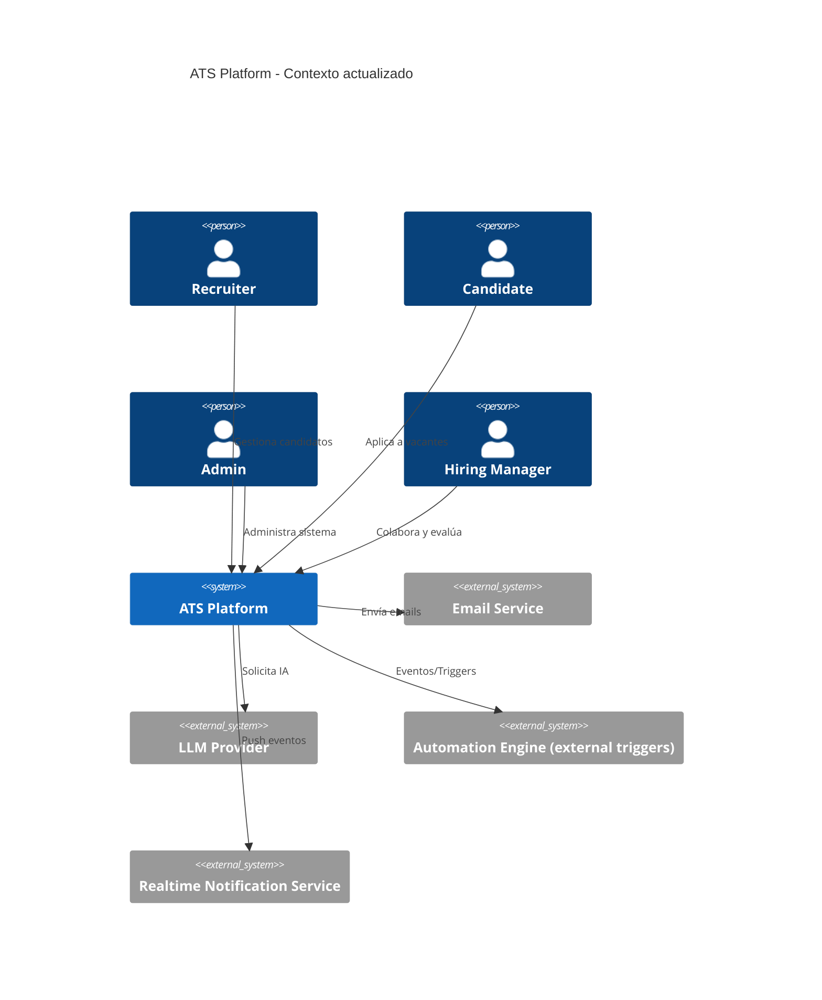
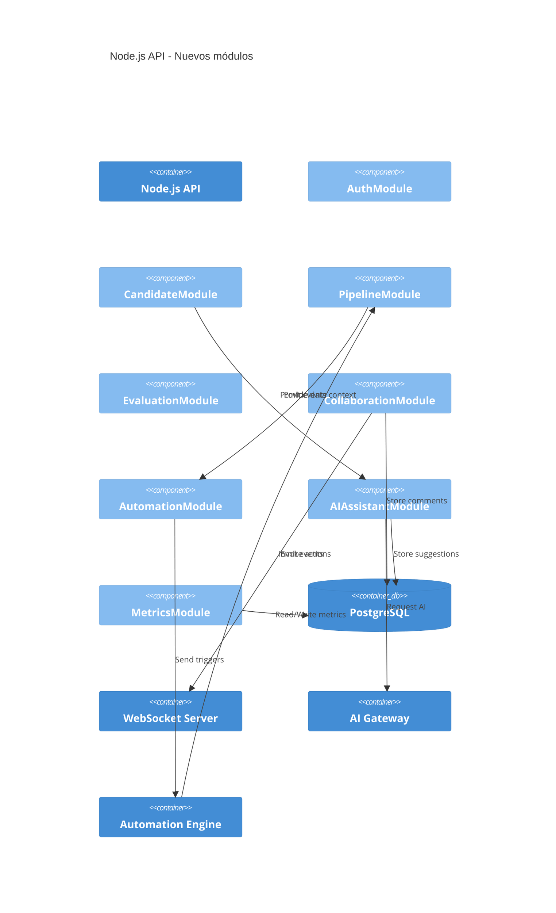
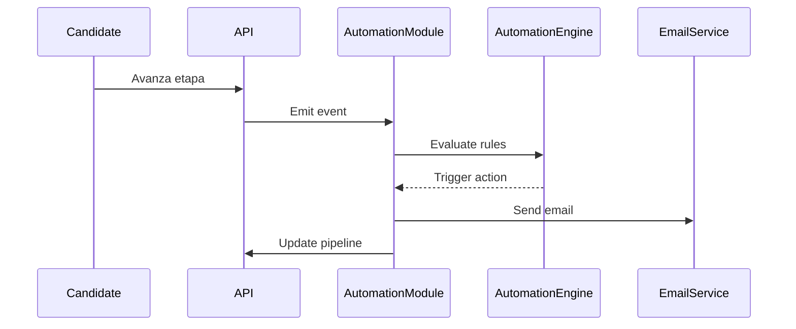
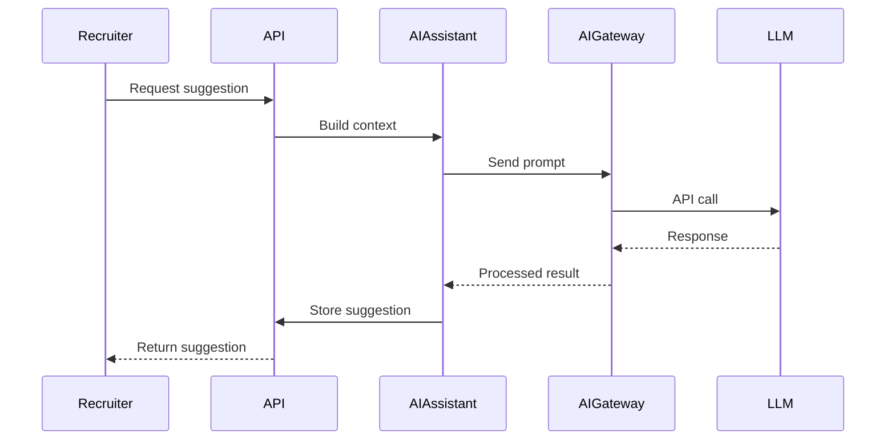
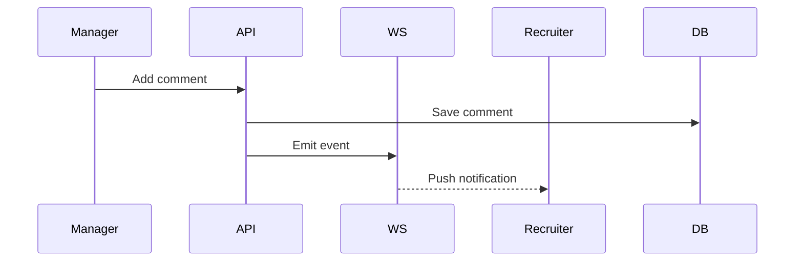
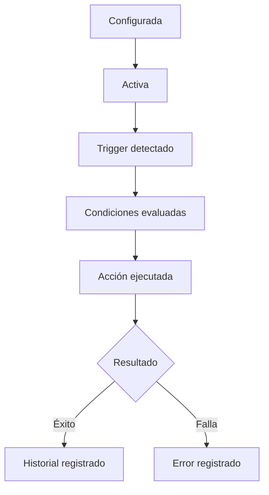

# 1. Diagrama de Contexto (C4 Nivel 1)



### Decisiones clave

* **LLM como sistema externo vs integrado** → Se desacopla como proveedor externo
  → Permite cambiar proveedor sin afectar core
  → Impacto: introduce capa gateway interna

* **Realtime como servicio separado vs polling** → Se usa push-based
  → Mejora UX y eficiencia
  → Impacto: nuevo contenedor obligatorio

---

# 2. Diagrama de Contenedores (C4 Nivel 2)

```mermaid
C4Container
    title ATS Platform - Contenedores extendidos

    Person(recruiter)
    
    Container(spa, "Angular SPA", "Frontend")
    Container(api, "Node.js API", "Backend REST")

    ContainerDb(db, "PostgreSQL", "Database")
    Container(email, "Email Service", "External")

    Container(ws, "WebSocket/SSE Server", "Realtime")
    Container(auto, "Automation Engine", "Rules & Triggers")
    Container(ai, "AI Gateway Service", "LLM abstraction")
    Container(metrics, "Metrics Service", "Analytics")

    System_Ext(llm, "LLM Provider")

    Rel(recruiter, spa, "Uses")
    Rel(spa, api, "REST")

    Rel(api, db, "SQL")
    Rel(api, email, "SMTP/API")

    Rel(api, ws, "Publish events")
    Rel(ws, spa, "Push updates")

    Rel(api, auto, "Emit domain events")
    Rel(auto, api, "Trigger actions")

    Rel(api, ai, "AI requests")
    Rel(ai, llm, "LLM API")

    Rel(api, metrics, "Send events")
    Rel(metrics, db, "Store aggregates")
```

### Decisiones clave

* **WebSocket separado vs embebido** → Separado
  → Escalabilidad independiente
  → Impacto: nuevo deployment unit

* **Automation Engine desacoplado** → Event-driven
  → Evita acoplamiento con PipelineModule
  → Impacto: comunicación por eventos

* **AI Gateway vs llamada directa** → Gateway
  → Abstracción total del proveedor
  → Impacto: nuevo servicio intermedio

---

# 3. Diagrama de Componentes (C4 Nivel 3 - Backend)



### Decisiones clave

* **AutomationModule vs lógica en Pipeline** → Separado
  → Mantiene single responsibility
  → Impacto: eventos de dominio obligatorios

* **AIAssistantModule como gateway interno** → No acoplado a provider
  → Permite multi-provider
  → Impacto: nuevo modelo de datos (AI suggestions)

---

# 4. Secuencia — Automatización



### Decisiones clave

* **Evaluación fuera del core**
  → Permite reglas dinámicas
  → Impacto: motor configurable

---

# 5. Secuencia — Asistencia IA



### Decisiones clave

* **Context building en backend vs frontend**
  → Seguridad + consistencia
  → Impacto: uso intensivo de CandidateModule

---

# 6. Secuencia — Colaboración en tiempo real



### Decisiones clave

* **Persistencia antes del evento**
  → Garantiza consistencia
  → Impacto: orden estricto en flujo

---

# 7. Flujo — Ciclo de vida de Automatización



### Decisiones clave

* **Estado explícito vs implícito**
  → Facilita debugging
  → Impacto: tabla de AutomationHistory

---

# 🔎 Conclusión directa para el equipo

Respondiendo las preguntas clave:

### 1. ¿Qué contenedor nuevo necesitas para realtime?

👉 **WebSocket/SSE Server**

---

### 2. ¿Cómo se comunica automatización sin acoplarse?

👉 Mediante **eventos de dominio desde PipelineModule → AutomationModule → Automation Engine**

---

### 3. ¿Dónde vive la lógica de IA?

👉 En **AIAssistantModule + AI Gateway (abstracción total del provider)**

---

### 4. Flujo completo de IA

👉 Recruiter → API → AIAssistant → AI Gateway → LLM → respuesta → almacenamiento → UI

---

Si quieres, en el siguiente paso podemos bajar esto a:

* contratos API (OpenAPI)
* eventos de dominio exactos
* diseño de tablas nuevas (AI suggestions, automation logs, metrics)

o incluso convertirlo en **tasks listas para sprint (Jira-ready)**.
